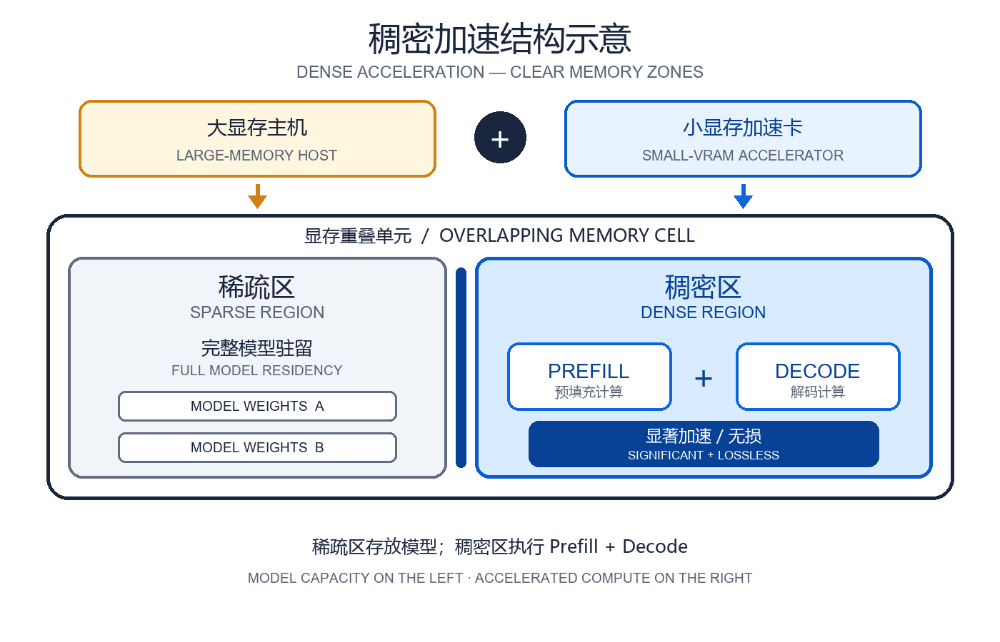
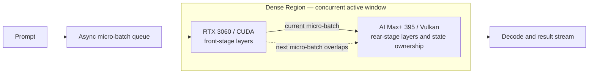

#  Small-VRAM Accelerator + Large-VRAM, Low-Compute Host Dense Acceleration — Heterogeneous GPU PD Lab

[简体中文](README_ZH.md)

An experimental record of heterogeneous GPU Prefill/Decode (PD) and Dense Acceleration: RTX 3060 / RTX 3080 accelerator heads work with an AMD Ryzen AI Max+ 395 / Radeon 8060S.

Current release: **v2.14 — the Qwen3.8-Flash Q4 dual-device layer-split record (r374) is published with its final C1–C6 envelope: aggregate Prefill up to 633.685 tok/s and aggregate Decode up to 71.185 tok/s, both at C4**. The Ornith-1.5-35B-A3B record remains locked to the r337 dual-machine path (RTX 3080 pure Prefill and AI Max+ 395 pure Decode), and the v2.10 27B-C / 27B-D versus DGX Spark comparison remains in place. This repository publishes architecture, measured data, design evolution, conclusions, and limitations. It intentionally excludes deployment instructions, reproduction commands, patches, endpoints, and internal layer-allocation policy.

**What Dense Acceleration is.** An accelerator card plus a host being accelerated. Where the two devices' memory overlaps is the memory-dense region; any model falling inside it is strongly accelerated for both decode and prefill. Output quality is preserved; realized throughput reflects both compute and communication, and cross-device KV expansion trades some communication overhead for a larger context capacity.

This gives low-compute, large-memory hosts (e.g. DGX Spark, AI Max+ 395) combined with high-compute, small-memory cards (e.g. RTX 3060, RTX 3080) more application opportunity and scenarios.

*Structure: the overlapping memory cell splits into a **sparse region** that holds the model and a **dense region** that does the compute; a model falling into the dense region gets significant, lossless decode & prefill acceleration.*

## Reading path and this release

- Read **architecture and measurement envelopes** first, then follow **research evolution → 9B experiment chain → unified 27B experiment area → external references**. Every local experiment starts with a “New experiment + key result” heading.
- The **9B main line** keeps the same-envelope v1.0–v2.4 evolution, ending at 2129.69 tok/s prefill and 50.73 tok/s decode.
- The **27B experiment area** now places the 3060 / IQ3 and 3080 / Q4 records together without merging their measurement envelopes.
- The old v1.0–v1.2 router tables and the 395 natural-language audit remain in the detailed record as historical controls; the homepage uses the current v2.8 long-context route throughout.
- From v2.8 on, in the latest 27B-C/D the **RTX 3080 performs all Prefill and Decode compute, and the AI Max+ 395 is a pure KV-only remote storage pool**: it takes part in neither Prefill nor Decode and provides 1M context capacity per stream (1M context per stream).

## Dense Acceleration architecture

The final design uses the RPC events/async capability from upstream llama.cpp [PR #18626](https://github.com/ggml-org/llama.cpp/pull/18626). Model layers stay on their assigned endpoint; micro-batches move through the stages so the two devices can work concurrently. The experiment does not claim a custom inference-engine patch.

### Terminology

- **Dense Acceleration** is this project's name for the final asynchronous layered-PD form: layer ownership is split between the external GPU and AI Max+ 395, while RPC/events keeps adjacent micro-batches active across both stages.
- The **Dense Region** is the overlapping compute window on the pipeline timeline in which the external GPU and AI Max+ 395 are both doing useful work on adjacent micro-batches and their own layer stages. Filling this window reduces pipeline bubbles and strongly accelerates the model-stage work it covers.
- The Dense Region is scheduling overlap, **not** two devices recomputing the same layer, tensor parallelism, or duplicated weight residency.

## Research evolution

Overall experimental goal: verify that when a high-compute, small-VRAM accelerator card cannot fit an entire model by itself, it can jointly host and compute the same model together with a low-compute, large-VRAM host, while accelerating both Prefill and Decode without lowering output quality.

| Stage | Experimental purpose | Validation method | Measured result |
| --- | --- | --- | --- |
| v1.0 | Establish basic feasibility: the RTX 3060 carries Prefill, then hands off the state to the AI Max+ 395 for Decode. | Complete the CUDA prefill → Vulkan decode state handoff reliably. | 1452.29 tok/s; 30.28 tok/s decode |
| v2.1 | Resolve the serial idle time at both endpoints in v1.0; check whether an async micro-batch pipeline lets both endpoints contribute to one prefill. | Verify that the same-request micro-batch pipeline keeps both layer stages active within a single request. | 1865.08 tok/s |
| v2.2 | Resolve the run-to-run overlap variance in v2.1; make the speedup repeatable rather than coincidental. | Tune the async overlap until the pipeline becomes consistent across runs. | 1893.87 tok/s |
| v2.3 | Once the pipeline is repeatable, check whether load balancing between the two backends reduces pipeline wait and improves Prefill and Decode at the same time. | The balanced split lifted decode above the v1.0 figure while raising prefill. | 1999.51 tok/s; 37.16 tok/s decode |
| **v2.4** | Complete the overall goal: compare the combined setup against both endpoints running the same 9B Q6_K, pp5064 local baseline, and confirm state and output correctness, sustained Dense Region work, and lossless Prefill/Decode acceleration. | The calibrated checkpoint keeps the Dense Region full and reaches 83.2% of the sum of both standalone prefill rates. | **2129.69 tok/s; 50.73 tok/s decode** |
| **v2.5** | After the 9B line, test whether full 3080 prefill + 395 decode can move 27B Q4 into serving. | Remove per-ubatch RPC sync and run six C1–C6 tiers across two paths, twelve groups total. | C1 prefill **1000.6 tok/s**; TTFT 1073 ms |
| **v2.6** | Resolve the split 3060/3080 narrative and add the latest router measurements. | Unify the 27B experiment area into input-acceleration and generation-acceleration paths. | Prefill up to **1210.6 tok/s**; single-stream decode up to **63.2 tok/s** |
| **v2.7** | Surface the strongest results immediately instead of burying them under implementation detail. | Reframe 27B-C/D as prefill-first and decode-first profiles with only high-level changes and best measurements on the homepage. | Prefill up to **1210.6 tok/s**; single-stream decode up to **63.2 tok/s** |
| **v2.8** | Correct compute attribution, add the real C1–C6 measurements, and clarify 1M context per stream and the communication cost. | State that the 3080 performs all Prefill and Decode compute while the 395 is a pure KV-only remote pool, and fill the homepage with the real C1–C6 compact table plus C1/C6 figures. | Prefill up to **1210.6 tok/s**; C1 single-stream Decode **63.2 tok/s**; C6 aggregate Decode **116.3 tok/s** |
| **v2.9** | Correct the 27B-D C6 aggregate Decode peak and scope the communication-trade sentence to 27B-D only. | State the C6 aggregate Decode peak as 116.3 tok/s in every target file, and remove the standalone-speed trade sentence from the 27B-C section while keeping it on 27B-D. | C6 aggregate Decode **116.3 tok/s** |
| **v2.10** | Make 27B-C, 27B-D, and DGX Spark readable in one comparison. | Present local C / D values in slash order, fill DGX Spark Prefill, single/aggregate Decode and C1–C6 concurrency, and add a dedicated DFlash2-head row. | **Complete C / D / DGX Spark comparison** |
| **v2.11** | Add the first MoE dual-machine PD record: Ornith-1.5-35B-A3B (qwen35moe, 10 full-attention + 30 Gated DeltaNet layers) on the 3080 full-prefill / 395 full-decode split. | Publish the short-task and 100K C1–C6 envelopes, keep the 395 decode-segment measurement independently attributable, and mark the MoE rows as not rankable against the 27B dense rows. | Short-task C1 aggregate Prefill **4017.46 tok/s**; 100K Prefill **2895.53 tok/s** (C1); 395 decode-segment up to **148.20 tok/s** (C6); 42/42 at route=pd |
| **v2.12** | Remove the derived whole-stage aggregate Decode series from the Ornith presentation. | Delete that column and its C1–C6 display values from both README files and both detailed reports while preserving the raw CSV. | **Displayed metrics now remain directly attributable to 3080 Prefill or the 395 decode segment** |
| **v2.13** | Lock the Ornith record to the requested r337 PD experiment and remove the remaining ambiguous machine-readable values. | State explicitly that the 3080 is Prefill-only and the 395 is Decode-only; clear the whole-stage wall-clock derivative from all 12 CSV rows. | Short-task Prefill **4017.46 tok/s**; 100K 395 pure Decode up to **148.20 tok/s** |
| **v2.14** | Publish the Qwen3.8-Flash Q4 dual-device layer-split record (r374) as a new independent envelope. | Run one llama-server on the RTX 3080 (CUDA0) and AI Max+ 395 (Vulkan1) with a 0.38 / 0.62 tensor split, and measure the final C1–C6 short-context tiers. | C4 aggregate Prefill **633.685 tok/s**; C4 aggregate Decode **71.185 tok/s**; C4 total throughput **338.270 tok/s** |
| **v3.0 (research direction)** | Adapt the v2.4 one-to-one mechanism to other types of large-memory hosts and small-VRAM accelerator cards. | Build a cross-platform adaptation matrix and validate memory-dense-region mapping, lossless prefill/decode acceleration, and scheduling stability across host architectures and accelerator models. | **Planned: adaptation research for other large-memory hosts + small-VRAM accelerator cards** |
| **v4.0 (research direction)** | Study one accelerator card accelerating X large-memory hosts at the same time. | Study one-to-many scheduling, resource isolation, fairness, fault recovery, and the scaling boundary as the number of concurrent hosts increases. | **Planned: 1 accelerator → X large-memory hosts** |

## 9B local test envelope

| Item | Configuration |
| --- | --- |
| Model | 9B, Q6_K |
| Devices | RTX 3060 12GB / CUDA + Ryzen AI Max+ 395 / Radeon 8060S / Vulkan |
| v1.0 input / output | 5064 / 128 tokens |
| v1.0 measurement | Cache disabled; second server request retained |
| v2 measurement | `pp5064`; `tg128` only where recorded |

## 9B local experiment chain — one main envelope

### New experiment 9B-v1.0 (Independent PD): 1452.29 tok/s prefill; 30.28 tok/s decode

| Configuration | TTFT | Prefill | Decode |
| --- | ---: | ---: | ---: |
| AI Max+ 395 only | 5.879 s | 861.55 tok/s | 30.24 tok/s |
| First 512 tokens on independent PD | 5.720 s | 886.62 tok/s | 30.22 tok/s |
| First 2048 tokens on independent PD | 5.077 s | 999.16 tok/s | 30.18 tok/s |
| Full independent PD | **3.496 s** | **1452.29 tok/s** | **30.28 tok/s** |

Full independent PD handed off 5063 tokens and 208.57 MiB of state. It preserved the architectural potential for cross-request prefill/decode duplexing, which this release did not benchmark under concurrency.

### New experiment 9B-v2.1 (first fused pipeline): 1865.08 tok/s prefill

One request first enters the async micro-batch pipeline, ending whole-request alternating idle time.

### New experiment 9B-v2.2 (overlap refinement): 1893.87 tok/s prefill

Overlap becomes stable across runs, showing that the gain is repeatable.

### New experiment 9B-v2.3 (balance refinement): 1999.51 tok/s prefill; 37.16 tok/s decode

Balancing the two stages lifts both prefill and decode above the prior checkpoint.

### New experiment 9B-v2.4 (Dense Acceleration final): 2129.69 tok/s prefill; 50.73 tok/s decode

#### Same-envelope 9B summary

Blank cells mean the metric was not recorded for that checkpoint.

| Checkpoint | Public description | Prefill | Decode | TTFT |
| --- | --- | ---: | ---: | --- |
| RTX 3060 baseline | CUDA endpoint only | 1589.00 tok/s | 43.87 tok/s | — |
| AI Max+ 395 baseline | Vulkan endpoint only | 970.00 tok/s | 31.27 tok/s | — |
| v2.1 | First fused pipeline | 1865.08 tok/s | — | — |
| v2.2 | Overlap refinement | 1893.87 tok/s | — | — |
| v2.3 | Balance refinement | 1999.51 tok/s | 37.16 tok/s | — |
| **v2.4** | Dense Acceleration final checkpoint | **2129.69 tok/s** | **50.73 tok/s** | — |

v2.4 is 34.0% above the RTX 3060 prefill baseline, 119.6% above the AI Max+ 395 baseline, and 83.2% of the 2559 tok/s sum of both standalone measurements. These are calculations from the local table, not claims about other hardware.

The 37.16 tok/s fused decode result belongs to the v2.3 checkpoint, while the v2.4 checkpoint recorded a 50.73 tok/s decode.

## Unified 27B experiment area — co-located narrative, separate envelopes

These experiments share the 27B model scale, but hardware, quantization, prompts, and engine revisions differ. **Compare only inside each table.**

### New experiment 27B-A (3060·IQ3): pp4096 658.52 tok/s (+110%)

This exploratory line is deliberately separated from the `9B Q6_K / pp5064` table above. It used Qwen3.8-27B UD-IQ3_XXS (27.32B parameters, 10.17 GiB, 3.06 bpw), so its values are not included in the v2.4 percentages.

| Measurement | AI Max+ 395 only | Dense Acceleration | Observed change |
| --- | ---: | ---: | ---: |
| pp4096 | 313.28 tok/s | **658.52 tok/s** | +110% |
| pp65536 | 136.69 tok/s | **319.10 tok/s** | +133% (2.33×) |
| pp98304 | Timed out after 900 s | **225.10 tok/s** | Completed; TTFT ≈ 437 s |
| Decode tg64 | 18.26 tok/s | **19.57 tok/s** | About +7% |

The full 27B model did not provide a valid standalone RTX 3060 baseline in this setup. Dense Acceleration succeeded because the external GPU only had to keep and compute its assigned layer stage; no internal allocation ratio is published. This result is an IQ3 validation, not a Q4 claim.

### Historical scheduling record · New experiment 27B-B (3080·Q4, serving v1.0): C1 prefill 1000.6 tok/s; TTFT 1073 ms

This experiment replaces the accelerator head with an RTX 3080 and records 27B Q4 heterogeneous PD across two endpoints. It remains separate from the 9B main table and the 27B-A IQ3 long-prompt sweep. The v1.0 table below is a **historical scheduling record** (3080 prefill + 395 decode split across both endpoints) and is kept apart from the latest “3080 full compute + 395 KV-only” design.

#### Configuration

- **Accelerator head**: **RTX 3080 20GB** (pure CUDA0 full prefill, no RPC and no draft speculation).
- **Host being accelerated**: **AMD Ryzen AI Max+ 395 / Radeon 8060S** (v1.0 historical envelope: Vulkan decode, full KV pool, DFlash2 speculative decoding).
- **Model**: Qwen3.8-27B, Q4_K_M (~17.66 GiB).
- **Engine**: llama.cpp fork (HEAD `18c8dde`, with upstream [PR #18626](https://github.com/ggml-org/llama.cpp/pull/18626) async/RPC capability), running as two instances: 8082 pure CUDA0 full prefill, 8081 pure 395 decode holding the full KV pool (`/dev/shm/kvx`).
- **Raw 3080 baseline**: pp1024 = 1228.53, pp4096 = 1203.06, tg64 = 33.08 tok/s.

#### v1.0 representative rows

This is **six C1–C6 concurrency tiers × split/solo paths = twelve measured groups**. The README keeps only the first and last row; all six tiers live in the detailed record and CSV.

| C | TTFT split/solo | prefill split/solo | decode split/solo | KV migration |
| --- | ---: | ---: | ---: | ---: |
| 1 | **1073 / 4825 ms** | **1000.6 / 207.2 tok/s** | 38.75 / 36.33 tok/s | 71 ms |
| 6 | 5009 / 22303 ms | 1014.3 / 44.8 tok/s | 9.67 / 8.82 tok/s | 70 ms |

Removing RPC lifted same-envelope C1 prefill from 683.2 to **1000.6 tok/s (+46%)**, about 82% of raw 3080 throughput.

### New experiment 27B-C | Prefill-first (fastest prefill): best measured **1210.6 tok/s**

- Latest envelope: the RTX 3080 performs all Prefill and Decode compute; the AI Max+ 395 is a pure KV-only remote storage pool that takes part in neither Prefill nor Decode and provides 1M context capacity per stream (1M context per stream).
- Best measured prefill reaches **1210.6 tok/s** (C1); the real C1–C6 compact table below is all in tok/s:

| Concurrency | Prefill | Single-stream Decode | Aggregate Decode |
| --- | ---: | ---: | ---: |
| C1 | 1210.6 | 38.50 | 33.55 |
| C2 | 1204.8 | 28.51 | 45.57 |
| C3 | 1205.5 | 22.51 | 52.31 |
| C4 | 1199.5 | 19.66 | 51.30 |
| C5 | 1194.4 | 16.07 | 61.64 |
| C6 | 1197.2 | 14.68 | 63.84 |

- Aimed at long prompts, RAG, and document workloads where time to first token matters.

### New experiment 27B-D | Decode-first (fastest single-stream decode): best measured **63.2 tok/s**

- Same latest envelope as 27B-C: the RTX 3080 performs all Prefill and Decode compute while the AI Max+ 395 is a pure KV-only remote storage pool (in neither Prefill nor Decode) providing 1M context per stream; the 3080 trades remote-KV communication overhead for the per-stream 1M long context.
- Real C1: Prefill **1090 tok/s**, single-stream Decode **63.2 tok/s**; aggregate Decode grows linearly with concurrency through C2–C6, peaking at **116.3 tok/s** at C6.
- Aimed at low-concurrency chat, coding, and other interactive workloads.

See the [complete 27B record](results/qwen3.8-27b-dual-machine-pd.md) for the v1.0/v1.1/v1.2 tables, natural-language audit, and envelope limits; see the [CSV](data/qwen27b-local-results.csv) for machine-readable data.

#### 27B-C / 27B-D versus DGX Spark

The value left of each slash is **27B-C**; the value on the right is **27B-D**. DGX Spark uses the summary presentation envelope.

| Metric | 27B-C / 27B-D (AI Max+ 395 + RTX 3080) | DGX Spark / GB10 |
| --- | --- | --- |
| Model/quantization | Qwen3.8-27B, Q4_K_M | Qwen3.8-27B, NVFP4 |
| Engine | llama.cpp (CUDA + Vulkan, fork `18c8dde`) | SGLang |
| DFlash2 acceleration head | **enabled / enabled** | **enabled** |
| KV precision | q4_0 / q4_0 | fp8_e4m3 |
| Prefill | **1210.6 / 1090 tok/s** | **about 1000 tok/s** |
| Single-stream Decode (C1) | **38.5 / 63.2 tok/s** | **25–30 tok/s** |
| Aggregate Decode (C6) | **63.84 / 116.3 tok/s** | **107 tok/s** |
| Context capacity | **1M per stream / 1M per stream** | 1M profile |
| Concurrency | **C1–C6 / C1–C6** | **C1–C6** |
| Topology | dual-machine heterogeneous / dual-machine heterogeneous (3080 full compute + 395 KV-only remote storage) | single machine |

**Not directly comparable**: the DGX Spark summary values are approximate; quantization (Q4_K_M vs NVFP4), engine (llama.cpp vs SGLang), KV precision (q4_0 vs fp8), prompt depth, and topology all differ.

## New experiment 35B-A3B (Ornith-1.5-35B-A3B, MoE) — 3080 pure Prefill / 395 pure Decode

**MoE warning: Ornith-1.5-35B-A3B (35B total / A3B active, qwen35moe, 40 layers: 10 full attention + 30 Gated DeltaNet) is not directly comparable with the Qwen3.8-27B dense rows above.**

This section uses only the r337 dual-machine PD experiment. The RTX 3080 (CUDA, batch 4096 / ubatch 4096 / ctx 114688) is Prefill-only; after KV migration through /dev/shm/kvxo, the AI Max+ 395 (Vulkan1, ctx 655360) is Decode-only and performs all Decode work. The target is Ornith-1.5-35B-A3B-IQ4_XS with the Qwen3.6-35B-A3B-DFlash-Q4_K_M draft head (spec n_max 6), also resident on the 395 Decode node. No single-node ROCmFP4 result is mixed into these tables. After the matrix, the online services were restored to ctx 8192 / 32768.

Stress: **42/42 succeeded**, all at route=pd, n_reuse=0.

Before the scored 100K rows, all six dFlash draft slots were advanced to 100K once to keep draft positions continuous; that warm-up is excluded from the measurements.

### Short task — 1000 input / 128 output (tok/s)

| C | 3080 pure Prefill aggregate |
| --- | ---: |
| C1 | **4017.46** |
| C2 | 3947.64 |
| C3 | 3924.83 |
| C4 | 3913.85 |
| C5 | 3906.09 |
| C6 | 3943.88 |

### 100K — 100000 input / 128 output (tok/s)

| C | 3080 pure Prefill aggregate | 395 pure Decode aggregate |
| --- | ---: | ---: |
| C1 | **2895.53** | **23.33** |
| C2 | 2826.07 | 53.37 |
| C3 | 2796.34 | 75.20 |
| C4 | 2795.28 | 103.33 |
| C5 | 2793.56 | 123.09 |
| C6 | 2793.24 | 148.20 |

The short-task table reports only 3080 pure Prefill because a separately timed 395 pure-Decode rate was not recorded for that caliber. In the 100K table, the rightmost column is measured solely inside the 395 Decode window; the 3080 performs no Decode work. Whole-stage wall-clock derivatives are excluded from both the presentation and the CSV. The 100K TTFT, 100K single-stream Decode, KV migration milliseconds, and dFlash acceptance rate were not recorded and remain empty rather than being inferred.

Full record: [Ornith-1.5-35B-A3B dual-machine PD](results/ornith-1.5-35b-a3b-dual-machine-pd.md) (Chinese: [zh-CN](results/ornith-1.5-35b-a3b-dual-machine-pd.zh-CN.md)); machine-readable data: [ornith35a3b-local-results.csv](data/ornith35a3b-local-results.csv).

## New experiment Flash-Q4 (Qwen3.8-Flash Q4, dual-device layer split) — C4 aggregate Prefill 633.685 tok/s

**Envelope warning: Qwen3.8-Flash Q4 on the 3080 + 395 dual-device layer split is a different model, hardware role, and caliber from the 27B and Ornith rows above; compare only within this table.**

This section uses only the r374 run: one llama-server hosts both devices at once, with the RTX 3080 (CUDA0) and the AI Max+ 395 (Vulkan1) each owning their layer stage (tensor split 0.38 / 0.62), ubatch 1024 / batch 4096, flash attention on, q4_0 KV cache, and 6 slots at 131072 context. The 3080 VRAM peaked at 19129 MiB. Workload: ~2077 input / 256 output per lane, temperature 0, six concurrency tiers, warm-up excluded; 21/21 scored requests succeeded with complete timings.

### C1–C6 — ~2077 input / 256 output (tok/s)

| C | Prefill aggregate | Single-stream Decode | Aggregate Decode | Total throughput |
| --- | ---: | ---: | ---: | ---: |
| C1 | 569.892 | 35.204 | 35.204 | 213.581 |
| C2 | 579.215 | 26.055 | 51.877 | 273.089 |
| C3 | 625.250 | 21.714 | 65.143 | 320.267 |
| C4 | **633.685** | 17.829 | **71.185** | **338.270** |
| C5 | 552.070 | 14.578 | 69.595 | 327.366 |
| C6 | 554.873 | 12.317 | 67.286 | 332.790 |

Prefill aggregate holds above 550 tok/s at every tier and peaks at C4; aggregate Decode grows with concurrency to 71.185 tok/s at C4 and eases slightly under the six-lane load. Per-tier TTFT is not recorded and is left empty rather than inferred.

Full record: [Qwen3.8-Flash Q4 dual-device layer split](results/qwen3.8-flash-q4-layer-split.md) (Chinese: [zh-CN](results/qwen3.8-flash-q4-layer-split.zh-CN.md)); machine-readable data: [qwen38flash-q4-local-results.csv](data/qwen38flash-q4-local-results.csv).

## External reference: DGX Spark community data (not a local new experiment)

These externally reported measurements are preserved for context, not ranked against the local experiment.

| Device | Community workload | Prompt metric | Prefill | Directly comparable? | Source |
| --- | --- | ---: | ---: | ---: | --- |
| NVIDIA DGX Spark / GB10 | Qwen3.5 9B, TQ3_4S, fork-specific FP4 cache-on path | pp2048 | 2766.28 tok/s | **No** — quantization, prompt length, fork, and kernel differ | [llama.cpp-tq3 PR #53](https://github.com/turbo-tan/llama.cpp-tq3/pull/53) |
| NVIDIA DGX Spark / GB10 | Qwen3.8-27B, NVFP4, SGLang + DFlash2 | 100K / 200K / 300K-token cold prefill | 1170 / 800 / 615 tok/s | **No** — quantization, engine, prompt depths, and test method differ | [hasso5703 benchmark](https://github.com/hasso5703/dgx-spark-qwen38/blob/17e7e2280e632b0a3ab91839c8c7522b256937ac/BENCHMARKS.md#L232-L243) |

See the [source notes](results/dgx-spark-community-control.md) and [machine-readable external controls](data/dgx-spark-community-controls.csv).

## Findings and limits

- v1.0 demonstrates heterogeneous state handoff between CUDA prefill and Vulkan decode.
- v2.4 Dense Acceleration demonstrates real asynchronous compute overlap in a heterogeneous layer pipeline, but occupying both endpoints removes v1.0's independent-PD duplex behavior.
- v1.0 uses server-request measurements; v2 uses llama-bench pp/tg. Cross-release percentages are engineering references, not strict same-method research claims.
- 27B-A validates the 3060 / IQ3 long-prompt Dense Region, while 27B-B/C/D cover 3080 / Q4 C1–C6 serving, router aggregate throughput, and two-stage preemption. Their envelopes remain distinct and cannot be collapsed into one ranking.
- From v2.8 on, all Prefill and Decode compute in the latest 27B-C/D is done by the 3080; the 395 is a pure KV-only remote storage pool (1M context per stream) that takes part in neither Prefill nor Decode. The old v1.0–v1.2 tables and the 395 natural-language audit are historical controls, as marked in the detailed record.
- The **Prefill-first** route publishes C1–C6 Prefill, single-stream Decode, and aggregate Decode; the **Decode-first** route publishes 1090 / 63.2 tok/s at C1 and 116.3 tok/s aggregate Decode at C6.
- **1M per stream** is the context capacity exposed by the latest route. The published speed points come from the current benchmark workload and must not be extrapolated to claim the same throughput with a fully populated 1M-token prompt.
- Community controls retain their original public methodology and are not normalized or extrapolated.

Detailed records: [v1.0 independent PD](results/v1.0-independent-pd.md), [v2.4 Dense Acceleration evolution](results/v2.4-fused-layer-pipeline.md), [complete 27B record](results/qwen3.8-27b-dual-machine-pd.md), [9B local CSV](data/benchmark-results.csv), [27B local CSV](data/qwen27b-local-results.csv), [Ornith-1.5-35B-A3B dual-machine PD](results/ornith-1.5-35b-a3b-dual-machine-pd.md) (Chinese: [zh-CN](results/ornith-1.5-35b-a3b-dual-machine-pd.zh-CN.md)), [35B-A3B local CSV](data/ornith35a3b-local-results.csv), [Qwen3.8-Flash Q4 dual-device layer split](results/qwen3.8-flash-q4-layer-split.md) (Chinese: [zh-CN](results/qwen3.8-flash-q4-layer-split.zh-CN.md)), [Flash-Q4 local CSV](data/qwen38flash-q4-local-results.csv), and [changelog](CHANGELOG.md).
