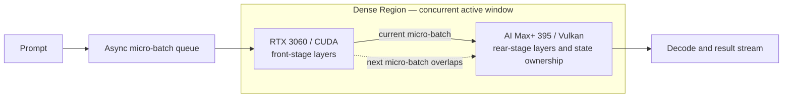

#  Small-VRAM Accelerator + Large-VRAM, Low-Compute Host Dense Acceleration — Heterogeneous GPU PD Lab

[简体中文](README_ZH.md)

An experimental record of heterogeneous GPU Prefill/Decode (PD) and Dense Acceleration on one host: an RTX 3060 12GB works with an AMD Ryzen AI Max+ 395 / Radeon 8060S.

Current release: **v2.4 — Dense Acceleration (Asynchronous Layered PD)**. This repository publishes architecture, measured data, design evolution, conclusions, and limitations. It intentionally excludes deployment instructions, reproduction commands, patches, endpoints, and internal layer-allocation policy.

**What Dense Acceleration is.** An accelerator card plus a host being accelerated. Where the two devices' memory overlaps is the memory-dense region; any model falling inside it is strongly accelerated for both decode and prefill. The acceleration is lossless, and every metric exceeds what the accelerator card or the host achieves on its own.

This gives low-compute, large-memory hosts (e.g. DGX Spark, AI Max+ 395) combined with high-compute, small-memory cards (e.g. RTX 3060, RTX 3080) more application opportunity and scenarios.

*Structure: the overlapping memory cell splits into a **sparse region** that holds the model and a **dense region** that does the compute; a model falling into the dense region gets significant, lossless decode & prefill acceleration.*

## What changed

- **v1.0** separated prefill and decode and transferred state to the AI Max+ 395.
- **v2.1–v2.4** evolved toward an asynchronous micro-batch pipeline in which both devices contribute to one prefill; the final form is named **Dense Acceleration**.
- **v2.4 reached 2129.69 tok/s**, 34.0% above the RTX 3060 baseline and 119.6% above the AI Max+ 395 baseline in the local `9B Q6_K / pp5064` test.
- A DGX Spark section now records community measurements as **external controls only**. Different models, quantizations, prompt lengths, forks, and kernels make them unsuitable for direct ranking.

## Dense Acceleration architecture

The final design uses the RPC events/async capability from upstream llama.cpp [PR #18626](https://github.com/ggml-org/llama.cpp/pull/18626). Model layers stay on their assigned endpoint; micro-batches move through the stages so the two devices can work concurrently. The experiment does not claim a custom inference-engine patch.

### Terminology

- **Dense Acceleration** is this project's name for the final asynchronous layered-PD form: layer ownership is split between the external GPU and AI Max+ 395, while RPC/events keeps adjacent micro-batches active across both stages.
- The **Dense Region** is the overlapping compute window on the pipeline timeline in which the external GPU and AI Max+ 395 are both doing useful work on adjacent micro-batches and their own layer stages. Filling this window reduces pipeline bubbles and strongly accelerates the model-stage work it covers.
- The Dense Region is scheduling overlap, **not** two devices recomputing the same layer, tensor parallelism, or duplicated weight residency.

## Research evolution

Overall experimental goal: verify that when a high-compute, small-VRAM accelerator card cannot fit an entire model by itself, it can jointly host and compute the same model together with a low-compute, large-VRAM host, while accelerating both Prefill and Decode without lowering output quality.

| Stage | Experimental purpose | Validation method | Measured result |
| --- | --- | --- | --- |
| v1.0 | Establish basic feasibility: the RTX 3060 carries Prefill, then hands off the state to the AI Max+ 395 for Decode. | Complete the CUDA prefill → Vulkan decode state handoff reliably. | 1452.29 tok/s; 30.28 tok/s decode |
| v2.1 | Resolve the serial idle time at both endpoints in v1.0; check whether an async micro-batch pipeline lets both endpoints contribute to one prefill. | Verify that the same-request micro-batch pipeline keeps both layer stages active within a single request. | 1865.08 tok/s |
| v2.2 | Resolve the run-to-run overlap variance in v2.1; make the speedup repeatable rather than coincidental. | Tune the async overlap until the pipeline becomes consistent across runs. | 1893.87 tok/s |
| v2.3 | Once the pipeline is repeatable, check whether load balancing between the two backends reduces pipeline wait and improves Prefill and Decode at the same time. | The balanced split lifted decode above the v1.0 figure while raising prefill. | 1999.51 tok/s; 37.16 tok/s decode |
| **v2.4** | Complete the overall goal: compare the combined setup against both endpoints running the same 9B Q6_K, pp5064 local baseline, and confirm state and output correctness, sustained Dense Region work, and lossless Prefill/Decode acceleration. | The calibrated checkpoint keeps the Dense Region full and reaches 83.2% of the sum of both standalone prefill rates. | **2129.69 tok/s; 50.73 tok/s decode** |
| **v3.0 (research direction)** | Adapt the v2.4 one-to-one mechanism to other types of large-memory hosts and small-VRAM accelerator cards. | Build a cross-platform adaptation matrix and validate memory-dense-region mapping, lossless prefill/decode acceleration, and scheduling stability across host architectures and accelerator models. | **Planned: adaptation research for other large-memory hosts + small-VRAM accelerator cards** |
| **v4.0 (research direction)** | Study one accelerator card accelerating X large-memory hosts at the same time. | Study one-to-many scheduling, resource isolation, fairness, fault recovery, and the scaling boundary as the number of concurrent hosts increases. | **Planned: 1 accelerator → X large-memory hosts** |

## Local test envelope

| Item | Configuration |
| --- | --- |
| Model | 9B, Q6_K |
| Devices | RTX 3060 12GB / CUDA + Ryzen AI Max+ 395 / Radeon 8060S / Vulkan |
| v1.0 input / output | 5064 / 128 tokens |
| v1.0 measurement | Cache disabled; second server request retained |
| v2 measurement | `pp5064`; `tg128` only where recorded |

## v1.0 — Independent PD

| Configuration | TTFT | Prefill | Decode |
| --- | ---: | ---: | ---: |
| AI Max+ 395 only | 5.879 s | 861.55 tok/s | 30.24 tok/s |
| First 512 tokens on independent PD | 5.720 s | 886.62 tok/s | 30.22 tok/s |
| First 2048 tokens on independent PD | 5.077 s | 999.16 tok/s | 30.18 tok/s |
| Full independent PD | **3.496 s** | **1452.29 tok/s** | **30.28 tok/s** |

Full independent PD handed off 5063 tokens and 208.57 MiB of state. It preserved the architectural potential for cross-request prefill/decode duplexing, which this release did not benchmark under concurrency.

## v2.1–v2.4 — Dense Acceleration evolution

Blank cells mean the metric was not recorded for that checkpoint.

| Checkpoint | Public description | Prefill | Decode | TTFT |
| --- | --- | ---: | ---: | ---: |
| RTX 3060 baseline | CUDA endpoint only | 1589.00 tok/s | 43.87 tok/s | — |
| AI Max+ 395 baseline | Vulkan endpoint only | 970.00 tok/s | 31.27 tok/s | — |
| v2.1 | First fused pipeline | 1865.08 tok/s | — | — |
| v2.2 | Overlap refinement | 1893.87 tok/s | — | — |
| v2.3 | Balance refinement | 1999.51 tok/s | 37.16 tok/s | — |
| **v2.4** | Dense Acceleration final checkpoint | **2129.69 tok/s** | **50.73 tok/s** | — |

v2.4 is 34.0% above the RTX 3060 prefill baseline, 119.6% above the AI Max+ 395 baseline, and 83.2% of the 2559 tok/s sum of both standalone measurements. These are calculations from the local table, not claims about other hardware.

The 37.16 tok/s fused decode result belongs to the v2.3 checkpoint, while the v2.4 checkpoint recorded a 50.73 tok/s decode.

## 27B Dense Region validation — separate envelope

This exploratory line is deliberately separated from the `9B Q6_K / pp5064` table above. It used Qwen3.8-27B UD-IQ3_XXS (27.32B parameters, 10.17 GiB, 3.06 bpw), so its values are not included in the v2.4 percentages.

| Measurement | AI Max+ 395 only | Dense Acceleration | Observed change |
| --- | ---: | ---: | --- |
| pp4096 | 313.28 tok/s | **658.52 tok/s** | +110% |
| pp65536 | 136.69 tok/s | **319.10 tok/s** | +133% (2.33×) |
| pp98304 | Timed out after 900 s | **225.10 tok/s** | Completed; TTFT ≈ 437 s |
| Decode tg64 | 18.26 tok/s | **19.57 tok/s** | About +7% |

The full 27B model did not provide a valid standalone RTX 3060 baseline in this setup. Dense Acceleration succeeded because the external GPU only had to keep and compute its assigned layer stage; no internal allocation ratio is published. This result is an IQ3 validation, not a Q4 claim.

## DGX Spark community controls

These externally reported measurements are preserved for context, not ranked against the local experiment.

| Device | Community workload | Prompt metric | Prefill | Directly comparable? | Source |
| --- | --- | ---: | ---: | --- | --- |
| NVIDIA DGX Spark / GB10 | Qwen3.5 9B, TQ3_4S, fork-specific FP4 cache-on path | pp2048 | 2766.28 tok/s | **No** — quantization, prompt length, fork, and kernel differ | [llama.cpp-tq3 PR #53](https://github.com/turbo-tan/llama.cpp-tq3/pull/53) |
| NVIDIA DGX Spark / GB10 | Qwen3.8-27B, NVFP4, SGLang + DFlash2 | 100K / 200K / 300K-token cold prefill | 1170 / 800 / 615 tok/s | **No** — quantization, engine, prompt depths, and test method differ | [hasso5703 benchmark](https://github.com/hasso5703/dgx-spark-qwen38/blob/17e7e2280e632b0a3ab91839c8c7522b256937ac/BENCHMARKS.md#L232-L243) |

See the [source notes](results/dgx-spark-community-control.md) and [machine-readable external controls](data/dgx-spark-community-controls.csv).

## Findings and limits

- v1.0 demonstrates heterogeneous state handoff between CUDA prefill and Vulkan decode.
- v2.4 Dense Acceleration demonstrates real asynchronous compute overlap in a heterogeneous layer pipeline, but occupying both endpoints removes v1.0's independent-PD duplex behavior.
- v1.0 uses server-request measurements; v2 uses llama-bench pp/tg. Cross-release percentages are engineering references, not strict same-method research claims.
- Evidence is limited to one host: a same-envelope 9B short single-concurrency benchmark plus a separate 27B IQ3 prompt-length sweep up to 98,304 tokens. 27B Q4, concurrent workloads, and multi-host operation remain untested.
- Community controls retain their original public methodology and are not normalized or extrapolated.

Detailed records: [v1.0 independent PD](results/v1.0-independent-pd.md), [v2.4 Dense Acceleration evolution](results/v2.4-fused-layer-pipeline.md), [local CSV](data/benchmark-results.csv), and [changelog](CHANGELOG.md).
