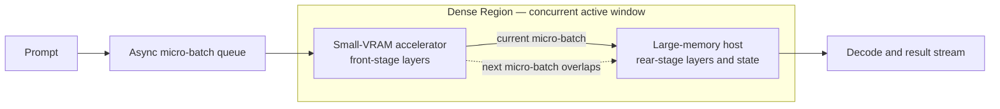

#  Small-VRAM Accelerator + Large-VRAM, Low-Compute Host Dense Acceleration — Heterogeneous GPU PD Lab

[简体中文](README_ZH.md)

Current release: **v2.17 — architecture first, with the six-experiment matrix and the full v2.1→v2.1X evolution restored**. Measurements, unfinished work, and future routes are separated on the homepage; canonical result records and machine-readable CSV files remain the numerical sources of truth.

This repository studies how a high-compute, small-VRAM accelerator can cooperate with a low-compute, large-memory host for LLM inference. It publishes architecture, measured evidence, design evolution, conclusions, and limitations. Deployment commands, patches, endpoints, and private layer-allocation policy remain out of scope.

## Base architecture: how the system works

**Dense Acceleration** means that two devices share useful work from the same model stage: the small-VRAM accelerator and large-memory host own and compute their respective layer stages, while adjacent micro-batches overlap inside a **Dense Region**. The **Sparse Region** retains full-model residency and capacity duties that cannot enter that overlap window. This is not ordinary serial layer execution, tensor parallelism, duplicate same-layer compute, or independent PD with the 395 acting only as remote KV storage.

## Six-experiment matrix: RTX 3080 / RTX 3060 controls

The six cells are defined by the **complete working set at the target context relative to accelerator VRAM**, not by a model name or parameter count. The working set includes weights, KV, compute buffers, and safety margin: **fits easily** leaves stable headroom, **fills the card** approaches usable VRAM, and **does not fit** cannot complete the target workload on that card alone.

Common control contract: each cell should record **RTX 3060 only, RTX 3080 only, AI Max+ 395 only, 3060 + 395, and 3080 + 395** wherever feasible, with the same model, quantization, prompt, context, concurrency, and metrics. If a card cannot hold the workload, “cannot load/complete” is the boundary result; changing model or quantization is not a substitute baseline. Core metrics are Prefill, Decode, TTFT, aggregate throughput, VRAM headroom, and success rate.

**Strict completion today: 0/6 cells fully closed.** Four cells have pilot or partial evidence and two remain untested; any cell missing a matched 3060 / 3080 control is explicitly incomplete.

| Experiment cell | Question to answer | 3080 / 3060 control role | 395 / heterogeneous route and gates | Current status and evidence |
| --- | --- | --- | --- | --- |
| **D1 Dense · fits easily** | When the complete working set fits with headroom, can a dense pipeline still beat the faster card rather than merely add capacity? | The matched 3060 standalone run exists; the same-contract 3080 repeat is pending. | Compare card-only, 395-only, and async layered pipeline on Prefill / Decode / TTFT. | **Partial**: 9B-PIPE-01 is **+34.0% Prefill** and **+15.6% Decode** versus the 3060; 3080 control missing. [Record](results/v2.4-fused-layer-pipeline.md) |
| **D2 Dense · fills the card** | Near the VRAM ceiling, should the route stay card-only, use phase-separated PD, or use a layered Dense Region? | The 20GB 3080 is the primary full-card control for 27B Q4; the 3060 records the non-fit or degraded boundary. | Compare VRAM headroom, TTFT, Prefill, Decode, and handoff cost. | **Partial**: 27B-PD-01 has 3080-Prefill / 395-Decode serving evidence; matched dual-card Dense Acceleration control is missing. [Record](results/qwen3.8-27b-dual-machine-pd.md) |
| **D3 Dense · does not fit** | If one card cannot complete the target working set, can layered residency make it finish and outperform the 395? | The 3060 is the current capacity floor; the 3080 needs the same prompt-depth sweep to determine whether it falls into “full” or “non-fit.” | Gate on completion, long-prompt Prefill, Decode, and TTFT. | **Partial**: 27B-LONG-01 reaches **+133.4% Prefill** at 64K versus the 395 and completes at 98K where the control times out; matched 3080 record missing. [Record](results/qwen3.8-27b-dual-machine-pd.md) |
| **M1 MoE · fits easily** | With a small active set and ample residency headroom, does MoE routing overhead erase heterogeneous overlap gains? | Both 3060 and 3080 need same-model, same-quantization standalone controls. | Compare post-routing Prefill / Decode, acceptance, TTFT, and balance. | **Planned**: no local run satisfies the dual-control contract; no gain is reported. |
| **M2 MoE · fills the card** | Near the 3080 ceiling, is phase separation stable, and does a later Dense Region add speed? | The 3080 is the full-card Prefill control; the 3060 records a non-fit boundary or a smaller same-family case. | Establish route attribution and long-context stability before matched speed comparisons. | **Partial**: ORNITH-PD-01 has **42/42** routed successes and a 100K envelope; matched 3080 / 3060 standalone speed controls are missing, so no acceleration claim is allowed. [Record](results/ornith-1.5-35b-a3b-dual-machine-pd.md) |
| **M3 MoE · does not fit** | When the total working set exceeds both control cards, can layer/expert residency preserve completion, throughput, and output correctness? | Both 3060 and 3080 must first record their standalone capacity boundary. | Gate on completion, routing correctness, Prefill / Decode, memory, and cross-device wait. | **Planned**: FLASH-SPLIT-01 is only an adjacent split-serving envelope; without both standalone controls it cannot close this cell. [Pilot record](results/qwen3.8-flash-q4-layer-split.md) |

## Decision summary

- **The controlled Dense Acceleration result is 9B-PIPE-01.** Against the faster RTX 3060 standalone control, the final pipeline raises Prefill from 1589.00 to **2129.69 tok/s (+34.0%)** and Decode from 43.87 to **50.73 tok/s (+15.6%)**.
- **Use phase-separated PD when the accelerator can hold the required Prefill copy and TTFT matters.** In 9B-PD-01, full PD cuts TTFT from 5.879 to **3.496 s (-40.5%)** while Decode stays flat; the 27B historical service path cuts C1 TTFT from 4825 to **1073 ms (-77.8%)**.
- **Use layered placement when the model does not fit on the small card.** In 27B-LONG-01, 3060 + 395 Prefill is **+110.2% at 4K** and **+133.4% at 64K** versus the matched 395 path; at 98K it completes where the control times out at 900 s.
- **Use remote KV for capacity, not for a compute-acceleration claim.** 27B-KV-01 provides **1M context per stream**, but the 3080 performs all model compute and the 395 is storage-only.
- **Treat Ornith and Flash as operating-envelope evidence.** Ornith passes 42/42 routed requests through 100K stress; Flash passes 21/21 scored requests and reaches its best measured point at **C4: 338.270 total tok/s**. Neither has a matched standalone speed control.

## Results at a glance

### Matched-baseline results — improvement claims are allowed

Percent change is `(tested route / matched control - 1) × 100%`; TTFT is shown as a reduction. Every comparison stays inside one model, quantization, workload, and experiment contract.

| Experiment | Matched comparison | Key measured result | Measured change | Direct conclusion |
| --- | --- | --- | --- | --- |
| **9B-PD-01** | 395-only → full CUDA-Prefill / Vulkan-Decode PD; 9B Q6_K, 5064 in / 128 out | TTFT **5.879 → 3.496 s**; Prefill **861.55 → 1452.29**; Decode **30.24 → 30.28 tok/s** | TTFT **-40.5%**; Prefill **+68.6%**; Decode **+0.1%** | Full state handoff works and lowers prompt latency; phases remain sequential, so this is not Dense Acceleration. |
| **9B-PIPE-01** | Fastest standalone control (RTX 3060) → final async pipeline; same 9B Q6_K envelope | Prefill **1589.00 → 2129.69**; Decode **43.87 → 50.73 tok/s** | Versus 3060: **+34.0% / +15.6%**; versus 395: **+119.6% / +62.2%** | This is the repository's controlled evidence that both devices contribute useful compute in a Dense Region. |
| **27B-LONG-01** | 395-only → layered 3060 + 395; Qwen3.8-27B IQ3 | pp4096 **313.28 → 658.52**; pp65536 **136.69 → 319.10**; pp98304 control timeout / route **225.10 tok/s**; tg64 **18.26 → 19.57** | **+110.2%** at 4K; **+133.4%** at 64K; completion versus timeout at 98K; Decode **+7.2%** | Choose layered residency when the full model cannot fit on the accelerator and long-prompt Prefill is the bottleneck. |
| **27B-PD-01** | 395-only → 3080 Prefill / 395 Decode service path; Q4, C1 | TTFT **4825 → 1073 ms**; Prefill **207.2 → 1000.6**; Decode **36.33 → 38.75 tok/s**; KV transfer **68–76 ms** across C1–C6 | TTFT **-77.8%**; Prefill **+382.9% (4.83×)**; Decode **+6.7%** at C1 | The two-instance service handoff works through C1–C6; it proves phase separation, not simultaneous same-phase compute. |

### Serving envelopes and audits — do not call these speedups

Here, percentages describe scaling inside one fixed configuration or workload sensitivity. They are not gains over a matched standalone system.

| Experiment | Headline measurements | Within-record change | Direct conclusion |
| --- | --- | --- | --- |
| **27B-KV-01** | **1M context per stream**; Profile C Prefill stays at **1194.4–1210.6 tok/s**; aggregate Decode C1→C6: C **33.55→63.84**, latest D summary **63.2→116.3 tok/s** | C **+90.3%**; D **+84.0%** with concurrency | Choose C for Prefill-first balance or D for Decode-first throughput. The 395 is KV-only, so this is a capacity/serving route, not Dense Acceleration. |
| **27B-DRAFT-AUDIT-01** | Repetitive text: **35.0–38.5 tok/s at 100% acceptance**; natural-language C1: **12.1 tok/s at 17.7% acceptance** | Natural-language C1 is **68.6% below** the 38.5 headline | Repetitive-text speculative results do not represent production prose; use workload-matched measurements. |
| **ORNITH-PD-01** | **42/42 passed**, `route=pd`, `n_reuse=0`; 100K Prefill C1→C6 **2895.53→2793.24**; pure Decode aggregate **23.33→148.20 tok/s** | Prefill endpoint change **-3.5%**; Decode concurrency scaling **6.35×** | Use this route for attributable MoE Prefill/Decode roles and 100K stability; no standalone baseline means no causal speedup claim. |
| **FLASH-SPLIT-01** | **21/21 passed**; best C4: Prefill **633.685**, aggregate Decode **71.185**, total **338.270 tok/s** | C1→C4: Prefill **+11.2%**, aggregate Decode **+102.2%**, total **+58.4%** | For this single-server split, C4 is the measured operating point; C5–C6 plateau, and no standalone comparison exists. |

Full rows, metric definitions, and missing fields remain in each linked [result record](results/) and CSV. The homepage repeats only one decision slice per stable experiment; if a summary ever conflicts with its canonical record, the record and CSV win.

## Route selector

| Your actual goal | Route to choose | Evidence anchor | Choose it when / reject it when |
| --- | --- | --- | --- |
| Prove that two devices accelerate the same model work | **Asynchronous layered Dense Acceleration** | 9B-PIPE-01: **+34.0% Prefill, +15.6% Decode** versus the faster standalone endpoint | Choose only with matched standalone controls and both stages doing useful compute. Do not transfer this 9B claim to another model without a new control. |
| Minimize prompt latency with explicit Prefill/Decode ownership | **Independent PD** | 9B-PD-01: TTFT **-40.5%**; 27B-PD-01 C1: TTFT **-77.8%** | Choose when the Prefill endpoint can hold the required model copy and state handoff is available. It is sequential phase specialization, not concurrent Dense Acceleration. |
| Run a model that cannot fit on the small accelerator | **Layered model residency** | 27B-LONG-01: 64K Prefill **2.33×** the 395 control; 98K completes versus timeout | Choose for long-prompt Prefill improvement and capacity sharing. Reject direct comparisons with Q4, 9B, or unrelated engines. |
| Maximize context capacity or concurrent Decode service | **3080 compute + 395 remote-KV pool** | 27B-KV-01: **1M context/stream**; latest Decode-first C6 **116.3 aggregate tok/s** | Choose for capacity. Reject it if the requirement is two-device compute acceleration: the 395 performs no model compute. |
| Validate a MoE PD service at deep context | **Role-separated PD stress route** | ORNITH-PD-01: **42/42 passed**; 100K Decode aggregate reaches **148.20 tok/s at C6** | Choose for route attribution and stability. A matched standalone run is still required before claiming speedup. |
| Prefer one service and need a measured concurrency setting | **Fixed dual-device layer split** | FLASH-SPLIT-01: C4 total **338.270 tok/s**, **+58.4%** versus its own C1 | Choose **C4** for the recorded ~2077/256 workload. Re-benchmark for another prompt mix; this is an operating point, not an acceleration factor. |

## Evidence rules

| Claim type | Minimum evidence | Wording allowed in this repository |
| --- | --- | --- |
| Feasibility | A complete request, valid stage/state transfer, and attributable measurements | “works in this configuration” |
| Acceleration | Same model, quantization, workload, metric, and a matched standalone control | “faster than the matched control” |
| Capacity / serving profile | A completed workload and resource/stability evidence, but no matched speed control | “fits”, “serves”, or “measured envelope”; **not** “accelerates” |
| External context | Public third-party measurements with their original method and source | “contextual reference”; never a local control |

- The README files expose a **decision-level snapshot**: matched baseline, selected result, calculated delta, route choice, and claim boundary.
- Each `results/` record still owns the complete human-readable tables for its experiment. Its linked `data/*.csv` is the machine-readable mirror and calculation source.
- A homepage headline is a summary of the same stable experiment, not another result series or a new experiment.
- `CHANGELOG.md` records publication history and corrections; a release number is not an experiment ID and is not an evidence source.
- Cross-model, cross-quantization, cross-engine, cross-prompt, or cross-topology values are not ranked as if they were controlled experiments.

## Local experiment registry

| Stable ID | Primary question | Control and changed factor | Primary decision gate | Claim supported | Source of record |
| --- | --- | --- | --- | --- | --- |
| **9B-PD-01** | Can CUDA Prefill hand state to Vulkan Decode at all? | AI Max+ 395-only control; change only how much of the prompt the RTX 3060 prefills before handoff | Completed handoff, TTFT/Prefill, Decode continuity, transferred state size | Independent-PD feasibility; not simultaneous compute | [record](results/v1.0-independent-pd.md) · [CSV](data/benchmark-results.csv) |
| **9B-PIPE-01** | Can both devices contribute compute to one model through an asynchronous layered pipeline? | RTX 3060-only and AI Max+ 395-only controls; model/workload fixed while pipeline scheduling is refined | Same-envelope Prefill/Decode versus both controls, repeatability, output boundary | Controlled Dense Acceleration for this 9B envelope | [record](results/v2.4-fused-layer-pipeline.md) · [CSV](data/benchmark-results.csv) |
| **27B-LONG-01** | When 27B does not fit on the accelerator alone, can layered placement improve long-prompt execution over the 395 host? | AI Max+ 395-only at the same IQ3 workload; add the RTX 3060 layer stage | Completion at increasing prompt depth, Prefill, Decode | Long-prompt feasibility and matched-host improvement; not a Q4 or 9B comparison | [record](results/qwen3.8-27b-dual-machine-pd.md) · [CSV](data/qwen27b-local-results.csv) |
| **27B-PD-01** | Can an RTX 3080 Prefill node hand off to a 395 Decode node as a service across C1–C6? | Same model on 395 solo; change the request path to two-node PD | TTFT, Prefill, Decode, KV migration, success across concurrency | Historical two-instance PD scheduling feasibility | [record](results/qwen3.8-27b-dual-machine-pd.md) · [CSV](data/qwen27b-local-results.csv) |
| **27B-KV-01** | What serving trade-off results when the 3080 performs all compute and the 395 is KV-only storage? | No matched no-remote-KV run in the latest series; C/D are two profiles of one experiment, and concurrency is swept | Context capacity, Prefill, single-stream Decode, aggregate Decode, missing-field discipline | Remote-KV capacity and serving envelope; **not Dense Acceleration** | [record](results/qwen3.8-27b-dual-machine-pd.md) · [CSV](data/qwen27b-local-results.csv) |
| **27B-DRAFT-AUDIT-01** | Do repetitive-text speculative-Decode headlines represent natural-language service behavior? | Natural-language requests on the 395 draft path; historical headless result is context, not a matched causal control | Direct prose completion, realized Decode, draft acceptance | Validation guardrail; prevents repetitive-text numbers standing in for production prose | [record](results/qwen3.8-27b-dual-machine-pd.md) · [CSV](data/qwen27b-local-results.csv) |
| **ORNITH-PD-01** | Can a MoE model keep Prefill and Decode roles attributable while surviving short and 100K C1–C6 PD stress? | No same-run single-node speed control; workload depth and concurrency are swept | Route success, no KV reuse, 3080 Prefill and 395 Decode measured in their own windows | Role attribution and stability envelope; not end-to-end speedup | [record](results/ornith-1.5-35b-a3b-dual-machine-pd.md) · [CSV](data/ornith35a3b-local-results.csv) |
| **FLASH-SPLIT-01** | Can one CUDA+Vulkan layer-split server sustain C1–C6, and where does its throughput saturate? | No standalone control; only concurrency changes inside the recorded configuration | HTTP success, aggregate Prefill/Decode, total throughput, VRAM headroom | Concurrency envelope and operating point; not an acceleration proof | [record](results/qwen3.8-flash-q4-layer-split.md) · [CSV](data/qwen38flash-q4-local-results.csv) |

Machine-readable experiment semantics and legacy-label aliases are listed in [data/experiment-index.csv](data/experiment-index.csv).

## Research and experiment evolution: v2.1 → v2.1X (current v2.17)

Here, **v2.1X** denotes the continuous v2.10–v2.19 family; the current release is **v2.17**. v2.1–v2.4 are real scheduling checkpoints inside 9B-PIPE-01. Later releases mix new experiments with attribution and presentation corrections, so the table labels their type instead of counting every release as a new experiment.

| Stage | Type | New question driven by the previous result | Validation / result |
| --- | --- | --- | --- |
| v1.0 | Feasibility experiment | First prove that CUDA Prefill state can hand off to Vulkan Decode. | Full PD: **1452.29 Prefill**, **30.28 tok/s Decode**; the phases remain serial. |
| v2.1 | Pipeline experiment | v1.0 alternates endpoint idle time; can micro-batches from one request overlap? | First fused pipeline: **1865.08 tok/s Prefill**. |
| v2.2 | Repeatability experiment | v2.1 overlap varies by run; is the gain reproducible? | Refined overlap: **1893.87 tok/s Prefill**. |
| v2.3 | Balance experiment | Once overlap repeats, can load balance improve both Prefill and Decode? | **1999.51 Prefill**, **37.16 tok/s Decode**. |
| **v2.4** | Dense Acceleration final | With both endpoints active, can the route beat the faster card and preserve output boundaries? | **2129.69 Prefill**, **50.73 tok/s Decode**; **+34.0% / +15.6%** versus the 3060. |
| v2.5 | New scale experiment | After the 9B mechanism works, can full 3080 Prefill + 395 Decode bring 27B Q4 into serving? | C1 **1000.6 tok/s Prefill**, **1073 ms TTFT**, with C1–C6 completed. |
| v2.6 | Experiment consolidation | The 3060 and 3080 27B records are fragmented; how do input- and generation-first routes fit together? | Unified 27B area; up to **1210.6 Prefill** and **63.2 tok/s single-stream Decode**. |
| v2.7 | Result presentation | The strongest results are buried under implementation detail. | Added Prefill-first / Decode-first profiles; no new measurement. |
| v2.8 | Attribution correction | Compute ownership and capacity value are conflated in C / D. | Clarified 3080 full compute and 395 KV-only with **1M context per stream**; no new measurement. |
| v2.9 | Data correction | The 27B-D C6 peak and its scope need correction. | Corrected C6 aggregate Decode to **116.3 tok/s**; no new experiment. |
| v2.10 | External comparison | C / D and DGX Spark evidence is scattered. | Co-located them with explicit non-comparability; no new local measurement. |
| v2.11 | New MoE experiment | After dense models, do phase attribution and 100K stability hold for MoE? | Ornith: **42/42** success; 395 pure-Decode aggregate up to **148.20 tok/s**. |
| v2.12 | Metric governance | Ornith whole-stage wall-clock derivatives are not independently attributable. | Removed derived Decode presentation and kept directly attributable metrics; no new measurement. |
| v2.13 | Evidence lock | Multiple runs could contaminate the requested record. | Locked r337: 3080 pure Prefill, 395 pure Decode; no new measurement. |
| v2.14 | New split envelope | A single-server dual-device concurrency operating point is still missing. | Flash C4: **633.685 Prefill**, **71.185 aggregate Decode**, **338.270 total tok/s**. |
| v2.15 | Experiment governance | One dataset is repeated in many places and experiment purposes are mixed. | Added stable IDs, one canonical entry, and claim boundaries; no new measurement. |
| v2.16 | Decision dashboard | The simplified homepage hides measured gains and route choices. | Restored key measurements, deltas, and route selection; no new measurement. |
| **v2.17** | Planning restoration | Once data is visible, the base architecture, six-cell plan, and 2.x evolution are still underemphasized. | Moved architecture first; added Dense / MoE × fits easily / fills / does not fit; explicitly records **0/6 fully closed, 4 partial, 2 planned**. |

Additional boundary: **27B-C / 27B-D** are two serving profiles inside 27B-KV-01; the 395 natural-language run is a validation audit; [DGX Spark](results/dgx-spark-community-control.md) is an external reference. None is another local experiment.

## Preserved future plan

| Route | Question driven by current results | Plan and completion gate |
| --- | --- | --- |
| **v3.0** | v2.4 closes only one 9B / 3060 envelope, while the six-experiment matrix remains incomplete. | Fill the 3080 / 3060 controls under one workload contract and adapt one-to-one Dense Acceleration to more large-memory hosts and small-VRAM accelerators; validate Dense Region mapping, lossless Prefill / Decode gains, and scheduling stability. |
| **v4.0** | Once one-to-one is stable, can one accelerator serve X large-memory hosts at the same time? | Study one-to-many scheduling, isolation, fairness, failure recovery, and scaling limits; completion requires reproducible gain as host count rises with bounded per-tenant regression. |

## Reading path

1. Start with the registry above and choose the question that matches your decision.
2. Read that experiment’s contract and boundaries in `results/` before reading its table.
3. Use the linked CSV for calculations; do not combine rows from different stable IDs unless the record explicitly defines a matched control.
4. Use the [changelog](CHANGELOG.md) only to understand when wording, attribution, or files changed.
