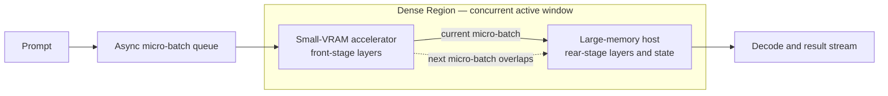

#  Small-VRAM Accelerator + Large-VRAM, Low-Compute Host Dense Acceleration — Heterogeneous GPU PD Lab

[简体中文](README_ZH.md)

This is **v2.20**. It only rewrites the wording so the page reads in one pass: the two accelerators now get separate chapters, single-device numbers come before every two-device result, and the stiff phrasing is gone. Nothing new was measured and no number changed. The exact figures live in the result records under `results/` and the CSV files under `data/`.

This repository studies one thing: how a card with plenty of compute but little VRAM can team up with a host that has weak compute but lots of memory, so that together they run large-model inference.

What is published here: the architecture, the measured numbers, how the design grew step by step, and where each conclusion applies. Deployment commands, patches, endpoints, and the exact layer-allocation policy stay private.

## Base architecture: how the system works

We call this approach **Dense Acceleration**: two devices compute the same stage of the same model.

The small-VRAM card holds the front layers and computes them. The large-memory host holds the rear layers and the state, and computes that half. The point of the **Dense Region** is timing: two neighbouring micro-batches run offset from each other, so at any moment both devices have work in hand and neither one waits.

Everything else belongs to the **Sparse Region**: hold the whole model and carry the context capacity. Whatever cannot fit into the overlap window is caught there.

It also helps to say what this is not. It is not running layers one after another, not tensor parallelism, not two devices computing the same layer twice, and not the kind of independent PD that uses the 395 as a remote KV store.

## Two accelerator tracks: RTX 3060 12GB and RTX 3080 20GB

This project has used exactly two NVIDIA cards so far. They hold different model sizes, so they support different claims, which is why they are two separate tracks. The large-memory host is the same AI Max+ 395 throughout. Before you read any number, check which track it came from.

| | Track 1: RTX 3060 12GB | Track 2: RTX 3080 20GB |
| --- | --- | --- |
| Releases covered | v1.0 → v2.4 | v2.5 → v2.14 |
| VRAM and what fits | 12GB, enough for a 9B dense model and nothing larger | 20GB, which is what makes 27B Q4 and MoE layer splits possible |
| Models run | 9B dense Q6_K; 27B only by placing IQ3 layers across both devices | 27B dense Q4; the Ornith-1.5-35B-A3B and Qwen3.8-Flash MoE models |
| Experiment IDs | 9B-PD-01, 9B-PIPE-01, 27B-LONG-01 | 27B-PD-01, 27B-KV-01, ORNITH-PD-01, FLASH-SPLIT-01 |
| Best result on this track | 9B async pipeline at Prefill **2129.69** and Decode **50.73 tok/s**, which is **+34.0% / +15.6%** faster than the 3060 alone | 27B long prompt at 64K is **+133.4%** faster than the 395 host; the Flash single-server split peaks at C4 with Prefill **633.685** and **338.270 total tok/s** |
| What this track proves | Two devices can share the prefill of one model and still beat the fastest card in the room. This is the only Dense Acceleration result here that has a control. | A bigger card lifts model size, context depth, and concurrency all at once. But this track has no single-device run under the same conditions, so it only shows what can run and how well it serves. |
| What this track is missing | The same 9B test has never been repeated on the RTX 3080 | The 27B and MoE cells have no matched 3060 or 3080 single-card run |

The two tracks never go into one ranking. A percentage measured on the 3060 track does not carry over to a model on the 3080 track, and the higher raw throughput of the 3080 track is not progress on the 3060 track. One more note: this repository holds no RTX 3090 measurement of any kind. That card was ruled out during selection, so none of these numbers involve a 3090.

## Experiment timeline: v1.0 → v2.20

A release number is a publication order, not a count of experiments. v2.1 through v2.4, for instance, are four checkpoints inside one 9B pipeline experiment. Later releases mix real new experiments with work that only files data correctly or rewrites text. The table below spells out the difference, and each phase heading names the card it used.

### Phase 1: v1.0 → v2.4 · accelerator RTX 3060 12GB · 9B goes from "can they hand off at all" to "faster than the fastest single card"

This phase answers "is it possible" first and "is it fast" second. It starts from a plain question: can two devices hand the intermediate state over at all. By the end, both devices compute on the same model and the async pipeline beats the fastest single card present. Prefill climbs the whole way: **1452.29 → 1865.08 → 1893.87 → 1999.51 → 2129.69 tok/s**, and every step has a reason we can name.

| Version | What this step asks | What was measured | What came out | How the conclusion moved forward |
| --- | --- | --- | --- | --- |
| v1.0 | Can CUDA Prefill hand its state to Vulkan Decode? | 9B Q6_K, 5064 in / 128 out. The RTX 3060 prefilled 0 / 512 / 2048 / all tokens, compared against the AI Max+ 395 host (**9B-PD-01**). | Full PD: TTFT **3.496 s**, Prefill **1452.29**, Decode **30.28 tok/s**; the 395 host measured 5.879 s, 861.55, 30.24. | The handoff works. First-token latency and Prefill both improve and Decode holds. But the two devices still run one after the other, which leads straight to the pipeline work. |
| v2.1 | In v1.0 each device idles in turn; can micro-batches overlap? | First fused-pipeline checkpoint, same 9B Q6_K setup. | Prefill **1865.08 tok/s**. | Overlapping pays off. Prefill passes the RTX 3060 single-card figure of 1589.00 for the first time. |
| v2.2 | Does that gain repeat? | More tuning of the overlap. | Prefill **1893.87 tok/s**. | Run-to-run spread narrows, so the gain holds up. |
| v2.3 | Does rebalancing the two ends improve both? | Tuned the load balance between the stages. | Prefill **1999.51**, Decode **37.16 tok/s**. | Decode is recorded for the first time, and both figures improve together. |
| **v2.4** | With both ends busy, can the route beat the fastest card and keep output quality in bounds? | Final calibration run, closed as **9B-PIPE-01**. The same release also added a separate 27B IQ3 layered check, the DGX Spark outside comparison (**EXT-DGX-01**), and a full Chinese mirror. | Prefill **2129.69**, Decode **50.73 tok/s**; against the RTX 3060 alone (1589.00 / 43.87) that is **+34.0% / +15.6%**. 27B IQ3: pp4096 **658.52**, pp65536 **319.10**, pp98304 **225.10**, tg64 **19.57 tok/s**. | Dense Acceleration works end to end at this setting, and the Dense Region gets its name here. The 27B data later became 27B-LONG-01. EXT-DGX-01 stays background only and is never ranked against local rows. |

### Phase 2: v2.5 → v2.10 · switch to the RTX 3080 20GB · model scales up to 27B

This phase moves the method proven on 9B onto a bigger model and a stronger card. Five new questions came up: placing layers across devices, PD while actually serving, using the 395 as a remote KV store, auditing speculative-decode numbers, and comparing against an outside machine. The verdict at the end: once the model gets large, pick the route by goal. Separate the phases to cut first-token latency, use remote KV when you need capacity, and split the layers when prompts are very long. None of the three is Dense Acceleration.

| Version | What this step asks | What was measured | What came out | How the conclusion moved forward |
| --- | --- | --- | --- | --- |
| v2.5 | Now that the 9B method works, can the 3080 take all Prefill and the 395 all Decode, and carry 27B Q4 in a real service? | Moved to the **RTX 3080 20GB**. Six concurrency tiers, C1 through C6, each on the split and solo paths, for twelve measured serving groups (**27B-PD-01**). | C1: TTFT **1073 / 4825 ms**, Prefill **1000.6 / 207.2**, Decode **38.75 / 36.33 tok/s**; KV transfer takes **68–76 ms** across C1–C6. After we removed the per-ubatch RPC sync, Prefill went from **683.2** to **1000.6 tok/s**, about **82%** of the 3080's own **1228.53 tok/s**. | PD works while serving. Prefill does not fall off as concurrency rises and Decode is unharmed. The sync overhead is identified as the biggest waste at that point. |
| v2.6 | The 3060 / IQ3 and 3080 / Q4 records of 27B sit apart; how do they fit together? | Merged them into one 27B section. Published the 3080 router v1.1 and the live v1.2. Added a natural-language audit on the 395 (**27B-DRAFT-AUDIT-01**). | Prefill up to **1210.6**, single-stream Decode **63.2 tok/s**. Repetitive text: **35.0–38.5 tok/s** at 100% acceptance; natural-language C1: only **12.1 tok/s** at 17.7% acceptance. | Two profiles take shape, one Prefill-first and one Decode-first. The audit also sets a rule: a high score on repetitive text does not stand for real text. |
| v2.7 | The strongest results are buried under implementation detail. | Reordered the presentation only. | No new measurement. | Route choice now comes before parameter detail. |
| v2.8 | In profiles C and D, "which device computes" and "how much it can hold" were mixed together. | Sorted out which device gets the credit. | No new measurement. Confirmed that all compute runs on the 3080 and the 395 only stores KV, with **1M** context per stream. | Remote KV is now clearly a capacity route, not a way to compute faster. |
| v2.9 | The 27B-D peak at C6 and its scope needed a correction. | Data fix. | Aggregate Decode at C6 corrected to **116.3 tok/s**. No new experiment. | The figure and the conditions it applies to now agree. |
| v2.10 | The C, D, and DGX Spark numbers were scattered. | Pulled them into one comparison table and gave the **DFlash2 acceleration head** its own category. | No new local measurement. The public DGX Spark figures are about **1000 tok/s Prefill, 25–30 tok/s single-stream Decode, 107 tok/s aggregate Decode, C1–C6 concurrency**, marked as not directly comparable. | Outside figures and local data now sit in separate columns instead of one list. |

### Phase 3: v2.11 → v2.14 · still the RTX 3080 20GB · extends to MoE models and a single-server layer split

This phase asks two questions. First, with an MoE model, can we still tell which device did the Prefill and which did the Decode? Second, when only one server runs, at which concurrency tier does throughput stop growing? The answers: MoE PD runs steadily and the two jobs stay clearly separated, but with no single-device figure to compare against there is no speed claim; the Flash layer split points to C4 as the tier that works best.

| Version | What this step asks | What was measured | What came out | How the conclusion moved forward |
| --- | --- | --- | --- | --- |
| v2.11 | On an MoE model, do the job split and 100K-context stability still hold? | Ornith-1.5-35B-A3B two-machine PD stress test: the 3080 does all Prefill, the 395 does all Decode (**ORNITH-PD-01**). | **42/42** requests passed, `route=pd`, `n_reuse=0`. Short-task aggregate Prefill **4017.46 → 3943.88**; 100K aggregate Prefill **2895.53 → 2793.24**; 395 pure-Decode aggregate **23.33 → 148.20 tok/s**. | MoE PD runs steadily and the split is clean. But the same run has no single-device figure, so nothing is claimed about speed. |
| v2.12 | Can numbers derived from whole-stage wall-clock time be credited to one device? | Metric cleanup. | No new measurement. Removed the derived Decode display. | Published metrics now include only quantities that belong to one device. |
| v2.13 | Other runs may have contaminated the record. | Locked the evidence to r337. | No new measurement. Locked to 3080 pure Prefill and 395 pure Decode. | The Ornith numbers now have exactly one source. |
| v2.14 | With one server driving both devices, at which tier does throughput stop growing? | r374 Qwen3.8-Flash Q4: a single llama-server uses the 3080 and the 395 together across C1–C6 (**FLASH-SPLIT-01**). | All **21/21** scored requests passed. C4 is best: Prefill **633.685**, aggregate Decode **71.185**, total **338.270 tok/s**. Peak 3080 VRAM **19129 MiB**. | For this configuration the tier that works best is C4. There is no single-device comparison, so this is not proof of a speedup. |

### Phase 4: v2.15 → v2.20 · no hardware change and no new tests, only filing the data properly and rewriting the text

This phase produced **no new tests and no new numbers**. Only two kinds of work happened: putting each result where it belongs, and making the text readable. By the end, every experiment has a fixed ID and one record to go to, the two cards are described separately, and the homepage keeps only the figures you need to make a call.

| Version | What this step asks | What was measured | What came out | How the conclusion moved forward |
| --- | --- | --- | --- | --- |
| v2.15 | The same data showed up in several places and the purposes were mixed together. | Cleaned up the experiment set. Added `data/experiment-index.csv` and put the v2.4 Decode figure of **50.73** back into `data/benchmark-results.csv`. | No new measurement. | Each experiment now has a fixed ID, one record, and a stated scope. |
| v2.16 | The homepage was cut down so far that outside readers could not see the gains. | Put the key data back on the homepage. | No new measurement. | Key figures, the measured gains, and the route table returned to the front page. |
| v2.17 | The data was visible again, but the architecture and the six-cell plan still did not stand out. | Restructured the page. | No new measurement. | The architecture moved to the top and the six-cell matrix was created, with progress marked as **0/6 finished, 4 cells partly measured, 2 cells untested**. |
| v2.18 | You could not read the progress from one release to the next, and the sentences were clumsy. | Rewrote the narrative. | No new measurement. | The timeline moved to the front in four phases, one row per release, saying what it asked and what it got. |
| v2.19 | The 3060 and 3080 tracks were told as one story, and two-device results came before single-device numbers. | Split the tracks and moved single-device data up. | No new measurement. | Each card got its own chapter, every cell and row names the card it used, and single-device figures now come before all two-device results. |
| **v2.20** | Many sentences on the homepage were stacked-up jargon, awkward in both languages. | Rewrote the prose throughout. | No new measurement. | Jargon replaced with plain wording and long sentences broken up. Structure, numbers, and conclusions are untouched. |

A few things that are easy to double-count: **27B-C and 27B-D** are two configurations of the single experiment 27B-KV-01, not two experiments; the natural-language run on the 395 belongs to 27B-DRAFT-AUDIT-01; and [DGX Spark](results/dgx-spark-community-control.md) is a public result from someone else's machine, kept as background. None of the three counts as another local experiment.

## Six experiment cells, with the 3060 and 3080 as the controls

The six cells are not sorted by model name or parameter count. They are sorted by **how much VRAM the model needs at run time compared with what the accelerator has**. That footprint includes weights, KV, compute buffers, and a safety margin. **Fits easily** means there is comfortable headroom; **fills the card** means the VRAM ceiling is close; **does not fit** means one card cannot finish the job on its own.

Each cell should be measured in five configurations wherever possible: **RTX 3060 alone, RTX 3080 alone, AI Max+ 395 alone, 3060 + 395, and 3080 + 395**. Within a cell, the model, quantization, prompt, context length, concurrency, and metrics all have to match. If a card genuinely cannot hold the workload, then "will not load / cannot finish" is itself a valid result; swapping in a smaller model or a harsher quantization does not count as a baseline. The metrics are fixed: Prefill, Decode, TTFT, total throughput, VRAM left over, and success rate.

**Right now not one of the six cells is finished.** Four have partial data and two have not been measured at all. Any cell missing a matched 3060 or 3080 baseline is marked incomplete.

| Cell | Question to answer | Role of the 3060 and 3080 here | What the two-device route is judged on | Where it stands today |
| --- | --- | --- | --- | --- |
| **D1 Dense · fits easily** Card measured: **RTX 3060** | With the model held comfortably on the card, can a dense pipeline actually beat the faster card, rather than just add capacity? | The matched 3060 single-card run exists; the same run on the 3080 is still pending. | Compare card alone, 395 alone, and the async layered pipeline on Prefill / Decode / TTFT. | **Partly done**: 9B-PIPE-01 is **+34.0%** on Prefill and **+15.6%** on Decode against the 3060; the 3080 comparison is missing. [Record](results/v2.4-fused-layer-pipeline.md) |
| **D2 Dense · fills the card** Card measured: **RTX 3080** | With VRAM nearly full, which wins: the whole model on one card, separated phases, or a layered dense route? | The 20GB 3080 is the main full-card control for 27B Q4; the 3060 records where the same model will not fit or has to be degraded. | Compare VRAM left over, TTFT, Prefill, Decode, and the cost of the handoff. | **Partly done**: 27B-PD-01 has serving data with the 3080 on Prefill and the 395 on Decode; a matched two-card dense comparison is missing. [Record](results/qwen3.8-27b-dual-machine-pd.md) |
| **D3 Dense · does not fit** Card measured: **RTX 3060** | When one card cannot finish the job, can splitting the model across devices finish it and still beat the 395? | The 3060 is the current capacity floor; the 3080 needs the same prompt-depth run to tell whether it counts as "fills the card" or "does not fit". | Judge on whether it finishes, long-prompt Prefill, Decode, and TTFT. | **Partly done**: 27B-LONG-01 is **+133.4%** on Prefill at 64K against the 395, and at 98K it finishes where the control times out; the matching 3080 record is missing. [Record](results/qwen3.8-27b-dual-machine-pd.md) |
| **M1 MoE · fits easily** Card measured: **neither card yet** | With a small active set and plenty of headroom, does MoE routing overhead eat up what the overlap saves? | Both the 3060 and the 3080 need single-card runs on the same model and quantization first. | Compare Prefill / Decode after routing, acceptance rate, TTFT, and how evenly the load spreads. | **Untested**: no local run meets the two-control requirement, so no gain is reported. |
| **M2 MoE · fills the card** Card measured: **RTX 3080** | With MoE nearly filling the 3080, is phase separation stable, and would a dense overlap on top add anything? | The 3080 is the full-card Prefill control; the 3060 records where it will not fit, or a smaller model from the same family. | Confirm the routing split and long-context stability first, then add matched speed comparisons. | **Partly done**: ORNITH-PD-01 has **42/42** requests routed successfully and a stable 100K record; the 3080 and 3060 single-device speed runs are missing, so no speed claim is allowed. [Record](results/ornith-1.5-35b-a3b-dual-machine-pd.md) |
| **M3 MoE · does not fit** Card measured: **RTX 3080 (pilot only)** | When the total footprint exceeds both control cards, can splitting by layer or by expert keep it running, keep throughput, and keep the output correct? | Both cards must first record the capacity limit where they cannot finish alone. | Judge on completion, routing correctness, Prefill / Decode, memory use, and cross-device waiting. | **Untested**: FLASH-SPLIT-01 only gives a nearby layer-split serving record, and without single-card runs on both cards it cannot stand in for this cell. [Pilot record](results/qwen3.8-flash-q4-layer-split.md) |

## The conclusions in a few lines

- **Only 9B-PIPE-01 has a control and can be called Dense Acceleration.** Against the faster RTX 3060 alone, Prefill rises from 1589.00 to **2129.69 tok/s (+34.0%)** and Decode from 43.87 to **50.73 tok/s (+15.6%)**.
- **If you only want the first token sooner, and the accelerator can hold the model copy that Prefill needs, use phase-separated PD.** In 9B-PD-01, full PD cuts TTFT from 5.879 s to **3.496 s (-40.5%)** while Decode stays flat; on 27B the service path cuts C1 TTFT from 4825 ms to **1073 ms (-77.8%)**.
- **If the model will not fit on the small card, split it across devices.** In 27B-LONG-01 the 3060 + 395 route is **+110.2%** on Prefill at 4K and **+133.4%** at 64K against the 395; at 98K the 395 alone was still running at 900 s while the split route finished.
- **If you just need a bigger context, use remote KV, but do not call it faster compute.** 27B-KV-01 reaches **1M context per stream**. All model compute runs on the 3080 and the 395 only stores KV.
- **Ornith and Flash only show how well the setup serves.** Ornith passed all 42 requests through the 100K stress test; Flash passed all 21 scored requests, with its best tier at **C4 and 338.270 total tok/s**. Neither has a single-device figure to compare with.

## The measurements

### Start with what each device does alone

Every two-device number below is meant to be read against these single-device rows. The values are copied straight from the CSV files, with no conversion and no estimation.

**The 9B Q6_K tier** (for 9B-PD-01 and 9B-PIPE-01)

| Single device | Model and quantization | How it was measured | Prefill | Decode |
| --- | --- | --- | --- | --- |
| **RTX 3060 12GB, card alone** | 9B Q6_K | `llama-bench`, pp5064 / tg128 | **1589.00 tok/s** | **43.87 tok/s** |
| **AI Max+ 395 alone (while serving)** | 9B Q6_K | server, second run, 5064 in / 128 out | **861.55 tok/s** | **30.24 tok/s** |
| **AI Max+ 395 alone (`llama-bench`)** | 9B Q6_K | `llama-bench`, pp5064 / tg128 | **970.00 tok/s** | **31.27 tok/s** |

The 395 has two figures. They do not disagree; they were measured differently. The serving figure is the control for the v1.0 independent PD run, and the `llama-bench` figure is the control for the v2.4 fused pipeline. A single comparison has to stay within one method. All three rows come from [benchmark-results.csv](data/benchmark-results.csv).

**The 27B tier** (for 27B-LONG-01, 27B-PD-01, and 27B-KV-01)

The RTX 3060 cannot hold a full 27B model, so this tier has no 3060 row — only the 3080 card and the 395 host.

| Single device | Model and quantization | Workload | Measured |
| --- | --- | --- | --- |
| **RTX 3080 20GB, card alone** | 27B Q4 | pp1024 / pp4096 / tg64 | Prefill **1228.53** / **1203.06 tok/s**; Decode **33.08 tok/s** |
| **AI Max+ 395 alone (IQ3)** | 27B IQ3 | pp4096 / pp65536 / pp98304 / tg64 | Prefill **313.28** / **136.69 tok/s**, and pp98304 times out at 900 s; Decode **18.26 tok/s** |
| **AI Max+ 395 alone (Q4, while serving)** | 27B Q4 | C1, solo path | TTFT **4825 ms**; Prefill **207.2 tok/s**; Decode **36.33 tok/s** |

All three 27B rows come from [qwen27b-local-results.csv](data/qwen27b-local-results.csv). The two MoE experiments, ORNITH-PD-01 and FLASH-SPLIT-01, have no matching single-card or single-host figure at all, which is why they appear only in the "no control" table below.

### Experiments with a control — gains can be calculated

Each gain is `(this route / the control - 1) × 100%`, and TTFT is shown as a reduction. Every row stays inside one model, one quantization, and one workload, and names the card it ran on.

| Experiment | Accelerator | The control | This route | Measured gain | What it says |
| --- | --- | --- | --- | --- | --- |
| **9B-PD-01** | RTX 3060 12GB | 395 alone: TTFT **5.879 s**, Prefill **861.55**, Decode **30.24 tok/s** (9B Q6_K, 5064 in / 128 out) | All Prefill on CUDA, Decode on Vulkan: TTFT **3.496 s**, Prefill **1452.29**, Decode **30.28 tok/s** | TTFT **-40.5%**; Prefill **+68.6%**; Decode **+0.1%** | The whole state can be handed over, and the first token arrives sooner. The two stages still run in sequence, so this is not Dense Acceleration. |
| **9B-PIPE-01** | RTX 3060 12GB | RTX 3060 alone: Prefill **1589.00**, Decode **43.87 tok/s**; the 395 measured the same way is **970.00 / 31.27 tok/s** | Final async layered pipeline: Prefill **2129.69**, Decode **50.73 tok/s** | Against the 3060: **+34.0% / +15.6%**; against the 395: **+119.6% / +62.2%** | This is the one result here, with a control, where both devices really do useful work inside the Dense Region. |
| **27B-LONG-01** | RTX 3060 12GB | 395 alone (27B IQ3): pp4096 **313.28**, pp65536 **136.69**, pp98304 times out at 900 s, tg64 **18.26 tok/s** | 3060 + 395 with layers split: pp4096 **658.52**, pp65536 **319.10**, pp98304 **225.10**, tg64 **19.57 tok/s** | **+110.2%** at 4K; **+133.4%** at 64K; finishes at 98K instead of timing out; Decode **+7.2%** | When the small card cannot hold the whole model and long-prompt Prefill is the bottleneck, split the layers. |
| **27B-PD-01** | RTX 3080 20GB | 395 alone (27B Q4, tier C1): TTFT **4825 ms**, Prefill **207.2**, Decode **36.33 tok/s** | 3080 on Prefill, 395 on Decode, as a service: TTFT **1073 ms**, Prefill **1000.6**, Decode **38.75 tok/s**; KV transfer **68–76 ms** across C1–C6 | TTFT **-77.8%**; Prefill **+382.9% (4.83×)**; Decode **+6.7%** | The handoff between two service instances holds from C1 to C6. It proves that the phases can be separated, not that both compute at once. |

### Experiments without a control — how well they serve, not how much faster

The percentages here describe what happens inside one fixed configuration as concurrency rises. They are not gains over a single device. All four ran on the RTX 3080 20GB.

| Experiment | Accelerator | Key measurements | Change inside the same configuration | Control that is missing | What it says |
| --- | --- | --- | --- | --- | --- |
| **27B-KV-01** | RTX 3080 20GB | **1M context per stream**; in profile C, Prefill stays at **1194.4–1210.6 tok/s**; aggregate Decode from C1 to C6 is **33.55→63.84** in profile C and **63.2→116.3 tok/s** in the latest profile D summary | Going from C1 to C6, C gains **+90.3%** and D gains **+84.0%** | No same-run series with the 3080 and no remote KV | Pick C for high Prefill or D for total Decode throughput. The 395 only stores KV, so this is a capacity and serving route, not Dense Acceleration. |
| **27B-DRAFT-AUDIT-01** | RTX 3080 20GB (draft model on the 395) | Repetitive text: **35.0–38.5 tok/s at 100% acceptance**; natural-language C1: **12.1 tok/s at 17.7% acceptance** | Natural-language C1 is **68.6% below** the 38.5 headline | Not applicable; this is an audit, not a speed test | A high speculative-decode score on repetitive text does not represent real text. Comparisons need data from a matching workload. |
| **ORNITH-PD-01** | RTX 3080 20GB | **42/42 passed**, `route=pd`, `n_reuse=0`; Prefill at 100K goes **2895.53→2793.24** from C1 to C6; pure Decode aggregate **23.33→148.20 tok/s** | Prefill moves only **-3.5%** from C1 to C6; Decode scales **6.35×** with concurrency | No 3080-alone or 395-alone speed figure from the same run | Good for checking which device owns Prefill and which owns Decode on an MoE model, and how stable it stays at 100K. Without a single-device figure, no gain can be attributed to the route. |
| **FLASH-SPLIT-01** | RTX 3080 20GB | **21/21 passed**; C4 is best: Prefill **633.685**, aggregate Decode **71.185**, total **338.270 tok/s** | From C1 to C4: Prefill **+11.2%**, aggregate Decode **+102.2%**, total **+58.4%** | No matching 3080-alone or 395-alone run | For this single-server layer split, C4 is the tier that works best. C5 and C6 stop growing, and there is no single-device comparison. |

The full rows, the metric definitions, and the fields that are missing all live in each [result record](results/) and its CSV. The homepage takes one key figure per experiment, and a figure quoted here is not a new experiment. If the homepage and a record disagree, the record and the CSV win.

## Choosing a route

| Your goal | Route to choose | Accelerator | Evidence | When it applies / when it does not |
| --- | --- | --- | --- | --- |
| Show that two devices compute one model faster together | **Asynchronous layered Dense Acceleration** | RTX 3060 12GB | 9B-PIPE-01: **+34.0% Prefill and +15.6% Decode** over the faster single device | Only claim this when a single-device control exists and both stages really do work. Do not carry the 9B result over to another model without a new control. |
| Get the first token sooner and keep Prefill and Decode on separate devices | **Independent PD** | 3060 for 9B, 3080 for 27B | 9B-PD-01: TTFT **-40.5%**; 27B-PD-01 at C1: TTFT **-77.8%** | Choose it when the Prefill side can hold the model copy it needs and the state can be handed over. It divides the work in time, not two devices computing at once. |
| Run a model that will not fit on the small accelerator | **Split the model across devices** | RTX 3060 12GB | 27B-LONG-01: Prefill at 64K is **2.33×** the 395 control; 98K finishes instead of timing out | Good for lifting long-prompt Prefill, or simply for capacity. Do not compare it directly with Q4, with 9B, or with a different engine. |
| Push context length as far as possible, or serve many concurrent Decode streams | **3080 for compute plus the 395 as a remote KV store** | RTX 3080 20GB | 27B-KV-01: **1M context per stream**; the Decode-first profile reaches **116.3 aggregate tok/s** at C6 | Choose it for capacity. Do not choose it if the goal is two devices computing faster together: the 395 does no model compute at all. |
| Validate an MoE PD service at deep context | **Role-separated PD stress route** | RTX 3080 20GB | ORNITH-PD-01: **42/42 passed**; at 100K, C6 reaches **148.20 aggregate tok/s** on Decode | Use it to check role ownership and stability. Speed claims need a matching single-device run first. |
| Run one service and know which concurrency tier to set | **A fixed two-device layer split** | RTX 3080 20GB | FLASH-SPLIT-01: total **338.270 tok/s** at C4, **+58.4%** over its own C1 | Under the recorded workload of roughly 2077 in / 256 out, the best tier measured is **C4**. Any other prompt mix needs a fresh run. This is a setting to use, not a speedup factor. |

## What kind of data supports what kind of claim

| Claim | Minimum evidence | How it may be worded |
| --- | --- | --- |
| It runs | The request completes, the stage and state transfer succeed, and every metric can be traced to a device | "this configuration runs" |
| It is faster | Same model, quantization, workload, and metric, plus a single-device figure to compare with | "faster than the control" |
| It fits and serves | The workload completes and there is memory and stability data, but no comparable speed figure | "it fits", "it serves", "measured this far"; **never** "it accelerates" |
| Outside reference | A public third-party measurement, with its original method and source noted | "background reference"; never used as a local control |

- The two README files carry only **what you need to make a decision**: the control figure, the chosen result, the calculated gain, the route advice, and where it applies.
- The full tables for each experiment stay in its `results/` record, and the matching `data/*.csv` is the machine-readable copy and the source of every calculation.
- Figures in bold on the homepage are quoted from existing experiments; they are not another round of testing.
- Every figure has to name its card, RTX 3060 or RTX 3080. Results from the two cards are never combined into one calculation.
- `CHANGELOG.md` records what each release changed or corrected. A release number is not an experiment ID and is not a data source.
- Numbers from different models, quantizations, engines, prompts, or connection setups are never lined up as one ranking.

## Local experiment registry

| ID | Accelerator | Question | Control and variable | Metrics watched | Claim it supports | Record |
| --- | --- | --- | --- | --- | --- | --- |
| **9B-PD-01** | RTX 3060 12GB | Can CUDA Prefill hand its state to Vulkan Decode at all? | Control is the AI Max+ 395 alone; the only variable is how many tokens the RTX 3060 prefills | Whether the handoff completes, TTFT / Prefill, whether Decode stays continuous, and the size of the transferred state | Independent PD runs; it says nothing about both devices computing at once | [record](results/v1.0-independent-pd.md) · [CSV](data/benchmark-results.csv) |
| **9B-PIPE-01** | RTX 3060 12GB | Can both devices compute one model together through an asynchronous layered pipeline? | Controls are the RTX 3060 alone and the AI Max+ 395 alone; model and workload are fixed and only the pipeline schedule is tuned | Prefill / Decode against both controls under the same conditions, repeatability, and output bounds | Dense Acceleration with a control, at this 9B setting | [record](results/v2.4-fused-layer-pipeline.md) · [CSV](data/benchmark-results.csv) |
| **27B-LONG-01** | RTX 3060 12GB | When 27B will not fit on the card alone, does splitting the layers make long prompts faster than the 395 alone? | Control is the 395 alone at the same IQ3 workload; the variable is the RTX 3060 layer stage that gets added | Whether it finishes at increasing prompt depth, Prefill, and Decode | Long prompts run, and run faster than the 395; it does not carry over to Q4 or 9B | [record](results/qwen3.8-27b-dual-machine-pd.md) · [CSV](data/qwen27b-local-results.csv) |
| **27B-PD-01** | RTX 3080 20GB | Can an RTX 3080 Prefill node hand off to a 395 Decode node as a service from C1 to C6? | Control is the same model on the 395 alone; the only variable is whether the request takes the two-node PD path | TTFT, Prefill, Decode, KV transfer, and success at every concurrency tier | Two-instance PD scheduling works | [record](results/qwen3.8-27b-dual-machine-pd.md) · [CSV](data/qwen27b-local-results.csv) |
| **27B-KV-01** | RTX 3080 20GB | With the 3080 doing all compute and the 395 storing KV only, what does the service trade off? | The latest series has no "3080 without remote KV" control; C and D are two configurations of one experiment, and only concurrency changes | Context capacity, Prefill, single-stream and aggregate Decode, and honest marking of missing fields | Remote-KV capacity and serving ability; **not Dense Acceleration** | [record](results/qwen3.8-27b-dual-machine-pd.md) · [CSV](data/qwen27b-local-results.csv) |
| **27B-DRAFT-AUDIT-01** | RTX 3080 20GB | Does a high speculative-Decode score on repetitive text represent real service? | Natural-language requests sent straight down the 395 draft path; the earlier headless result is background, not a control | Whether real text completes, the Decode actually achieved, and the draft acceptance rate | A guardrail: repetitive-text numbers may not stand in for real text | [record](results/qwen3.8-27b-dual-machine-pd.md) · [CSV](data/qwen27b-local-results.csv) |
| **ORNITH-PD-01** | RTX 3080 20GB | Can an MoE model keep Prefill and Decode clearly separated while surviving short and 100K stress from C1 to C6? | No single-device speed control in the same run; the variables are workload depth and concurrency | Whether routing succeeds, that no KV is reused, and that 3080 Prefill and 395 Decode are timed in their own windows | Role ownership and stability; it does not show an end-to-end speedup | [record](results/ornith-1.5-35b-a3b-dual-machine-pd.md) · [CSV](data/ornith35a3b-local-results.csv) |
| **FLASH-SPLIT-01** | RTX 3080 20GB | Can one server split across CUDA and Vulkan hold C1 to C6, and where does throughput level off? | No single-device control; only concurrency changes inside this configuration | HTTP success, aggregate Prefill / Decode, total throughput, and VRAM left over | How far concurrency scales and which tier to use; not proof of a speedup | [record](results/qwen3.8-flash-q4-layer-split.md) · [CSV](data/qwen38flash-q4-local-results.csv) |

The machine-readable list of experiment IDs and their legacy labels is in [data/experiment-index.csv](data/experiment-index.csv).

## The plan from here

| Release | Question the current results raise | Plan, and what counts as done |
| --- | --- | --- |
| **v3.0** | v2.4 is only complete for one setting, 9B on the 3060, and most of the six cells are still open. | Fill in the 3060 and 3080 baselines under one workload standard, then take one-to-one Dense Acceleration to more large-memory hosts and more small-VRAM cards. Done means three things: the Dense Region maps cleanly, the Prefill and Decode gains survive, and scheduling stays stable. |
| **v4.0** | Once one-to-one is stable, can one accelerator serve several large-memory hosts at the same time? | Study one-to-many scheduling, resource isolation, fair sharing, failure recovery, and the scaling limit. Done means the gain still reproduces as hosts are added, with per-host slowdown kept inside an acceptable range. |

## How to read this repository

1. Start with "Two accelerator tracks" and work out which card produced the numbers you care about.
2. Then read "Start with what each device does alone" and keep the card-alone and host-alone figures for that tier in mind.
3. Next, use the six cells or the measurement tables to find the experiment that matches your question.
4. Open the record in `results/` and read the test conditions and limits before the data. Use the linked CSV for your own calculations, and do not combine rows from different experiment IDs unless the record states that they share a control.
5. Use the [changelog](CHANGELOG.md) to find out when a piece of text, a credit line, or a file changed.
