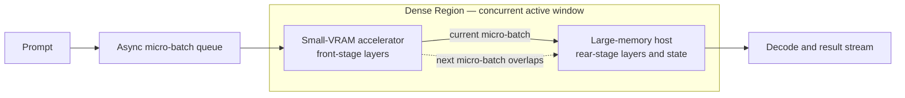

#  Small-VRAM Accelerator + Large-VRAM, Low-Compute Host Dense Acceleration — Heterogeneous GPU PD Lab

[简体中文](README_ZH.md)

Current release: **v2.15 — the experiment catalogue has been rebuilt around research questions, controls, changed factors, decision metrics, and claim boundaries**. Benchmark tables now live only in their detailed result records and machine-readable CSV files; this homepage is the navigation and interpretation layer.

This repository studies how a high-compute, small-VRAM accelerator can cooperate with a low-compute, large-memory host for LLM inference. It publishes architecture, measured evidence, design evolution, conclusions, and limitations. Deployment commands, patches, endpoints, and private layer-allocation policy remain out of scope.

## Architecture under study

**Dense Acceleration** means that both devices own part of the same model-stage work and contribute useful compute inside an asynchronous layered pipeline. The **Dense Region** is the scheduling-overlap window in which adjacent micro-batches keep both stages active. It is not tensor parallelism, duplicated same-layer computation, or a generic name for remote KV storage.

## Evidence rules

| Claim type | Minimum evidence | Wording allowed in this repository |
| --- | --- | --- |
| Feasibility | A complete request, valid stage/state transfer, and attributable measurements | “works in this configuration” |
| Acceleration | Same model, quantization, workload, metric, and a matched standalone control | “faster than the matched control” |
| Capacity / serving profile | A completed workload and resource/stability evidence, but no matched speed control | “fits”, “serves”, or “measured envelope”; **not** “accelerates” |
| External context | Public third-party measurements with their original method and source | “contextual reference”; never a local control |

- The README files contain **no benchmark result tables**. They identify what each experiment tests and where its source of record lives.
- Each `results/` record owns the human-readable tables for its experiment. Its linked `data/*.csv` is the machine-readable mirror.
- `CHANGELOG.md` records publication history and corrections; a release number is not an experiment ID and is not an evidence source.
- Cross-model, cross-quantization, cross-engine, cross-prompt, or cross-topology values are not ranked as if they were controlled experiments.

## Local experiment registry

| Stable ID | Primary question | Control and changed factor | Primary decision gate | Claim supported | Source of record |
| --- | --- | --- | --- | --- | --- |
| **9B-PD-01** | Can CUDA Prefill hand state to Vulkan Decode at all? | AI Max+ 395-only control; change only how much of the prompt the RTX 3060 prefills before handoff | Completed handoff, TTFT/Prefill, Decode continuity, transferred state size | Independent-PD feasibility; not simultaneous compute | [record](results/v1.0-independent-pd.md) · [CSV](data/benchmark-results.csv) |
| **9B-PIPE-01** | Can both devices contribute compute to one model through an asynchronous layered pipeline? | RTX 3060-only and AI Max+ 395-only controls; model/workload fixed while pipeline scheduling is refined | Same-envelope Prefill/Decode versus both controls, repeatability, output boundary | Controlled Dense Acceleration for this 9B envelope | [record](results/v2.4-fused-layer-pipeline.md) · [CSV](data/benchmark-results.csv) |
| **27B-LONG-01** | When 27B does not fit on the accelerator alone, can layered placement improve long-prompt execution over the 395 host? | AI Max+ 395-only at the same IQ3 workload; add the RTX 3060 layer stage | Completion at increasing prompt depth, Prefill, Decode | Long-prompt feasibility and matched-host improvement; not a Q4 or 9B comparison | [record](results/qwen3.8-27b-dual-machine-pd.md) · [CSV](data/qwen27b-local-results.csv) |
| **27B-PD-01** | Can an RTX 3080 Prefill node hand off to a 395 Decode node as a service across C1–C6? | Same model on 395 solo; change the request path to two-node PD | TTFT, Prefill, Decode, KV migration, success across concurrency | Historical two-instance PD scheduling feasibility | [record](results/qwen3.8-27b-dual-machine-pd.md) · [CSV](data/qwen27b-local-results.csv) |
| **27B-KV-01** | What serving trade-off results when the 3080 performs all compute and the 395 is KV-only storage? | No matched no-remote-KV run in the latest series; C/D are two profiles of one experiment, and concurrency is swept | Context capacity, Prefill, single-stream Decode, aggregate Decode, missing-field discipline | Remote-KV capacity and serving envelope; **not Dense Acceleration** | [record](results/qwen3.8-27b-dual-machine-pd.md) · [CSV](data/qwen27b-local-results.csv) |
| **27B-DRAFT-AUDIT-01** | Do repetitive-text speculative-Decode headlines represent natural-language service behavior? | Natural-language requests on the 395 draft path; historical headless result is context, not a matched causal control | Direct prose completion, realized Decode, draft acceptance | Validation guardrail; prevents repetitive-text numbers standing in for production prose | [record](results/qwen3.8-27b-dual-machine-pd.md) · [CSV](data/qwen27b-local-results.csv) |
| **ORNITH-PD-01** | Can a MoE model keep Prefill and Decode roles attributable while surviving short and 100K C1–C6 PD stress? | No same-run single-node speed control; workload depth and concurrency are swept | Route success, no KV reuse, 3080 Prefill and 395 Decode measured in their own windows | Role attribution and stability envelope; not end-to-end speedup | [record](results/ornith-1.5-35b-a3b-dual-machine-pd.md) · [CSV](data/ornith35a3b-local-results.csv) |
| **FLASH-SPLIT-01** | Can one CUDA+Vulkan layer-split server sustain C1–C6, and where does its throughput saturate? | No standalone control; only concurrency changes inside the recorded configuration | HTTP success, aggregate Prefill/Decode, total throughput, VRAM headroom | Concurrency envelope and operating point; not an acceleration proof | [record](results/qwen3.8-flash-q4-layer-split.md) · [CSV](data/qwen38flash-q4-local-results.csv) |

Machine-readable experiment semantics and legacy-label aliases are listed in [data/experiment-index.csv](data/experiment-index.csv).

## What is a checkpoint, profile, or release—not a separate experiment

- **v2.1–v2.4** are refinement checkpoints inside **9B-PIPE-01**, not four independent experiments.
- **27B-C and 27B-D** are Prefill-first and Decode-first profiles inside **27B-KV-01**. Re-publication or corrected compute attribution does not create a new measurement.
- **v2.5–v2.14** mostly describe publication, presentation, or attribution changes around existing records. See the [changelog](CHANGELOG.md); do not count those rows as additional experiments.
- The 395 natural-language run is a **validation audit**, not a competing architecture.
- DGX Spark figures are an [external community reference](results/dgx-spark-community-control.md), not a local experiment or a matched baseline.

## Reading path

1. Start with the registry above and choose the question that matches your decision.
2. Read that experiment’s contract and boundaries in `results/` before reading its table.
3. Use the linked CSV for calculations; do not combine rows from different stable IDs unless the record explicitly defines a matched control.
4. Use the [changelog](CHANGELOG.md) only to understand when wording, attribution, or files changed.

## Conclusions and limits

- **9B-PIPE-01** is the repository’s controlled evidence for Dense Acceleration because matched standalone endpoints exist in the same envelope.
- **27B-LONG-01** supports a narrower claim: the layered configuration improves the matched 395-only long-prompt path, while the RTX 3060 cannot provide a full-model standalone control.
- **27B-KV-01** is a memory-capacity architecture. The 395 stores KV but performs neither Prefill nor Decode, so its results must not be presented as two-device compute acceleration.
- **ORNITH-PD-01** and **FLASH-SPLIT-01** characterize stability and throughput envelopes. Without a matched standalone run, neither establishes causal acceleration.
- Missing fields stay missing. No interpolation is used to complete unrecorded concurrency tiers or phase timings.

## Research directions

- **v3.0 direction**: repeat controlled Dense Acceleration experiments across other large-memory hosts and small-VRAM accelerators using a common workload matrix.
- **v4.0 direction**: study one accelerator serving multiple large-memory hosts, with explicit fairness, isolation, recovery, and scaling gates.

