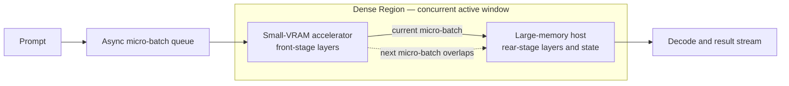

#  Small-VRAM Accelerator + Large-VRAM, Low-Compute Host Dense Acceleration — Heterogeneous GPU PD Lab

[简体中文](README_ZH.md)

Current release: **v2.19 — the two accelerator tracks are split apart and single-device baselines come first**. This release separates the RTX 3060 and RTX 3080 eras into two independent tracks, and moves the RTX 3060 standalone and AI Max+ 395 host baselines ahead of every heterogeneous result. There is no new measurement and no changed value. Canonical result records and machine-readable CSV files remain the numerical sources of truth.

This repository studies one question: how can a high-compute, small-VRAM accelerator cooperate with a low-compute, large-memory host to run large-model inference. It publishes architecture, measured evidence, design evolution, conclusions, and limitations. Deployment commands, patches, endpoints, and private layer-allocation policy stay out of scope.

## Base architecture: how the system works

In **Dense Acceleration**, two devices share the compute of the same model stage. The small-VRAM accelerator holds and computes the front-stage layers. The large-memory host holds and computes the rear-stage layers and state. Adjacent micro-batches overlap inside the **Dense Region**, so both devices do useful work in the same time window. The **Sparse Region** carries the remaining duties: full-model residency and capacity. Whatever cannot enter the overlap window belongs there.

This route is not plain serial layer-by-layer execution, not tensor parallelism, not duplicate compute of the same layer, and not independent PD that treats the 395 as a remote KV pool.

## Two accelerator tracks: RTX 3060 12GB and RTX 3080 20GB

This project has used exactly two NVIDIA accelerators so far. They belong to two different experiment tracks: they hold different model sizes and they support different claims. The large-memory host is the same AI Max+ 395 throughout. Before reading any number, check which track it comes from.

| | Track 1: RTX 3060 12GB | Track 2: RTX 3080 20GB |
| --- | --- | --- |
| Releases covered | v1.0 → v2.4 | v2.5 → v2.14 |
| VRAM and what fits | 12GB, enough to hold a 9B dense model and nothing larger | 20GB, which is what makes 27B Q4 and MoE layer splits possible |
| Model sizes | 9B dense Q6_K; 27B only through IQ3 layered residency | 27B dense Q4; Ornith-1.5-35B-A3B and Qwen3.8-Flash MoE |
| Experiment IDs | 9B-PD-01, 9B-PIPE-01, 27B-LONG-01 | 27B-PD-01, 27B-KV-01, ORNITH-PD-01, FLASH-SPLIT-01 |
| Best result on this track | 9B async pipeline at Prefill **2129.69** and Decode **50.73 tok/s**, which is **+34.0% / +15.6%** over the 3060 standalone | 27B long prompt at 64K is **+133.4%** over the 395 host; the Flash single-server split peaks at C4 with Prefill **633.685** and **338.270 total tok/s** |
| What this track proves | Two devices can share the prefill of one model and beat the fastest card present. This is the only controlled Dense Acceleration evidence in the repository. | A larger accelerator lifts model size, context depth, and concurrency together. But this track has no matched standalone control, so today it supports feasibility and serving-envelope claims only. |
| Main gap on this track | The same 9B envelope has never been repeated on the RTX 3080 | The 27B and MoE cells lack a matched 3060 or 3080 standalone baseline |

The two tracks are never merged into one ranking. A percentage measured on the 3060 track does not transfer to a model on the 3080 track, and the higher absolute throughput of the 3080 track is not progress on the 3060 track. The repository holds no RTX 3090 measurement of any kind — that card was ruled out during selection — so none of these numbers involve a 3090.

## Experiment timeline: v1.0 → v2.19

A release number is a publication order, not an experiment count. v2.1–v2.4 are four checkpoints inside one 9B pipeline experiment. Later releases mix new experiments with attribution and presentation fixes. The table below labels each one, and every phase heading names the accelerator it used.

### Phase 1: v1.0 → v2.4 — accelerator RTX 3060 12GB, from "can it hand off at all" to "faster than the fastest single card"

This phase answers "is it possible" before "is it fast". It starts from the simplest question: can two devices hand state over at all. By the end, both devices compute on the same model and the async pipeline beats the fastest single-card control. Prefill climbs in one continuous run: **1452.29 → 1865.08 → 1893.87 → 1999.51 → 2129.69 tok/s**. Each step has a clear reason.

| Version | Question at this step | What was measured | What the data shows | How the conclusion advanced |
| --- | --- | --- | --- | --- |
| v1.0 | Can CUDA Prefill hand state over to Vulkan Decode? | 9B Q6_K, 5064 in / 128 out. The RTX 3060 prefilled 0 / 512 / 2048 / all tokens, against the AI Max+ 395 host (**9B-PD-01**). | Full PD: TTFT **3.496 s**, Prefill **1452.29**, Decode **30.28 tok/s**; the 395 host measured 5.879 s, 861.55, 30.24. | Handoff works. TTFT and Prefill improve and Decode holds. The two devices still run in sequence, which sets up the pipeline work next. |
| v2.1 | v1.0 leaves the two devices idle in turn; can micro-batches overlap? | First fused-pipeline checkpoint, same 9B Q6_K envelope. | Prefill **1865.08 tok/s**. | Overlap pays off. Prefill passes the RTX 3060 standalone control at 1589.00 for the first time. |
| v2.2 | Is the overlap gain reproducible? | Overlap-refinement checkpoint. | Prefill **1893.87 tok/s**. | Run-to-run spread narrows; the gain repeats. |
| v2.3 | Can load balance improve both endpoints together? | Stage-balance refinement checkpoint. | Prefill **1999.51**, Decode **37.16 tok/s**. | Decode is recorded for the first time. Both endpoints improve together. |
| **v2.4** | With both endpoints active, can the route beat the fastest card and keep output boundaries? | Final calibrated pipeline, closed as **9B-PIPE-01**. Also added a separate-envelope 27B IQ3 layered check, DGX Spark external context (**EXT-DGX-01**), and a full Chinese mirror. | Prefill **2129.69**, Decode **50.73 tok/s**; versus the RTX 3060 standalone (1589.00 / 43.87): **+34.0% / +15.6%**. 27B IQ3: pp4096 **658.52**, pp65536 **319.10**, pp98304 **225.10**, tg64 **19.57 tok/s**. | Dense Acceleration closes for this envelope, and the Dense Region gets its name. The 27B data feeds the later 27B-LONG-01. EXT-DGX-01 stays external context and is never ranked against local rows. |

### Phase 2: v2.5 → v2.10 — accelerator switches to the RTX 3080 20GB and the model scales to 27B

This phase carries the mechanism proven on 9B to a larger model and a stronger card. It covers five new questions: layered residency, serving-state PD, a remote KV pool, a speculative-decode audit, and external context. The closing conclusion is that large-model routes must split by goal. Use phase separation to cut TTFT; use remote KV for capacity; use layered residency for long prompts. None of the three is Dense Acceleration.

| Version | Question at this step | What was measured | What the data shows | How the conclusion advanced |
| --- | --- | --- | --- | --- |
| v2.5 | After the 9B mechanism works, can full 3080 Prefill + 395 Decode bring 27B Q4 into serving? | Migration to the **RTX 3080 20GB**. Six concurrency tiers × split / solo paths, twelve measured serving groups (**27B-PD-01**). | C1: TTFT **1073 / 4825 ms**, Prefill **1000.6 / 207.2**, Decode **38.75 / 36.33 tok/s**; KV migration **68–76 ms** across C1–C6. After removing per-ubatch RPC sync, Prefill rose from **683.2** to **1000.6 tok/s**, about **82%** of the 3080 raw compute at **1228.53 tok/s**. | Serving-state PD works. Prefill does not decay with concurrency and Decode stays intact. Sync overhead is identified as the main loss. |
| v2.6 | The 3060 / IQ3 and 3080 / Q4 27B records are fragmented; how do they fit together? | Merged into one 27B experiment area. Published the 3080 router v1.1 and the live v1.2. Added the 395 natural-language audit (**27B-DRAFT-AUDIT-01**). | Prefill up to **1210.6**, single-stream Decode **63.2 tok/s**. Repetitive text **35.0–38.5 tok/s** at 100% acceptance; natural-language C1 **12.1 tok/s** at 17.7% acceptance. | Prefill-first and Decode-first profiles take shape. The audit sets a guardrail: repetitive-text highs do not represent production text. |
| v2.7 | The strongest results are buried under implementation detail. | Presentation only. | No new measurement. | Route choice now leads, ahead of parameter detail. |
| v2.8 | Compute ownership and capacity value are conflated in C / D. | Attribution fix. | No new measurement. Confirmed the 3080 does all compute and the 395 stores KV only, with **1M** context per stream. | Remote KV is now clearly a capacity route, not a compute speedup. |
| v2.9 | The 27B-D C6 peak and its scope need correction. | Data correction. | C6 aggregate Decode corrected to **116.3 tok/s**. No new experiment. | The figure and its scope are now consistent. |
| v2.10 | C / D and DGX Spark evidence is scattered. | Consolidated into one comparison table. The **DFlash2 acceleration head** also became its own category. | No new local measurement. The DGX Spark summary reads about **1000 tok/s Prefill, 25–30 tok/s single-stream Decode, 107 tok/s aggregate Decode, C1–C6 concurrency**, with explicit non-comparability. | External context and local data now sit in separate columns and are never mixed. |

### Phase 3: v2.11 → v2.14 — still the RTX 3080 20GB, extending to MoE models and a single-server layer split

This phase answers two new questions. First, when the mechanism moves to an MoE model, can Prefill and Decode ownership still be measured cleanly? Second, when only one server runs, at which concurrency tier does throughput saturate? The conclusions: MoE PD is stable and ownership is clean, but with no standalone baseline there is no speedup claim; the Flash layer split yields the C4 operating point.

| Version | Question at this step | What was measured | What the data shows | How the conclusion advanced |
| --- | --- | --- | --- | --- |
| v2.11 | On an MoE model, do phase attribution and 100K stability still hold? | Ornith-1.5-35B-A3B dual-machine PD stress: the 3080 does all Prefill, the 395 does all Decode (**ORNITH-PD-01**). | **42/42** all passed, `route=pd`, `n_reuse=0`. Short-task aggregate Prefill **4017.46 → 3943.88**; 100K aggregate Prefill **2895.53 → 2793.24**; 395 pure-Decode aggregate **23.33 → 148.20 tok/s**. | MoE PD is stable and ownership is clean. But with no same-run standalone baseline, no speedup is claimed. |
| v2.12 | Can whole-stage wall-clock derivatives be attributed on their own? | Metric governance. | No new measurement. Derived Decode presentation removed. | Published metrics now keep only directly attributable quantities. |
| v2.13 | Multiple runs could contaminate the requested record. | Evidence lock on r337. | No new measurement. Locked to 3080 pure Prefill and 395 pure Decode. | The Ornith evidence source is now unique. |
| v2.14 | At which concurrency tier does a single-server dual-device split saturate? | r374 Qwen3.8-Flash Q4: one llama-server runs the 3080 and the 395 together, C1–C6 (**FLASH-SPLIT-01**). | **21/21** scored requests all passed. Best at C4: Prefill **633.685**, aggregate Decode **71.185**, total **338.270 tok/s**. 3080 VRAM peak **19129 MiB**. | The concurrency operating point for this envelope is C4. With no standalone comparison, it is not a speedup proof. |

### Phase 4: v2.15 → v2.19 — evidence governance and wording only, no new hardware and no new measurement

This phase has **no new measurement and no new value**. The work falls into two kinds only: organizing evidence attribution and revising presentation. By the end, every experiment has one stable ID and one canonical entry, the two accelerator tracks are stated separately, and the homepage keeps only a decision-level slice.

| Version | Question at this step | What was measured | What the data shows | How the conclusion advanced |
| --- | --- | --- | --- | --- |
| v2.15 | One dataset is repeated in many places and experiment purposes are mixed. | Experiment governance. Added `data/experiment-index.csv` and restored the v2.4 Decode **50.73** into `data/benchmark-results.csv`. | No new measurement. | Stable IDs, one canonical entry per experiment, and explicit claim boundaries are established. |
| v2.16 | The simplified homepage hides measured gains from outside readers. | Decision-dashboard restoration. | No new measurement. | Key figures, deltas, and the route table return to the homepage. |
| v2.17 | Once data is visible, the architecture and the six-cell plan are still underemphasized. | Structural reordering. | No new measurement. | Architecture moved first. The six-cell matrix was created. Progress marked as **0/6 fully closed, 4 partial, 2 untested**. |
| v2.18 | The step-by-step progress between releases is unreadable and the sentences are clumsy. | Narrative rewrite. | No new measurement. | The timeline moved to the front in four phases, with one row per release stating its question and its result. |
| **v2.19** | The RTX 3060 and RTX 3080 tracks are tangled, and heterogeneous results appear before any single-device baseline. | Track split and baseline-first ordering. | No new measurement. | The two accelerator tracks get their own chapter, every cell and row names its card, and single-device baselines now precede all combined results. |

Additional boundary: **27B-C / 27B-D** are two serving profiles inside 27B-KV-01, not two experiments. The 395 natural-language run is the validation workload of 27B-DRAFT-AUDIT-01. [DGX Spark](results/dgx-spark-community-control.md) is the external context of EXT-DGX-01. None counts as another local experiment.

## Six-experiment matrix: RTX 3080 / RTX 3060 controls

The six cells are not defined by model name or parameter count, but by **how the complete working set compares with accelerator VRAM**. The working set includes weights, KV, compute buffers, and a safety margin. **Fits easily** means stable headroom remains; **fills the card** means the usable VRAM ceiling is close; **does not fit** means one card cannot complete the target workload.

Common control setup: each cell should record **RTX 3060 only, RTX 3080 only, AI Max+ 395 only, 3060 + 395, and 3080 + 395** wherever feasible. Model, quantization, prompt, context, concurrency, and metrics must match. When a card cannot hold the workload, "cannot load / cannot complete" is itself the boundary result; swapping the model or quantization is not a substitute baseline. Core metrics are Prefill, Decode, TTFT, aggregate throughput, VRAM headroom, and success rate.

**Strict completion today: 0/6 cells fully closed.** Four cells hold pilot or partial evidence and two remain untested. Any cell missing a matched 3060 / 3080 control is explicitly incomplete.

| Experiment cell | Question to answer | 3080 / 3060 control role | 395 / heterogeneous route and gates | Current status and evidence |
| --- | --- | --- | --- | --- |
| **D1 Dense · fits easily** Card measured: **RTX 3060** | When the working set fits with headroom, can a dense pipeline beat the faster card rather than only add capacity? | The matched 3060 standalone run exists; the same-envelope 3080 repeat is pending. | Compare card-only, 395-only, and async layered pipeline on Prefill / Decode / TTFT. | **Partial**: 9B-PIPE-01 is **+34.0% Prefill** and **+15.6% Decode** versus the 3060; 3080 control missing. [Record](results/v2.4-fused-layer-pipeline.md) |
| **D2 Dense · fills the card** Card measured: **RTX 3080** | Near the VRAM ceiling, do card-only, phase separation, or a layered dense route win? | The 20GB 3080 is the primary full-card control for 27B Q4; the 3060 records the same model's cannot-fit or degraded boundary. | Compare VRAM headroom, TTFT, Prefill, Decode, and handoff cost. | **Partial**: 27B-PD-01 has 3080-Prefill / 395-Decode serving evidence; matched dual-card dense control missing. [Record](results/qwen3.8-27b-dual-machine-pd.md) |
| **D3 Dense · does not fit** Card measured: **RTX 3060** | When one card cannot complete the target working set, can layered residency finish the job and beat the 395? | The 3060 is the current capacity floor; the 3080 needs the same prompt-depth sweep to decide whether it falls into "fills" or "does not fit". | Gate on completion, long-prompt Prefill, Decode, and TTFT. | **Partial**: 27B-LONG-01 reaches **+133.4% Prefill** at 64K versus the 395 and completes at 98K where the control times out; matched 3080 record missing. [Record](results/qwen3.8-27b-dual-machine-pd.md) |
| **M1 MoE · fits easily** Card measured: **neither card yet** | With a small active set and ample headroom, does MoE routing overhead erase the heterogeneous overlap gain? | Both 3060 and 3080 need same-model, same-quantization standalone baselines. | Compare post-routing Prefill / Decode, acceptance, TTFT, and balance. | **Planned**: no local run satisfies the dual-control setup; no gain is reported. |
| **M2 MoE · fills the card** Card measured: **RTX 3080** | Near the 3080 ceiling, is phase separation stable, and does a later dense overlap add speed? | The 3080 is the full-card Prefill control; the 3060 records the cannot-fit boundary or a feasible smaller same-family model. | Establish route attribution and long-context stability first, then matched speed comparisons. | **Partial**: ORNITH-PD-01 has **42/42** routed successes and a 100K envelope; matched 3080 / 3060 standalone speed baselines are missing, so no acceleration claim is allowed. [Record](results/ornith-1.5-35b-a3b-dual-machine-pd.md) |
| **M3 MoE · does not fit** Card measured: **RTX 3080 (pilot only)** | When the total working set exceeds both control cards, can layer / expert residency keep completion, throughput, and output correctness? | Both 3060 and 3080 must first record the capacity boundary where they cannot finish alone. | Gate on completion, routing correctness, Prefill / Decode, memory, and cross-device wait. | **Planned**: FLASH-SPLIT-01 is only an adjacent split-serving envelope; without both standalone baselines it cannot close this cell. [Pilot record](results/qwen3.8-flash-q4-layer-split.md) |

## Decision summary

- **The controlled Dense Acceleration result is 9B-PIPE-01.** Against the faster RTX 3060 standalone control, Prefill rises from 1589.00 to **2129.69 tok/s (+34.0%)** and Decode from 43.87 to **50.73 tok/s (+15.6%)**.
- **Use phase-separated PD when the goal is lower TTFT and the accelerator can hold the required Prefill copy.** In 9B-PD-01, full PD cuts TTFT from 5.879 to **3.496 s (-40.5%)** while Decode stays flat; the 27B historical service path cuts C1 TTFT from 4825 to **1073 ms (-77.8%)**.
- **Use layered placement when the model does not fit on the small card.** In 27B-LONG-01, the 3060 + 395 route is **+110.2% Prefill at 4K** and **+133.4% at 64K** versus the 395; at 98K the control times out at 900 s while the layered route completes.
- **Use remote KV for capacity, and do not write it up as compute acceleration.** 27B-KV-01 provides **1M context per stream**. The 3080 does all model compute and the 395 stores KV only.
- **Treat Ornith and Flash as operating-envelope evidence.** Ornith passes 42/42 routed requests through 100K stress; Flash passes 21/21 scored requests and reaches its best measured point at **C4: 338.270 total tok/s**. Neither has a matched standalone speed control.

## Results at a glance

### Single-device baselines first

Every heterogeneous number below is meant to be read against these standalone rows. The baseline values are copied verbatim from the CSV files, with no conversion and no interpolation.

**9B Q6_K baselines** (for 9B-PD-01 and 9B-PIPE-01)

| Standalone baseline | Model and quantization | Method and workload | Prefill | Decode |
| --- | --- | --- | --- | --- |
| **RTX 3060 12GB, card only** | 9B Q6_K | `llama-bench`, pp5064 / tg128 | **1589.00 tok/s** | **43.87 tok/s** |
| **AI Max+ 395 host (serving method)** | 9B Q6_K | server second run, 5064 in / 128 out | **861.55 tok/s** | **30.24 tok/s** |
| **AI Max+ 395 host (`llama-bench` method)** | 9B Q6_K | `llama-bench`, pp5064 / tg128 | **970.00 tok/s** | **31.27 tok/s** |

The two 395 figures do not conflict; they come from different methods. The serving figure is the control for the v1.0 independent PD run, and the `llama-bench` figure is the control for the v2.4 fused pipeline. A single comparison must stay inside one method. All three rows come from [benchmark-results.csv](data/benchmark-results.csv).

**27B baselines** (for 27B-LONG-01, 27B-PD-01, and 27B-KV-01)

The RTX 3060 cannot hold a full 27B model, so this tier has no 3060 standalone row — only the 3080 card and the 395 host.

| Standalone baseline | Model and quantization | Workload | Measured |
| --- | --- | --- | --- |
| **RTX 3080 20GB, raw compute** | 27B Q4 | pp1024 / pp4096 / tg64 | Prefill **1228.53** / **1203.06 tok/s**; Decode **33.08 tok/s** |
| **AI Max+ 395 host (IQ3)** | 27B IQ3 | pp4096 / pp65536 / pp98304 / tg64 | Prefill **313.28** / **136.69 tok/s**, pp98304 times out at 900 s; Decode **18.26 tok/s** |
| **AI Max+ 395 host (Q4 serving)** | 27B Q4 | C1, solo path | TTFT **4825 ms**; Prefill **207.2 tok/s**; Decode **36.33 tok/s** |

All three 27B rows come from [qwen27b-local-results.csv](data/qwen27b-local-results.csv). The two MoE experiments (ORNITH-PD-01 and FLASH-SPLIT-01) have no matched card or host baseline at all, which is why their numbers appear only in the serving-envelope table below.

### Matched-baseline results — improvement claims are allowed

Percent change is `(tested route / matched control - 1) × 100%`; TTFT is shown as a reduction. Every comparison stays inside one model, quantization, workload, and experiment envelope, and names the accelerator it ran on.

| Experiment | Accelerator | Matched baseline measured | This route measured | Measured change | Direct conclusion |
| --- | --- | --- | --- | --- | --- |
| **9B-PD-01** | RTX 3060 12GB | 395 host: TTFT **5.879 s**, Prefill **861.55**, Decode **30.24 tok/s** (9B Q6_K, 5064 in / 128 out) | Full CUDA-Prefill / Vulkan-Decode PD: TTFT **3.496 s**, Prefill **1452.29**, Decode **30.28 tok/s** | TTFT **-40.5%**; Prefill **+68.6%**; Decode **+0.1%** | Full state handoff works and lowers prompt latency. The phases still run in sequence, so this is not Dense Acceleration. |
| **9B-PIPE-01** | RTX 3060 12GB | RTX 3060 card only: Prefill **1589.00**, Decode **43.87 tok/s**; the 395 host in the same method is **970.00 / 31.27 tok/s** | Final async layered pipeline: Prefill **2129.69**, Decode **50.73 tok/s** | Versus 3060: **+34.0% / +15.6%**; versus 395: **+119.6% / +62.2%** | This is the repository's controlled evidence that both devices contribute useful compute in a Dense Region. |
| **27B-LONG-01** | RTX 3060 12GB | 395 host (27B IQ3): pp4096 **313.28**, pp65536 **136.69**, pp98304 times out at 900 s, tg64 **18.26 tok/s** | Layered 3060 + 395: pp4096 **658.52**, pp65536 **319.10**, pp98304 **225.10**, tg64 **19.57 tok/s** | **+110.2%** at 4K; **+133.4%** at 64K; completion versus timeout at 98K; Decode **+7.2%** | Choose layered residency when the full model cannot fit on the accelerator and long-prompt Prefill is the bottleneck. |
| **27B-PD-01** | RTX 3080 20GB | 395 solo (27B Q4, C1): TTFT **4825 ms**, Prefill **207.2**, Decode **36.33 tok/s** | 3080 Prefill / 395 Decode service path: TTFT **1073 ms**, Prefill **1000.6**, Decode **38.75 tok/s**; KV migration **68–76 ms** across C1–C6 | TTFT **-77.8%**; Prefill **+382.9% (4.83×)**; Decode **+6.7%** at C1 | The two-instance service handoff works through C1–C6. It proves phase separation, not simultaneous same-phase compute. |

### Serving envelopes and audits — do not call these speedups

Here, percentages describe concurrency scaling or workload sensitivity inside one fixed configuration. They are not gains over a standalone system. All four records ran on the RTX 3080 20GB.

| Experiment | Accelerator | Headline measurements | Within-record change | Baseline that is missing | Direct conclusion |
| --- | --- | --- | --- | --- | --- |
| **27B-KV-01** | RTX 3080 20GB | **1M context per stream**; Profile C Prefill stays at **1194.4–1210.6 tok/s**; aggregate Decode C1→C6: C **33.55→63.84**, latest D summary **63.2→116.3 tok/s** | C **+90.3%**; D **+84.0%** with concurrency | No same-run "3080 without remote KV" series | Choose C for Prefill-first balance or D for Decode-first throughput. The 395 is KV-only, so this is a capacity and serving route, not Dense Acceleration. |
| **27B-DRAFT-AUDIT-01** | RTX 3080 20GB (draft path on the 395) | Repetitive text: **35.0–38.5 tok/s at 100% acceptance**; natural-language C1: **12.1 tok/s at 17.7% acceptance** | Natural-language C1 is **68.6% below** the 38.5 headline | Not applicable; this is an audit, not a speed run | Repetitive-text speculative results do not represent production prose. Use workload-matched measurements. |
| **ORNITH-PD-01** | RTX 3080 20GB | **42/42 passed**, `route=pd`, `n_reuse=0`; 100K Prefill C1→C6 **2895.53→2793.24**; pure Decode aggregate **23.33→148.20 tok/s** | Prefill moves **-3.5%** from C1 to C6; Decode concurrency scaling **6.35×** | No same-run 3080 card or 395 host speed baseline | Use this route for attributable MoE Prefill / Decode roles and 100K stability. No standalone baseline means no causal speedup claim. |
| **FLASH-SPLIT-01** | RTX 3080 20GB | **21/21 passed**; best C4: Prefill **633.685**, aggregate Decode **71.185**, total **338.270 tok/s** | C1→C4: Prefill **+11.2%**, aggregate Decode **+102.2%**, total **+58.4%** | No matched 3080 card or 395 host run | For this single-server split, C4 is the measured operating point. C5–C6 plateau, and no standalone comparison exists. |

Full rows, metric definitions, and missing fields remain in each linked [result record](results/) and CSV. The homepage keeps only one decision slice per stable experiment and never counts a summary as a new experiment. If a summary conflicts with a canonical record, the record and CSV win.

## Route selector

| Your actual goal | Route to choose | Accelerator | Evidence anchor | Choose it when / reject it when |
| --- | --- | --- | --- | --- |
| Prove that two devices accelerate the same model work | **Asynchronous layered Dense Acceleration** | RTX 3060 12GB | 9B-PIPE-01: **+34.0% Prefill, +15.6% Decode** versus the faster standalone endpoint | Choose only with matched standalone controls and both stages doing useful compute. Do not transfer this 9B claim to another model without a new control. |
| Minimize prompt latency with explicit Prefill / Decode ownership | **Independent PD** | 3060 for 9B, 3080 for 27B | 9B-PD-01: TTFT **-40.5%**; 27B-PD-01 C1: TTFT **-77.8%** | Choose when the Prefill endpoint can hold the required model copy and state handoff is available. It is sequential phase specialization, not concurrent Dense Acceleration. |
| Run a model that cannot fit on the small accelerator | **Layered model residency** | RTX 3060 12GB | 27B-LONG-01: 64K Prefill **2.33×** the 395 control; 98K completes versus timeout | Choose for long-prompt Prefill improvement and capacity sharing. Reject direct comparisons with Q4, 9B, or unrelated engines. |
| Maximize context capacity or concurrent Decode service | **3080 compute + 395 remote-KV pool** | RTX 3080 20GB | 27B-KV-01: **1M context per stream**; Decode-first C6 at **116.3 aggregate tok/s** | Choose for capacity. Reject it if the requirement is two-device compute acceleration: the 395 performs no model compute. |
| Validate a MoE PD service at deep context | **Role-separated PD stress route** | RTX 3080 20GB | ORNITH-PD-01: **42/42 passed**; 100K Decode aggregate reaches **148.20 tok/s at C6** | Choose for route attribution and stability. A matched standalone run is still required before claiming speedup. |
| Prefer one service and need a measured concurrency setting | **Fixed dual-device layer split** | RTX 3080 20GB | FLASH-SPLIT-01: C4 total **338.270 tok/s**, **+58.4%** versus its own C1 | Under the recorded ~2077 in / 256 out workload, the measured operating point is **C4**. Re-benchmark for another prompt mix. It is an operating point, not an acceleration factor. |

## Evidence rules

| Claim type | Minimum evidence | Wording allowed in this repository |
| --- | --- | --- |
| Feasibility | A complete request, valid stage / state transfer, and attributable measurements | "works in this configuration" |
| Acceleration | Same model, quantization, workload, metric, and a matched standalone control | "faster than the matched control" |
| Capacity / serving profile | A completed workload and resource / stability evidence, but no matched speed control | "fits", "serves", or "measured envelope"; **not** "accelerates" |
| External context | Public third-party measurements with their original method and source | "contextual reference"; never a local control |

- The README files expose a **decision-level snapshot**: matched baseline, selected result, calculated delta, route choice, and claim boundary.
- Each `results/` record still owns the complete human-readable tables for its experiment. Its linked `data/*.csv` is the machine-readable mirror and calculation source.
- A homepage headline is a summary of the same stable experiment. It is not another result series and creates no new experiment.
- Every published figure must name its accelerator, RTX 3060 or RTX 3080. Results from the two eras are never combined in one calculation.
- `CHANGELOG.md` records publication history and corrections. A release number is not an experiment ID and not an evidence source.
- Cross-model, cross-quantization, cross-engine, cross-prompt, or cross-topology values are never ranked as if they were controlled experiments.

## Local experiment registry

| Stable ID | Accelerator | Primary question | Control and changed factor | Primary decision gate | Claim supported | Source of record |
| --- | --- | --- | --- | --- | --- | --- |
| **9B-PD-01** | RTX 3060 12GB | Can CUDA Prefill hand state to Vulkan Decode at all? | AI Max+ 395-only control; change only how much of the prompt the RTX 3060 prefills before handoff | Completed handoff, TTFT / Prefill, Decode continuity, transferred state size | Independent-PD feasibility; not simultaneous compute | [record](results/v1.0-independent-pd.md) · [CSV](data/benchmark-results.csv) |
| **9B-PIPE-01** | RTX 3060 12GB | Can both devices contribute compute to one model through an asynchronous layered pipeline? | RTX 3060-only and AI Max+ 395-only controls; model and workload fixed while pipeline scheduling is refined | Same-envelope Prefill / Decode versus both controls, repeatability, output boundary | Controlled Dense Acceleration for this 9B envelope | [record](results/v2.4-fused-layer-pipeline.md) · [CSV](data/benchmark-results.csv) |
| **27B-LONG-01** | RTX 3060 12GB | When 27B does not fit on the accelerator alone, can layered placement improve long-prompt execution over the 395 host? | AI Max+ 395-only at the same IQ3 workload; add the RTX 3060 layer stage | Completion at increasing prompt depth, Prefill, Decode | Long-prompt feasibility and matched-host improvement; not a Q4 or 9B comparison | [record](results/qwen3.8-27b-dual-machine-pd.md) · [CSV](data/qwen27b-local-results.csv) |
| **27B-PD-01** | RTX 3080 20GB | Can an RTX 3080 Prefill node hand off to a 395 Decode node as a service across C1–C6? | Same model on 395 solo; change only whether the request takes the two-node PD path | TTFT, Prefill, Decode, KV migration, success across concurrency | Historical two-instance PD scheduling feasibility | [record](results/qwen3.8-27b-dual-machine-pd.md) · [CSV](data/qwen27b-local-results.csv) |
| **27B-KV-01** | RTX 3080 20GB | What serving trade-off results when the 3080 does all compute and the 395 is KV-only storage? | No matched no-remote-KV run in the latest series; C / D are two profiles of one experiment, and only concurrency is swept | Context capacity, Prefill, single-stream Decode, aggregate Decode, missing-field discipline | Remote-KV capacity and serving envelope; **not Dense Acceleration** | [record](results/qwen3.8-27b-dual-machine-pd.md) · [CSV](data/qwen27b-local-results.csv) |
| **27B-DRAFT-AUDIT-01** | RTX 3080 20GB | Do repetitive-text speculative-Decode headlines represent natural-language service behavior? | Natural-language requests sent directly on the 395 draft path; the historical headless result is context, not a matched causal control | Direct prose completion, realized Decode, draft acceptance | Validation guardrail; prevents repetitive-text numbers standing in for production prose | [record](results/qwen3.8-27b-dual-machine-pd.md) · [CSV](data/qwen27b-local-results.csv) |
| **ORNITH-PD-01** | RTX 3080 20GB | Can a MoE model keep Prefill / Decode roles attributable while surviving short and 100K C1–C6 PD stress? | No same-run single-node speed control; workload depth and concurrency are swept | Route success, no KV reuse, 3080 Prefill and 395 Decode measured in their own windows | Role attribution and stability envelope; not end-to-end speedup | [record](results/ornith-1.5-35b-a3b-dual-machine-pd.md) · [CSV](data/ornith35a3b-local-results.csv) |
| **FLASH-SPLIT-01** | RTX 3080 20GB | Can one CUDA + Vulkan layer-split server sustain C1–C6, and where does throughput saturate? | No standalone control; only concurrency changes inside the recorded configuration | HTTP success, aggregate Prefill / Decode, total throughput, VRAM headroom | Concurrency envelope and operating point; not an acceleration proof | [record](results/qwen3.8-flash-q4-layer-split.md) · [CSV](data/qwen38flash-q4-local-results.csv) |

Machine-readable experiment semantics and legacy-label aliases are listed in [data/experiment-index.csv](data/experiment-index.csv).

## Preserved future plan

| Route | Question driven by current results | Plan and completion gate |
| --- | --- | --- |
| **v3.0** | v2.4 closes only one 9B / 3060 envelope, while the six-experiment matrix remains incomplete. | Fill the 3080 / 3060 controls under one workload contract and adapt one-to-one Dense Acceleration to more large-memory hosts and small-VRAM accelerators. Gate on three items: Dense Region mapping holds, Prefill / Decode gains stay lossless, scheduling stays stable. |
| **v4.0** | Once one-to-one is stable, can one accelerator serve X large-memory hosts at the same time? | Study one-to-many scheduling, resource isolation, fairness, failure recovery, and scaling limits. Completion requires reproducible gain as host count rises, with per-host regression kept within a controlled range. |

## Reading path

1. Start with "Two accelerator tracks" and decide whether the numbers you care about belong to the 3060 track or the 3080 track.
2. Read "Single-device baselines first" and keep the card-only and host-only figures for that tier in mind.
3. Then use the six-cell matrix or the results tables to find the experiment that matches your decision.
4. Read that experiment's envelope and boundaries in `results/` before reading its table. Use the linked CSV for calculations, and do not combine rows from different stable IDs unless the record explicitly defines a matched control.
5. Use the [changelog](CHANGELOG.md) only to understand when wording, attribution, or files changed.
