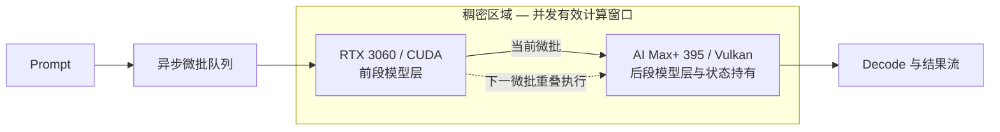

#  小显存加速卡 + 大显存低算力主机稠密加速 — 异构 GPU PD 实验室

[English](README.md)

本仓库记录异构 GPU Prefill/Decode（PD）与稠密加速实验：RTX 3060 / RTX 3080 加速头与 AMD Ryzen AI Max+ 395 / Radeon 8060S 协同工作。

当前版本：**v2.12 — 已从 Ornith-1.5-35B-A3B 展示中删除整档墙钟派生的聚合 Decode 列；表格只保留可直接归属的 Prefill 与 395 解码段实测**。v2.10 的 27B-C / 27B-D 与 DGX Spark 对比保留原位。公开范围仅包含架构、实测数据、思维演进、结论与限制；不提供部署步骤、复现命令、补丁、端点或内部切层策略。

**什么是稠密加速。** 由一张加速卡 + 一台被加速机器组成。两者显存重叠的区域即为显存稠密区；落入该区域内的模型，其解码（decode）与预填充（prefill）都会得到显著加速。该加速不降低输出质量；具体吞吐由计算与通信共同决定，跨设备 KV 扩容会以一定通信成本换取更大的上下文容量。

这为低算力大显存主机（如 DGX Spark、AI Max+ 395）与高算力小显存卡（如 RTX 3060、RTX 3080）提供了更多应用机会与场景。

*结构：可重叠的显存单元分为**稀疏区**（存放模型）与**稠密区**（进行解码与预填充计算）；落入稠密区的模型，其 decode 与 prefill 均获显著、无损加速。*

## 阅读路径与本次变化

- 先读**架构与测试口径**，再按**研究演进 → 9B 实验链 → 27B 实验区 → 外部对照**阅读；每个本地实验都用“新实验 + 关键结果”标题开场。
- **9B 主线**保留 v1.0–v2.4 的同口径演进，最终达到 prefill 2129.69 tok/s、decode 50.73 tok/s。
- **27B 实验区**现已融合 3060 / IQ3 与 3080 / Q4 两条记录；融合只为编排清晰，不改变彼此独立的测量口径。
- v1.0–v1.2 的旧路由表与 395 自然文本审计仅作为历史对照保留在详档；首页当前结论统一采用 v2.8 长上下文路线。
- v2.8 起，最新 27B-C/D 中 **RTX 3080 承担全部 Prefill 与 Decode 计算，AI Max+ 395 是纯 KV-only 远端存储池**：它不参与 Prefill、不参与 Decode，为每一条流提供 1M 上下文容量（1M context per stream）。

## 稠密加速架构

最终设计依赖 llama.cpp 上游 [PR #18626](https://github.com/ggml-org/llama.cpp/pull/18626) 的 RPC events/async 能力。模型层常驻各自端点，微批依次穿过两个阶段，使两端能够并发工作；本实验不宣称拥有自研推理引擎补丁。

### 术语定义

- **稠密加速**是本项目对最终异步分层 PD 形态的正式命名：外接显卡与 AI Max+ 395 分别持有自己的模型层，RPC/events 让相邻微批持续占用两个阶段。
- **稠密区域**是异步微批流水时间轴上的重叠计算窗口：外接显卡与 AI Max+ 395 同时处于有效计算状态，分别处理相邻微批和各自层段。填满这段窗口可减少流水气泡，对其覆盖的模型层段进行强加速。
- 稠密区域描述的是调度重叠，**不代表**两卡重复计算同一层、进行张量并行或重复驻留权重。

## 研究演进

实验总目标：验证一张小显存、高算力的加速卡在无法独立装下完整模型时，能否与一台大显存、低算力的主机共同承载并计算同一模型，在不降低输出质量的前提下，同时加速 Prefill 与 Decode。

| 阶段 | 实验目的（为什么做） | 验证方法（怎么测） | 实测结果 |
| --- | --- | --- | --- |
| v1.0 | 建立基本可行性：RTX 3060 承担 Prefill，随后把状态交给 AI Max+ 395 完成 Decode。 | 稳定完成 CUDA prefill → Vulkan decode 的状态交接。 | 1452.29 tok/s；decode 30.28 tok/s |
| v2.1 | 解决 v1.0 中两端按请求串行、交替空闲的问题；验证同一请求的微批流水能否让两端同时参与一次 Prefill。 | 验证同一请求的微批流水让两个切层阶段在同一请求内同时保持激活。 | 1865.08 tok/s |
| v2.2 | 解决 v2.1 的重叠在轮次间波动的问题；验证提速可复现，而不是偶然。 | 调整异步重叠，直到流水在各轮次间保持一致。 | 1893.87 tok/s |
| v2.3 | 流水可复现后，验证两端负载平衡能否减少流水等待，并同时改善 Prefill 与 Decode。 | 平衡后的切层在提高 prefill 的同时把 decode 抬到 v1.0 之上。 | 1999.51 tok/s；decode 37.16 tok/s |
| **v2.4** | 完成实验总目标：用同一 9B Q6_K、pp5064 本地口径对照两端单机与组合结果，验证状态与输出正确、稠密区持续工作、Prefill 与 Decode 无损加速。 | 校准检查点把稠密区域填满，达到两端单卡 prefill 之和的 83.2%。 | **2129.69 tok/s；decode 50.73 tok/s** |
| **v2.5** | 9B 主线完成后，验证 3080 全量 prefill + 395 decode 能否把 27B Q4 带进服务态。 | 去掉逐 ubatch RPC 同步，完成 C1–C6 六档、两种路径共 12 组。 | C1 prefill **1000.6 tok/s**；TTFT 1073 ms |
| **v2.6** | 解决 3060/3080 两组 27B 数据割裂，并补入最新路由实测。 | 统一 27B 实验区，形成输入加速与生成加速两条路线。 | Prefill 最高 **1210.6 tok/s**；单流解码最高 **63.2 tok/s** |
| **v2.7** | 首页需要更快呈现最强结论，避免实现细节淹没结果。 | 将 27B-C/D 重组为 Prefill 加速向与解码加速向，只保留高层调整与最佳实测。 | Prefill 最高 **1210.6 tok/s**；单流解码最高 **63.2 tok/s** |
| **v2.8** | 纠正计算归属、补 C1–C6 实测、明确 1M/流与通信代价。 | 明确 3080 承担全部 Prefill 与 Decode 计算、395 为纯 KV-only 远端存储池，首页补齐真实 C1–C6 紧凑表与 C1/C6 指标。 | Prefill 最高 **1210.6 tok/s**；C1 单流 Decode **63.2 tok/s**；C6 聚合 Decode **116.3 tok/s** |
| **v2.9** | 更正 27B-D 的 C6 聚合 Decode 峰值，并把通信代价句限定到 27B-D。 | 全部目标文件将 C6 聚合 Decode 峰值写为 116.3 tok/s，并从 27B-C 小节移除独立速度换 1M 上下文的句子、保留在 27B-D 小节。 | C6 聚合 Decode **116.3 tok/s** |
| **v2.10** | 把 27B-C、27B-D 与 DGX Spark 整理为同一组可读对照。 | 本地 C / D 数据按斜杠顺序展示，补齐 DGX Spark 的 Prefill、单流/聚合 Decode、C1–C6 并发，并单列 DFlash2 加速头。 | **C / D / DGX Spark 对照完整** |
| **v2.11** | 首条 MoE 双机 PD 记录：Ornith-1.5-35B-A3B（qwen35moe，10 层全注意力 + 30 层 Gated DeltaNet），3080 全量 prefill / 395 全量 decode 分工。 | 发布短任务与 100K 的 C1–C6 表，保持 395 解码段指标可独立归属，并显著标注 MoE 行不与 27B dense 行直接排名。 | 短任务 C1 Prefill 聚合 **4017.46 tok/s**；100K Prefill **2895.53 tok/s**（C1）；395 解码段最高 **148.20 tok/s**（C6）；42/42 route=pd |
| **v2.12** | 从 Ornith 展示中删除整档墙钟派生的聚合 Decode 序列。 | 在中英文首页与中英文详档中删除该列及其 C1–C6 展示值，原始 CSV 保留。 | **当前展示指标均可直接归属到 3080 Prefill 或 395 解码段** |
| **v3.0（研究方向）** | 把 v2.4 的一对一机制适配到其他各类大显存主机与小显存加速卡。 | 建立跨平台适配矩阵，验证不同主机架构与加速卡型号下的显存稠密区映射、prefill/decode 无损加速和调度稳定性。 | **计划：其他各类大显存主机 + 小显存加速卡的适配加速研究** |
| **v4.0（研究方向）** | 研究一张加速卡同时加速 X 台大显存主机。 | 研究一对多任务调度、资源隔离、公平性、故障恢复，以及并发主机数量扩大时的性能边界。 | **计划：1 张加速卡 → X 台大显存主机** |

## 9B 本地测试口径

| 项目 | 配置 |
| --- | --- |
| 模型 | 9B, Q6_K |
| 设备 | RTX 3060 12GB / CUDA + Ryzen AI Max+ 395 / Radeon 8060S / Vulkan |
| v1.0 输入 / 输出 | 5064 / 128 token |
| v1.0 测量 | 关闭缓存，保留第二次 server 请求结果 |
| v2 测量 | `pp5064`；仅在有记录的节点给出 `tg128` |

## 9B 本地实验链 — 同一主口径

### 新实验 9B-v1.0（独立 PD）：prefill 1452.29 tok/s，decode 30.28 tok/s

| 配置 | TTFT | Prefill | Decode |
| --- | ---: | ---: | ---: |
| 纯 AI Max+ 395 | 5.879 s | 861.55 tok/s | 30.24 tok/s |
| 前段 512 token 独立 PD | 5.720 s | 886.62 tok/s | 30.22 tok/s |
| 前段 2048 token 独立 PD | 5.077 s | 999.16 tok/s | 30.18 tok/s |
| 完整独立 PD | **3.496 s** | **1452.29 tok/s** | **30.28 tok/s** |

完整独立 PD 交接 5063 token、208.57 MiB 状态数据。它保留了多请求下 prefill/decode 双工的架构潜力，但本版本没有进行并发量化。

### 新实验 9B-v2.1（首个融合流水）：prefill 1865.08 tok/s

同一请求首次进入异步微批流水，两端不再按整请求交替空闲。

### 新实验 9B-v2.2（重叠细化）：prefill 1893.87 tok/s

跨轮次重叠稳定，确认提升不是偶然波动。

### 新实验 9B-v2.3（平衡细化）：prefill 1999.51 tok/s，decode 37.16 tok/s

两端负载平衡后，prefill 与 decode 同时越过上一检查点。

### 新实验 9B-v2.4（稠密加速定型）：prefill 2129.69 tok/s，decode 50.73 tok/s

#### 9B 同口径汇总

空白表示该检查点未记录该指标。

| 检查点 | 公开说明 | Prefill | Decode | TTFT |
| --- | --- | ---: | ---: | ---: |
| RTX 3060 基线 | 仅 CUDA 端 | 1589.00 tok/s | 43.87 tok/s | — |
| AI Max+ 395 基线 | 仅 Vulkan 端 | 970.00 tok/s | 31.27 tok/s | — |
| v2.1 | 首个融合流水 | 1865.08 tok/s | — | — |
| v2.2 | 重叠细化 | 1893.87 tok/s | — | — |
| v2.3 | 平衡细化 | 1999.51 tok/s | 37.16 tok/s | — |
| **v2.4** | 稠密加速最终检查点 | **2129.69 tok/s** | **50.73 tok/s** | — |

v2.4 比 RTX 3060 prefill 基线高 34.0%，比 AI Max+ 395 基线高 119.6%，达到两端单卡实测之和 2559 tok/s 的 83.2%。这些结果仅由本地表格计算，不外推到其他硬件。

融合 decode 的 37.16 tok/s 来自 v2.3 检查点；v2.4 检查点记录到 50.73 tok/s 的 decode。

## 27B 实验区 — 同区编排、口径独立

以下实验共享“27B”这一模型量级，但硬件、量化、prompt 和引擎版本不同，**只在各自表内比较**。

### 新实验 27B-A（3060·IQ3）：pp4096 658.52 tok/s（+110%）

本组探索数据与上方 `9B Q6_K / pp5064` 主表严格分开。模型为 Qwen3.8-27B UD-IQ3_XXS（27.32B 参数、10.17 GiB、3.06 bpw），因此不参与 v2.4 百分比计算。

| 测量项 | 纯 AI Max+ 395 | 稠密加速 | 实测变化 |
| --- | ---: | ---: | ---: |
| pp4096 | 313.28 tok/s | **658.52 tok/s** | +110% |
| pp65536 | 136.69 tok/s | **319.10 tok/s** | +133%（2.33 倍） |
| pp98304 | 900 秒超时 | **225.10 tok/s** | 完成，TTFT ≈ 437 秒 |
| Decode tg64 | 18.26 tok/s | **19.57 tok/s** | 约 +7% |

本环境没有可用的 RTX 3060 单卡 27B 同口径基线。稠密加速能够完成，是因为外接显卡只需驻留并计算分配给它的层段；文档不公开内部切层比例。本组是 IQ3 验证，不能写成 Q4 结论。

### 历史调度记录 · 新实验 27B-B（3080·Q4，服务态 v1.0）：C1 prefill 1000.6 tok/s，TTFT 1073 ms

本实验把加速头换为 RTX 3080，记录 27B Q4 双端异构 PD。它与 9B 主表、27B-A 的长 prompt 扫描严格分开。下表 v1.0 属于**历史调度记录**（3080 prefill + 395 decode 的双端分工），与最新“3080 全计算 + 395 KV-only”方案分开。

#### 配置

- **加速头**：**RTX 3080 20GB**（纯 CUDA0 全量 prefill，无 RPC、无 draft 投机）。
- **被加速主机**：**AMD Ryzen AI Max+ 395 / Radeon 8060S**（v1.0 历史口径：Vulkan decode，持全量 KV 池，启用 DFlash2 投机解码）。
- **模型**：Qwen3.8-27B，Q4_K_M（约 17.66 GiB）。
- **引擎**：llama.cpp fork（HEAD `18c8dde`，含上游 [PR #18626](https://github.com/ggml-org/llama.cpp/pull/18626) 的 async/RPC 能力），运行于双实例：8082 纯 CUDA0 全量 prefill，8081 纯 395 decode 并持全量 KV 池（`/dev/shm/kvx`）。
- **3080 裸算基准**：pp1024 = 1228.53、pp4096 = 1203.06、tg64 = 33.08 tok/s。

#### v1.0 代表行

这里是 **C1–C6 六个并发档 × split/solo 两种路径 = 12 组**；README 只留首尾代表行，完整六档见详档与 CSV。

| C | TTFT split/solo | prefill split/solo | decode split/solo | KV 迁移税 |
| --- | ---: | ---: | ---: | ---: |
| 1 | **1073 / 4825 ms** | **1000.6 / 207.2 tok/s** | 38.75 / 36.33 tok/s | 71 ms |
| 6 | 5009 / 22303 ms | 1014.3 / 44.8 tok/s | 9.67 / 8.82 tok/s | 70 ms |

同口径去掉 RPC 后，C1 prefill 从 683.2 升至 **1000.6 tok/s（+46%）**，约为 3080 裸算的 82%。

### 新实验 27B-C｜Prefill 优先（Prefill 最快）：最高 **1210.6 tok/s**

- 最新口径：RTX 3080 承担全部 Prefill 与 Decode 计算；AI Max+ 395 是纯 KV-only 远端存储池，不参与 Prefill、不参与 Decode，为每一条流提供 1M 上下文容量（1M context per stream）。
- 最佳实测 Prefill 达 **1210.6 tok/s**（C1）；以下为真实 C1–C6 紧凑表（单位均为 tok/s）：

| 并发 | Prefill | 单流 Decode | 聚合 Decode |
| --- | ---: | ---: | ---: |
| C1 | 1210.6 | 38.50 | 33.55 |
| C2 | 1204.8 | 28.51 | 45.57 |
| C3 | 1205.5 | 22.51 | 52.31 |
| C4 | 1199.5 | 19.66 | 51.30 |
| C5 | 1194.4 | 16.07 | 61.64 |
| C6 | 1197.2 | 14.68 | 63.84 |

- 适合长提示词、知识库检索和长文档等首字延迟敏感场景。

### 新实验 27B-D｜Decode 优先（单流 Decode 最快）：最高 **63.2 tok/s**

- 最新口径与 27B-C 相同：RTX 3080 承担全部 Prefill 与 Decode 计算，AI Max+ 395 是纯 KV-only 远端存储池（不参与 Prefill、不参与 Decode），提供每流 1M 上下文容量；3080 以远端 KV 通信损耗换每流 1M 长上下文。
- 真实 C1：Prefill **1090 tok/s**、单流 Decode **63.2 tok/s**；C2–C6 聚合 Decode 随并发线性增长，C6 最高 **116.3 tok/s**。
- 适合低并发对话、代码生成等即时交互场景。

完整 v1.0/v1.1/v1.2 表、自然文本审计与口径限制见 [27B 异构实验全集](results/qwen3.8-27b-dual-machine-pd.zh-CN.md)；机器可读数据见 [CSV](data/qwen27b-local-results.csv)。

#### 27B-C / 27B-D 与 DGX Spark 对比

斜杠左侧为 **27B-C**，右侧为 **27B-D**；DGX Spark 使用汇总展示口径。

| 指标 | 27B-C / 27B-D（AI Max+ 395 + RTX 3080） | DGX Spark / GB10 |
| --- | --- | --- |
| 模型/量化 | Qwen3.8-27B，Q4_K_M | Qwen3.8-27B，NVFP4 |
| 引擎 | llama.cpp（CUDA + Vulkan，fork `18c8dde`） | SGLang |
| DFlash2 加速头 | **启用 / 启用** | **启用** |
| KV 精度 | q4_0 / q4_0 | fp8_e4m3 |
| Prefill | **1210.6 / 1090 tok/s** | **约 1000 tok/s** |
| 单流 Decode（C1） | **38.5 / 63.2 tok/s** | **25–30 tok/s** |
| 聚合 Decode（C6） | **63.84 / 116.3 tok/s** | **107 tok/s** |
| 上下文容量 | **每流 1M / 每流 1M** | 1M 配置档 |
| 并发 | **C1–C6 / C1–C6** | **C1–C6** |
| 拓扑 | 双机异构 / 双机异构（3080 全计算 + 395 KV-only 远端存储） | 单机整机 |

**不可直接排名**：DGX Spark 的约值用于概览；量化（Q4_K_M vs NVFP4）、引擎（llama.cpp vs SGLang）、KV 精度（q4_0 vs fp8）、prompt 深度与拓扑均不同，仅作同模型量级参照。

## 新实验 35B-A3B（Ornith-1.5-35B-A3B，MoE）— 独立口径

**MoE 警示：Ornith-1.5-35B-A3B（35B 总参数 / A3B 每 token 激活，qwen35moe，40 层：10 层全注意力 + 30 层 Gated DeltaNet）与上方 Qwen3.8-27B dense 行不可直接比较。**

压测拓扑：RTX 3080（CUDA，batch 4096 / ubatch 4096 / ctx 114688）执行全量 prefill，KV 经 /dev/shm/kvxo 迁移，AMD Ryzen AI Max+ 395（Vulkan1，ctx 655360）执行全量 decode；主模型 Ornith-1.5-35B-A3B-IQ4_XS，挂 Qwen3.6-35B-A3B-DFlash-Q4_K_M 草稿头（spec n_max 6）。矩阵结束后，线上服务已恢复为 ctx 8192 / 32768。

压测：**42/42 全部成功**，全部 route=pd，n_reuse=0。

100K 正式计分前，6 个 dFlash 草稿槽分别预热到 100K 以保持位置连续；该预热不计入成绩。

### 短任务 — 1000 输入 / 128 输出（tok/s）

| C | 3080 Prefill 聚合 |
| --- | ---: |
| C1 | **4017.46** |
| C2 | 3947.64 |
| C3 | 3924.83 |
| C4 | 3913.85 |
| C5 | 3906.09 |
| C6 | 3943.88 |

### 100K — 100000 输入 / 128 输出（tok/s）

| C | 3080 Prefill 聚合 | 395 解码段聚合 |
| --- | ---: | ---: |
| C1 | **2895.53** | **23.33** |
| C2 | 2826.07 | 53.37 |
| C3 | 2796.34 | 75.20 |
| C4 | 2795.28 | 103.33 |
| C5 | 2793.56 | 123.09 |
| C6 | 2793.24 | 148.20 |

短任务表只展示 3080 Prefill 聚合，因为没有单独记录 395 解码段速率；100K 表最右列仅统计 395 解码窗口。整档墙钟派生的聚合 Decode 序列不再展示；100K TTFT、100K 单流 Decode、KV 迁移毫秒与 dFlash 接受率也未记录，一律留空而非补值。

完整记录：[Ornith-1.5-35B-A3B 双机 PD](results/ornith-1.5-35b-a3b-dual-machine-pd.zh-CN.md)（English: [EN](results/ornith-1.5-35b-a3b-dual-machine-pd.md)）；机器可读数据：[ornith35a3b-local-results.csv](data/ornith35a3b-local-results.csv)。

## 外部对照：DGX Spark 社区数据（非本地新实验）

以下数据保留社区原始公开口径，仅提供背景，不与本地实验排名。

| 设备 | 社区工作负载 | Prompt 口径 | Prefill | 可直接比较？ | 来源 |
| --- | --- | ---: | ---: | ---: | --- |
| NVIDIA DGX Spark / GB10 | Qwen3.5 9B，TQ3_4S，分支专属 FP4 cache-on 路径 | pp2048 | 2766.28 tok/s | **否** — 量化、prompt、分支与内核不同 | [llama.cpp-tq3 PR #53](https://github.com/turbo-tan/llama.cpp-tq3/pull/53) |
| NVIDIA DGX Spark / GB10 | Qwen3.8-27B，NVFP4，SGLang + DFlash2 | 10万 / 20万 / 30万 token 冷 prefill | 1170 / 800 / 615 tok/s | **否** — 量化、引擎、prompt 深度与测试方法不同 | [hasso5703 实测](https://github.com/hasso5703/dgx-spark-qwen38/blob/17e7e2280e632b0a3ab91839c8c7522b256937ac/BENCHMARKS.md#L232-L243) |

详见 [来源说明](results/dgx-spark-community-control.zh-CN.md) 与 [机器可读外部对照](data/dgx-spark-community-controls.csv)。

## 结论与限制

- v1.0 证明了 CUDA prefill 与 Vulkan decode 间的异构状态交接。
- v2.4 稠密加速证明了异构切层流水能产生真实异步计算重叠，但同时占用两端会失去 v1.0 的独立 PD 双工能力。
- v1.0 来自 server 请求测量，v2 来自 llama-bench pp/tg；跨版本百分比仅为工程参考，不是严格同口径研究结论。
- 27B-A 证明 3060 / IQ3 长 prompt 可进入稠密区域；27B-B/C/D 进一步覆盖 3080 / Q4 的 C1–C6 服务态、router 聚合与两阶段抢占。它们属于不同口径，不能合并成同一排名。
- v2.8 起，最新 27B-C/D 的全部 Prefill 与 Decode 均由 3080 完成；395 是纯 KV-only 远端存储池（每流 1M 上下文容量），不参与 Prefill、不参与 Decode。旧 v1.0–v1.2 表与 395 自然文本审计为历史对照，详见详档标注。
- **Prefill 优先**路线完整公开 C1–C6 的 Prefill、单流与聚合 Decode；**Decode 优先**路线公开 C1 的 1090 / 63.2 tok/s 与 C6 的 116.3 tok/s 聚合 Decode。
- **每流 1M**是最新路线提供的上下文容量；已公布速度点来自当前压测负载，不能直接外推为填满 1M prompt 时仍保持相同吞吐。
- 社区外部对照不做归一化或推算，完整保留原始公开口径。

详细记录：[v1.0 独立 PD](results/v1.0-independent-pd.zh-CN.md)、[v2.4 稠密加速演进](results/v2.4-fused-layer-pipeline.zh-CN.md)、[27B 异构实验全集](results/qwen3.8-27b-dual-machine-pd.zh-CN.md)、[9B 本地 CSV](data/benchmark-results.csv)、[27B 本地 CSV](data/qwen27b-local-results.csv) 、[Ornith-1.5-35B-A3B 双机 PD](results/ornith-1.5-35b-a3b-dual-machine-pd.zh-CN.md)（English: [EN](results/ornith-1.5-35b-a3b-dual-machine-pd.md)）、[35B-A3B 本地 CSV](data/ornith35a3b-local-results.csv) 与 [更新记录](CHANGELOG_ZH.md)。
