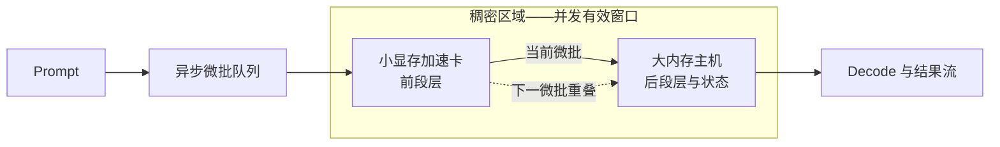

#  小显存加速卡 + 大显存低算力主机稠密加速 — 异构 GPU PD 实验室

[English](README.md)

当前版本：**v2.15 — 实验目录改为围绕研究问题、对照组、唯一变量、判定指标与结论边界组织**。完整性能表只保留在对应详档和机器可读 CSV；首页只负责导航与解释，不再重复展示同一组数据。

本仓库研究高算力小显存加速卡如何与低算力大内存主机协同完成大模型推理。公开内容包括架构、实测证据、设计演进、结论与限制；部署命令、补丁、端点和内部切层策略仍不公开。

## 研究架构

**稠密加速**专指两个设备分别持有同一模型的部分阶段，并在异步分层流水中都贡献有效计算。**稠密区域**是相邻微批让两段同时工作的调度重叠窗口；它不是张量并行、同一层重复计算，也不是远端 KV 存储的泛称。

## 证据规则

| 结论类型 | 最低证据要求 | 本仓库允许的表述 |
| --- | --- | --- |
| 可行性 | 完整请求、有效的阶段/状态交接、指标可归属 | “该配置可以运行” |
| 加速 | 模型、量化、负载、指标一致，并有匹配的单端对照 | “快于匹配对照” |
| 容量 / 服务画像 | 负载完成且有资源、稳定性证据，但没有匹配速度对照 | “能装下”“能服务”或“实测包络”；**不能写成加速** |
| 外部背景 | 保留原方法与来源的第三方公开实测 | “背景参考”；不能当成本地对照 |

- 中英文 README **不再放性能结果表**，只说明每项实验验证什么以及权威数据在哪里。
- 每项实验的可读表格只由对应 `results/` 详档承载；其链接的 `data/*.csv` 是机器可读镜像。
- `CHANGELOG_ZH.md` 只记录发布与纠错历史；版本号不是实验编号，也不是证据来源。
- 模型、量化、引擎、prompt 或拓扑不同的数据，不得拼成受控横向排名。

## 本地实验目录

| 稳定编号 | 主要问题 | 对照与变化因素 | 主要判定门槛 | 可以支持的结论 | 权威入口 |
| --- | --- | --- | --- | --- | --- |
| **9B-PD-01** | CUDA Prefill 能否把状态交给 Vulkan Decode？ | AI Max+ 395 单机对照；只改变 RTX 3060 预填充的 prompt 份额 | 交接完成、TTFT/Prefill、Decode 连续性、迁移状态大小 | 独立 PD 可行；不证明两端同时计算 | [详档](results/v1.0-independent-pd.zh-CN.md) · [CSV](data/benchmark-results.csv) |
| **9B-PIPE-01** | 两端能否通过异步分层流水共同计算同一模型？ | RTX 3060 单卡与 AI Max+ 395 单机对照；模型和负载固定，只细化流水调度 | 同口径 Prefill/Decode 对照、重复性、输出边界 | 该 9B 口径下的受控稠密加速 | [详档](results/v2.4-fused-layer-pipeline.zh-CN.md) · [CSV](data/benchmark-results.csv) |
| **27B-LONG-01** | 27B 无法由小卡独立装下时，分层驻留能否改善 395 主机的长 prompt 执行？ | 同 IQ3 负载的 395 单机对照；增加 RTX 3060 层段 | 不同 prompt 深度能否完成、Prefill、Decode | 长 prompt 可行性与相对 395 对照的改善；不能外推到 Q4 或 9B | [详档](results/qwen3.8-27b-dual-machine-pd.zh-CN.md) · [CSV](data/qwen27b-local-results.csv) |
| **27B-PD-01** | RTX 3080 Prefill 节点能否在 C1–C6 服务态交给 395 Decode 节点？ | 同模型 395 solo 对照；只改变请求是否走双节点 PD | TTFT、Prefill、Decode、KV 迁移、并发成功 | 历史双实例 PD 调度可行性 | [详档](results/qwen3.8-27b-dual-machine-pd.zh-CN.md) · [CSV](data/qwen27b-local-results.csv) |
| **27B-KV-01** | 3080 承担全部计算、395 只存 KV 时，服务能力如何取舍？ | 最新序列没有匹配的无远端 KV 对照；C/D 是同一实验的两个配置画像，只扫并发 | 上下文容量、Prefill、单流与聚合 Decode、缺失字段纪律 | 远端 KV 容量与服务包络；**不是稠密加速** | [详档](results/qwen3.8-27b-dual-machine-pd.zh-CN.md) · [CSV](data/qwen27b-local-results.csv) |
| **27B-DRAFT-AUDIT-01** | 重复文本的投机 Decode 高值能否代表自然语言服务？ | 在 395 草稿路径直接发自然语言；历史无头结果只作背景，不当因果对照 | 真实文本完成、实际 Decode、草稿接受率 | 审计护栏；禁止用重复文本结果代替生产文本 | [详档](results/qwen3.8-27b-dual-machine-pd.zh-CN.md) · [CSV](data/qwen27b-local-results.csv) |
| **ORNITH-PD-01** | MoE 模型能否保持 Prefill/Decode 归属清楚，并通过短任务与 100K 的 C1–C6 PD 压测？ | 没有同轮单机速度对照；改变负载深度和并发 | 路由成功、无 KV 复用、3080 Prefill 与 395 Decode 各自在独立窗口计量 | 角色归属与稳定性包络；不证明端到端加速 | [详档](results/ornith-1.5-35b-a3b-dual-machine-pd.zh-CN.md) · [CSV](data/ornith35a3b-local-results.csv) |
| **FLASH-SPLIT-01** | 单服务 CUDA+Vulkan 切层能否稳定跑 C1–C6，吞吐在哪个并发档饱和？ | 没有单设备对照；记录配置内只改变并发 | HTTP 成功、Prefill/Decode 聚合、总吞吐、显存余量 | 并发包络与工作点；不构成加速证明 | [详档](results/qwen3.8-flash-q4-layer-split.zh-CN.md) · [CSV](data/qwen38flash-q4-local-results.csv) |

机器可读的实验语义与旧标签别名见 [data/experiment-index.csv](data/experiment-index.csv)。

## 哪些是检查点、配置画像或版本，而不是新实验

- **v2.1–v2.4** 是 **9B-PIPE-01** 内部的调度细化检查点，不是四项独立实验。
- **27B-C 与 27B-D** 是 **27B-KV-01** 内部的 Prefill 优先 / Decode 优先配置画像，不是两个实验；重新发布或纠正计算归属不会产生新测量。
- **v2.5–v2.14** 多数是围绕既有记录的发布、展示或归属修订。它们只属于[更新记录](CHANGELOG_ZH.md)，不能按版本行累计成实验数量。
- 395 自然语言测试是**验证审计**，不是另一套竞争架构。
- DGX Spark 数字是[社区外部参考](results/dgx-spark-community-control.zh-CN.md)，不是本地实验，也不是匹配基线。

## 阅读顺序

1. 先在上表找到与你的决策问题一致的实验。
2. 先读 `results/` 中的实验契约和边界，再看数据表。
3. 计算时使用对应 CSV；除非详档明确给出匹配对照，否则不要跨稳定编号合并数据。
4. [更新记录](CHANGELOG_ZH.md)只用于追溯文案、归属和文件在何时变化。

## 结论与限制

- **9B-PIPE-01** 有同口径两端单机对照，是本仓库证明稠密加速的受控证据。
- **27B-LONG-01** 只能支持更窄的结论：分层配置改善同口径 395 单机的长 prompt 路径；RTX 3060 无法提供整模单卡对照。
- **27B-KV-01** 是内存容量架构。395 只存 KV，不参与 Prefill 或 Decode，因此不能表述成两端计算加速。
- **ORNITH-PD-01** 与 **FLASH-SPLIT-01** 只刻画稳定性和吞吐包络；没有匹配单机对照，就不作因果加速结论。
- 未记录字段保持缺失，不插值补齐并发档或阶段计时。

## 后续研究方向

- **v3.0 方向**：使用统一工作负载矩阵，在更多大内存主机与小显存加速卡上复做受控稠密加速实验。
- **v4.0 方向**：研究一张加速卡服务多台大内存主机，并把公平性、隔离、故障恢复与扩展边界纳入门禁。

