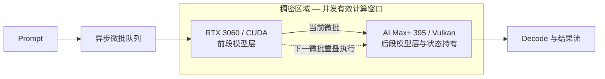

#  AI Max+ 395 稠密加速 — 异构 GPU PD 实验室

[English](README.md)

本仓库记录单机异构 GPU Prefill/Decode（PD）与稠密加速实验：RTX 3060 12GB 与 AMD Ryzen AI Max+ 395 / Radeon 8060S 协同工作。

当前版本：**v2.5 — 稠密加速（异步分层 PD）**。公开范围仅包含架构、实测数据、思维演进、结论与限制；不提供部署步骤、复现命令、补丁、端点或内部切层策略。

**什么是稠密加速。** 由一张加速卡 + 一台被加速机器组成。两者显存重叠的区域即为显存稠密区；落入该区域内的模型，其解码（decode）与预填充（prefill）都会得到显著加速。该加速是无损的，且各项指标均高于加速卡或被加速机器单独运行时的数值。

这为低算力大显存主机（如 DGX Spark、AI Max+ 395）与高算力小显存卡（如 RTX 3060、RTX 3080）提供了更多应用机会与场景。

## 本次变化

- **v1.0** 将 prefill 与 decode 分离，并把状态交给 AI Max+ 395。
- **v2.1–v2.5** 演进为异步微批流水，让两台设备共同处理一次 prefill；最终形态正式命名为**稠密加速**。
- **v2.5 达到 2129.69 tok/s**：在本地 `9B Q6_K / pp5064` 测试中，比 RTX 3060 基线高 34.0%，比 AI Max+ 395 基线高 119.6%。
- 新增 DGX Spark 社区数据作为**外部对照**。由于模型、量化、prompt、分支与内核不同，不能直接排名。

## 稠密加速架构

最终设计依赖 llama.cpp 上游 [PR #18626](https://github.com/ggml-org/llama.cpp/pull/18626) 的 RPC events/async 能力。模型层常驻各自端点，微批依次穿过两个阶段，使两端能够并发工作；本实验不宣称拥有自研推理引擎补丁。

### 术语定义

- **稠密加速**是本项目对最终异步分层 PD 形态的正式命名：外接显卡与 AI Max+ 395 分别持有自己的模型层，RPC/events 让相邻微批持续占用两个阶段。
- **稠密区域**是异步微批流水时间轴上的重叠计算窗口：外接显卡与 AI Max+ 395 同时处于有效计算状态，分别处理相邻微批和各自层段。填满这段窗口可减少流水气泡，对其覆盖的模型层段进行强加速。
- 稠密区域描述的是调度重叠，**不代表**两卡重复计算同一层、进行张量并行或重复驻留权重。

## 研究演进

每一步都由上一步的实测结果驱动，而非预设计划。下面的 v2 名称是公开修订标签，不披露内部切层比例。

| 阶段 | 驱动来源 | 关键验证 | 结果 |
| --- | --- | --- | ---: |
| v1.0 | 395 单卡 prefill 约 970 tok/s，3060 全程闲置。能否让 3060 分担 prefill 的一部分？ | CUDA prefill → Vulkan decode 状态交接可稳定完成。 | 1452.29 tok/s；decode 30.28 tok/s |
| v2.1 | v1.0 让两卡对同一请求*先后*处理。能否让它们*同时*为同一次 prefill 工作？ | 异步微批流水让同一请求内两个切层阶段同时保持激活。 | 1865.08 tok/s |
| v2.2 | v2.1 的重叠在不同轮次间仍会波动。能否做到可复现？ | 细化异步重叠调度后，流水在各轮次间趋于一致。 | 1893.87 tok/s |
| v2.3 | 流水可复现后，哪种切层比例最能平衡两台后端？ | 平衡后的切层同时把 decode 抬到 v1.0 之上。 | 1999.51 tok/s；decode 37.16 tok/s |
| **v2.5** | 切层调好后，什么样才称得上稠密加速而非普通重叠？ | 校准检查点把稠密区域填满，达到两端单卡 prefill 之和的 83.2%。 | **2129.69 tok/s；decode 50.73 tok/s** |

## 本地测试口径

| 项目 | 配置 |
| --- | --- |
| 模型 | 9B，Q6_K |
| 设备 | RTX 3060 12GB / CUDA + Ryzen AI Max+ 395 / Radeon 8060S / Vulkan |
| v1.0 输入 / 输出 | 5064 / 128 token |
| v1.0 测量 | 关闭缓存，保留第二次 server 请求结果 |
| v2 测量 | `pp5064`；仅在有记录的节点给出 `tg128` |

## v1.0 — 独立 PD

| 配置 | TTFT | Prefill | Decode |
| --- | ---: | ---: | ---: |
| 纯 AI Max+ 395 | 5.879 s | 861.55 tok/s | 30.24 tok/s |
| 前段 512 token 独立 PD | 5.720 s | 886.62 tok/s | 30.22 tok/s |
| 前段 2048 token 独立 PD | 5.077 s | 999.16 tok/s | 30.18 tok/s |
| 完整独立 PD | **3.496 s** | **1452.29 tok/s** | **30.28 tok/s** |

完整独立 PD 交接 5063 token、208.57 MiB 状态数据。它保留了多请求下 prefill/decode 双工的架构潜力，但本版本没有进行并发量化。

## v2.1–v2.5 — 稠密加速演进

空白表示该检查点未记录该指标。

| 检查点 | 公开说明 | Prefill | Decode | TTFT |
| --- | --- | ---: | ---: | ---: |
| RTX 3060 基线 | 仅 CUDA 端 | 1589.00 tok/s | 43.87 tok/s | — |
| AI Max+ 395 基线 | 仅 Vulkan 端 | 970.00 tok/s | 31.27 tok/s | — |
| v2.1 | 首个融合流水 | 1865.08 tok/s | — | — |
| v2.2 | 重叠细化 | 1893.87 tok/s | — | — |
| v2.3 | 平衡细化 | 1999.51 tok/s | 37.16 tok/s | — |
| **v2.5** | 稠密加速最终检查点 | **2129.69 tok/s** | **50.73 tok/s** | — |

v2.5 比 RTX 3060 prefill 基线高 34.0%，比 AI Max+ 395 基线高 119.6%，达到两端单卡实测之和 2559 tok/s 的 83.2%。这些结果仅由本地表格计算，不外推到其他硬件。

融合 decode 的 37.16 tok/s 来自 v2.3 检查点；v2.5 检查点记录到 50.73 tok/s 的 decode。

## 27B 稠密区域验证 — 独立口径

本组探索数据与上方 `9B Q6_K / pp5064` 主表严格分开。模型为 Qwen3.8-27B UD-IQ3_XXS（27.32B 参数、10.17 GiB、3.06 bpw），因此不参与 v2.5 百分比计算。

| 测量项 | 纯 AI Max+ 395 | 稠密加速 | 实测变化 |
| --- | ---: | ---: | --- |
| pp4096 | 313.28 tok/s | **658.52 tok/s** | +110% |
| pp65536 | 136.69 tok/s | **319.10 tok/s** | +133%（2.33 倍） |
| pp98304 | 900 秒超时 | **225.10 tok/s** | 完成，TTFT ≈ 437 秒 |
| Decode tg64 | 18.26 tok/s | **19.57 tok/s** | 约 +7% |

本环境没有可用的 RTX 3060 单卡 27B 同口径基线。稠密加速能够完成，是因为外接显卡只需驻留并计算分配给它的层段；文档不公开内部切层比例。本组是 IQ3 验证，不能写成 Q4 结论。

## DGX Spark 社区外部对照

以下数据保留社区原始公开口径，仅提供背景，不与本地实验排名。

| 设备 | 社区工作负载 | Prompt 口径 | Prefill | 可直接比较？ | 来源 |
| --- | --- | ---: | ---: | --- | --- |
| NVIDIA DGX Spark / GB10 | Qwen3.5 9B，TQ3_4S，分支专属 FP4 cache-on 路径 | pp2048 | 2766.28 tok/s | **否** — 量化、prompt、分支与内核不同 | [llama.cpp-tq3 PR #53](https://github.com/turbo-tan/llama.cpp-tq3/pull/53) |
| NVIDIA DGX Spark / GB10 | Nemotron-3-Nano-30B-A3B，UD-Q4_K_XL，depth 0，f16 KV | pp2048 | 809.55 tok/s | **否** — 模型架构/大小、量化、prompt 与分支不同 | [TurboQuant issue #44](https://github.com/TheTom/llama-cpp-turboquant/issues/44) |

详见 [来源说明](results/dgx-spark-community-control.zh-CN.md) 与 [机器可读外部对照](data/dgx-spark-community-controls.csv)。

## 结论与限制

- v1.0 证明了 CUDA prefill 与 Vulkan decode 间的异构状态交接。
- v2.5 稠密加速证明了异构切层流水能产生真实异步计算重叠，但同时占用两端会失去 v1.0 的独立 PD 双工能力。
- v1.0 来自 server 请求测量，v2 来自 llama-bench pp/tg；跨版本百分比仅为工程参考，不是严格同口径研究结论。
- 当前证据只覆盖单机：一组严格同口径的 9B 单并发短基准，以及一组独立的 27B IQ3 prompt 长度扫描，最长 98,304 token。27B Q4、多并发与多机仍未验证。
- 社区外部对照不做归一化或推算，完整保留原始公开口径。

详细记录：[v1.0 独立 PD](results/v1.0-independent-pd.zh-CN.md)、[v2.5 稠密加速演进](results/v2.5-fused-layer-pipeline.zh-CN.md)、[本地 CSV](data/benchmark-results.csv) 与 [更新记录](CHANGELOG_ZH.md)。
