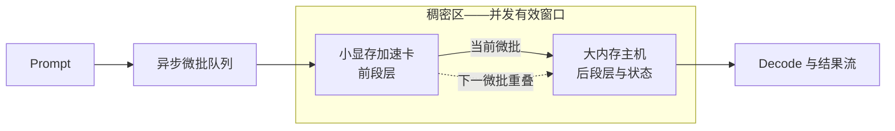

#  小显存加速卡 + 大显存低算力主机稠密加速 — 异构 GPU PD 实验室

[English](README.md)

当前版本：**v2.19 — 两条加速卡路线分线，单卡基线前置**。本版把 RTX 3060 与 RTX 3080 两代加速卡拆成两条独立主线，并把 RTX 3060 单卡与 AI Max+ 395 单机的基线数据提到所有异构组合数据之前。没有新测量，没有改任何数值。权威详档与机器可读 CSV 仍是数值事实源。

本仓库研究一个问题：高算力、小显存的加速卡，如何与低算力、大内存的主机协同完成大模型推理。公开内容包括架构、实测证据、设计演进、结论与限制。部署命令、补丁、端点和内部切层策略不公开。

## 基础架构：系统如何工作

**稠密加速**由两台设备共同完成同一模型阶段的计算。小显存加速卡驻留并计算前段层。大内存主机驻留并计算后段层与状态。相邻微批在**稠密区（Dense Region）**内重叠执行，因此两台设备在同一时间窗口里都有有效计算。**稀疏区（Sparse Region）**负责其余职责：完整模型驻留与容量。未能进入重叠窗口的部分由它承担。

这条路线不是普通逐层串行，不是张量并行，不是同一层重复计算，也不是把 395 当远端 KV 池的独立 PD。

## 两条加速卡路线：RTX 3060 12GB 与 RTX 3080 20GB

本项目至今只用过两张 NVIDIA 加速卡。它们属于两条不同的实验线：能装下的模型档位不同，能支持的结论也不同。大内存主机始终是同一台 AI Max+ 395。看任何数据之前，先确认它属于哪条线。

| 对比项 | 路线一：RTX 3060 12GB | 路线二：RTX 3080 20GB |
| --- | --- | --- |
| 覆盖版本 | v1.0 → v2.4 | v2.5 → v2.14 |
| 显存与能装什么 | 12GB，只够 9B 这一档稠密模型完整驻留 | 20GB，27B Q4 与 MoE 切层才成为可能 |
| 模型规模 | 9B 稠密 Q6_K；27B 只能靠 IQ3 分层驻留 | 27B 稠密 Q4；Ornith-1.5-35B-A3B 与 Qwen3.8-Flash MoE |
| 实验编号 | 9B-PD-01、9B-PIPE-01、27B-LONG-01 | 27B-PD-01、27B-KV-01、ORNITH-PD-01、FLASH-SPLIT-01 |
| 该线最好的一组数据 | 9B 异步流水 Prefill **2129.69**、Decode **50.73 tok/s**，相对 3060 单卡为 **+34.0% / +15.6%** | 27B 长 prompt 在 64K 相对 395 单机为 **+133.4%**；Flash 单服务切层 C4 档 Prefill **633.685**、总吞吐 **338.270 tok/s** |
| 这条线证明了什么 | 两台设备可以共同完成同一模型的预填充，并超过在场最快的单卡。这是仓库里唯一的受控稠密加速证据。 | 换上更大显存的加速卡后，可跑的模型规模、上下文深度和并发档位整体抬了一档。但这条线缺同口径单机对照，目前只支持可行性与服务包络结论。 |
| 该线主要缺口 | 缺 RTX 3080 在同一 9B 口径下的复测 | 27B 与 MoE 各格缺 3060 单卡或 3080 单卡的匹配基线 |

两条线不能混排成一张排名表。3060 线的加速百分比不能外推到 3080 线的模型；3080 线更高的绝对吞吐也不等于 3060 线上的进步。仓库内没有 RTX 3090 的任何实测数据，选型阶段已排除该卡，因此本仓库全部数值都与 3090 无关。

## 实验发展时间线：v1.0 → v2.19

版本号是发布顺序，不是实验数量。v2.1–v2.4 是同一项 9B 流水实验的四个检查点。后面的版本里，有的是新实验，有的只做归属整理或表达修订。下表逐版区分，并在阶段标题里标明该阶段用的是哪张加速卡。

### 阶段一：v1.0 → v2.4，加速卡 RTX 3060 12GB，9B 稠密模型从能否交接做到超过最快单卡

这一阶段先回答“能不能”，再回答“快不快”。起点是最朴素的问题：两台设备能否把状态交接起来。到阶段结束，两台设备在同一模型上共同计算，异步流水超过了最快的单卡对照。Prefill 沿 **1452.29 → 1865.08 → 1893.87 → 1999.51 → 2129.69 tok/s** 连续爬升。每一步提升都有明确原因。

| 版本 | 这一步在问什么 | 做了什么实验 | 拿到什么数据 | 结论如何往前走了一步 |
| --- | --- | --- | --- | --- |
| v1.0 | CUDA Prefill 能否把状态交给 Vulkan Decode？ | 9B Q6_K，5064 输入 / 128 输出。RTX 3060 预填充 0 / 512 / 2048 / 全部，与 AI Max+ 395 单机对照（**9B-PD-01**）。 | 完整 PD：TTFT **3.496 秒**、Prefill **1452.29**、Decode **30.28 tok/s**；395 单机为 5.879 秒、861.55、30.24。 | 交接可行。TTFT 与 Prefill 改善，Decode 不掉。但两端仍按阶段串行，为下一步流水化铺路。 |
| v2.1 | v1.0 两端按请求交替空闲，能否让微批重叠？ | 首个融合流水检查点，同一 9B Q6_K 口径。 | Prefill **1865.08 tok/s**。 | 重叠有效。Prefill 首次超过 RTX 3060 单卡对照的 1589.00。 |
| v2.2 | 重叠带来的提升能否复现？ | 重叠细化检查点。 | Prefill **1893.87 tok/s**。 | 轮次波动收窄，提升可复现。 |
| v2.3 | 负载平衡能否同时改善两端？ | 阶段平衡细化检查点。 | Prefill **1999.51**、Decode **37.16 tok/s**。 | Decode 首次有记录。两端指标同步改善。 |
| **v2.4** | 两端都工作后，能否超过最快单卡并守住输出边界？ | 最终校准流水，收口为 **9B-PIPE-01**。同时新增独立口径的 27B IQ3 分层验证、DGX Spark 外部对照（**EXT-DGX-01**）与完整中文镜像。 | Prefill **2129.69**、Decode **50.73 tok/s**；相对 RTX 3060 单卡（1589.00 / 43.87）为 **+34.0% / +15.6%**。27B IQ3：pp4096 **658.52**、pp65536 **319.10**、pp98304 **225.10**、tg64 **19.57 tok/s**。 | 该口径的稠密加速闭环，并正式命名稠密区域。27B 数据进入后续 27B-LONG-01。EXT-DGX-01 只作外部背景，不可与本地行排名。 |

### 阶段二：v2.5 → v2.10，加速卡换成 RTX 3080 20GB，模型升到 27B

这一阶段把 9B 验证过的机制搬到更大的模型和更强的卡上。阶段覆盖五类新问题：分层驻留、服务态 PD、远端 KV 池、投机解码审计、外部对照。阶段结束时的结论是：大模型路线必须按目标分流。降 TTFT 用阶段分离；要容量用远端 KV；长 prompt 用分层驻留。三者都不是稠密加速。

| 版本 | 这一步在问什么 | 做了什么实验 | 拿到什么数据 | 结论如何往前走了一步 |
| --- | --- | --- | --- | --- |
| v2.5 | 9B 机制成立后，3080 全量 Prefill + 395 Decode 能否把 27B Q4 带入服务态？ | 迁移到 **RTX 3080 20GB**。C1–C6 六个并发档 × split / solo 两种路径，共 12 组服务态压测（**27B-PD-01**）。 | C1：TTFT **1073 / 4825 毫秒**、Prefill **1000.6 / 207.2**、Decode **38.75 / 36.33 tok/s**；C1–C6 KV 迁移 **68–76 毫秒**。移除 RPC 逐 ubatch 同步后，Prefill 从 **683.2** 升到 **1000.6 tok/s**，约为 3080 裸算 **1228.53 tok/s** 的 **82%**。 | 服务态 PD 可行。Prefill 不随并发衰减，Decode 无损。同步开销被定位为主要损耗。 |
| v2.6 | 3060 / IQ3 与 3080 / Q4 两条 27B 记录割裂，如何统一？ | 合并为统一 27B 实验区。发布 3080 路由 v1.1 与线上 v1.2。新增 395 自然语言审计（**27B-DRAFT-AUDIT-01**）。 | Prefill 最高 **1210.6**、单流 Decode **63.2 tok/s**。重复文本 **35.0–38.5 tok/s**、接受率 100%；自然语言 C1 **12.1 tok/s**、接受率 17.7%。 | 形成 Prefill 优先 / Decode 优先两类画像。审计确立护栏：重复文本高值不能代表生产文本。 |
| v2.7 | 关键结果被实现细节淹没，如何让路线先被看见？ | 只重排表达。 | 无新测量。 | 路线选择先于参数细节。 |
| v2.8 | C / D 的计算归属与容量价值被混淆。 | 归属纠正。 | 无新测量。确认 3080 承担全部计算，395 只存 KV，每流 **1M** 上下文。 | 远端 KV 被明确划为容量路线，不是计算加速。 |
| v2.9 | 27B-D 的 C6 峰值与适用范围需要更正。 | 数据纠错。 | C6 聚合 Decode 更正为 **116.3 tok/s**。无新实验。 | 数字与适用口径统一。 |
| v2.10 | C / D 与 DGX Spark 口径分散。 | 集中成一张对比表。同时把 **DFlash2 加速头**独立成类目。 | 无新本地测量。DGX Spark 摘要为约 **1000 tok/s Prefill、25–30 tok/s 单流 Decode、107 tok/s 聚合 Decode、C1–C6 并发**，并显式标注不可直接比较。 | 外部背景与本地数据分栏，不再混排。 |

### 阶段三：v2.11 → v2.14，仍用 RTX 3080 20GB，扩到 MoE 模型与单服务切层

这一阶段回答两个新问题。其一，机制换到 MoE 模型后，Prefill 与 Decode 的归属还能不能计量清楚。其二，只运行一个服务时，吞吐在哪个并发档饱和。结论：MoE PD 稳定且归属清楚，但没有单机基线，不能谈加速；Flash 切层给出 C4 工作点。

| 版本 | 这一步在问什么 | 做了什么实验 | 拿到什么数据 | 结论如何往前走了一步 |
| --- | --- | --- | --- | --- |
| v2.11 | 换到 MoE，阶段归属与 100K 稳定性还成立吗？ | Ornith-1.5-35B-A3B 双机 PD 压测：3080 全量 Prefill，395 全量 Decode（**ORNITH-PD-01**）。 | **42/42** 全部成功，`route=pd`、`n_reuse=0`。短任务 Prefill 聚合 **4017.46 → 3943.88**；100K Prefill 聚合 **2895.53 → 2793.24**；395 纯 Decode 聚合 **23.33 → 148.20 tok/s**。 | MoE PD 稳定，归属清楚。但没有同轮单机基线，不能宣称加速。 |
| v2.12 | 整档墙钟派生值能否独立归属？ | 指标治理。 | 无新测量。删除派生 Decode 展示。 | 公开指标只保留可直接归属的量。 |
| v2.13 | 多轮记录可能混入非目标实验。 | 证据锁定 r337。 | 无新测量。锁定 3080 纯 Prefill、395 纯 Decode。 | Ornith 证据源唯一。 |
| v2.14 | 单服务双设备切层在哪个并发档饱和？ | r374 Qwen3.8-Flash Q4：单个 llama-server 同时跑 3080 与 395，C1–C6（**FLASH-SPLIT-01**）。 | **21/21** 计分请求全部成功。C4 最佳：Prefill **633.685**、聚合 Decode **71.185**、总吞吐 **338.270 tok/s**。3080 显存峰值 **19129 MiB**。 | 得到该口径的并发工作点 C4。没有单机对照，不构成加速证明。 |

### 阶段四：v2.15 → v2.19，只做证据治理与表达修订，无新硬件、无新测量

这一阶段**没有新测量，没有新数值**。做的事只有两类：整理证据归属，修订表达。阶段结束时，每个实验有唯一编号和唯一权威入口，两条加速卡路线分开陈述，首页只保留决策级切片。

| 版本 | 这一步在问什么 | 做了什么实验 | 拿到什么数据 | 结论如何往前走了一步 |
| --- | --- | --- | --- | --- |
| v2.15 | 同一数据在多处重复、实验目的混杂。 | 实验治理。新增 `data/experiment-index.csv`，把 v2.4 的 Decode **50.73** 补回 `data/benchmark-results.csv`。 | 无新测量。 | 稳定编号、唯一权威入口与结论边界确立。 |
| v2.16 | 首页过度简化，外部读者看不到提升幅度。 | 决策看板恢复。 | 无新测量。 | 关键数字、变化率与路线表回到首页。 |
| v2.17 | 数据可见后，基础架构与六格主线仍不突出。 | 结构重排。 | 无新测量。 | 架构前置。六格矩阵建立。进度标为 **0/6 全闭环、4 格部分完成、2 格待测**。 |
| v2.18 | 版本之间的递进读不出来，语句也不通顺。 | 叙事重写。 | 无新测量。 | 时间线整章前移并分成四个阶段，每版一行写清这一步在问什么、拿到什么。 |
| **v2.19** | RTX 3060 与 RTX 3080 两条线混在一起，异构组合数据出现在单卡基线之前。 | 分线与基线前置。 | 无新测量。 | 两条加速卡路线独立成章，每格与每行标明用的是哪张卡。单卡基线排在全部组合数据之前。 |

补充边界：**27B-C / 27B-D** 是 27B-KV-01 的两个服务画像，不是两项实验。395 自然语言测试是 27B-DRAFT-AUDIT-01 的验证负载。[DGX Spark](results/dgx-spark-community-control.zh-CN.md) 是 EXT-DGX-01 的外部背景。三者都不另算为新的本地实验。

## 六实验主矩阵：3080 / 3060 双基准

六格不按模型名字或参数量划分，而按**完整工作集与加速卡显存的相对大小**划分。工作集包括权重、KV、计算缓冲和安全余量。**轻松装**表示仍有稳定余量；**装满**表示接近可用显存上限；**装不下**表示单卡无法完成目标负载。

统一对照口径：每格尽量记录 **RTX 3060 单卡、RTX 3080 单卡、AI Max+ 395 单机、3060 + 395、3080 + 395** 五种配置。模型、量化、prompt、上下文、并发和指标必须一致。单卡装不下时，“无法加载 / 无法完成”本身就是边界结果，不能换模型或换量化来冒充基线。核心指标统一为 Prefill、Decode、TTFT、聚合吞吐、显存余量和成功率。

**当前严格完成度：0/6 全闭环。** 已有 4 格先导或局部证据，2 格仍待测。任何缺少 3060 / 3080 同口径基线的格子都明确标为未完成。

| 六类实验 | 要验证的问题 | 3080 / 3060 基准角色 | 395 / 异构路线与判定指标 | 当前状态与证据 |
| --- | --- | --- | --- | --- |
| **D1 稠密·轻松装** 已测加速卡：**RTX 3060** | 工作集完整留在小卡且余量充足时，稠密流水能否超过更快的单卡，而不只是扩容？ | 3060 同口径单卡已测；3080 同口径复测待补。 | 单卡、395 与异步分层流水对比 Prefill / Decode / TTFT。 | **部分完成**：9B-PIPE-01 相对 3060 为 Prefill **+34.0%**、Decode **+15.6%**；缺 3080 基线。[详档](results/v2.4-fused-layer-pipeline.zh-CN.md) |
| **D2 稠密·装满** 已测加速卡：**RTX 3080** | 工作集贴近卡上限时，整模单卡、阶段分离、分层稠密三条路线哪条更优？ | 3080 20GB 是 27B Q4 的主要满载基准；3060 负责记录同模型装不下或降级的边界。 | 比较显存余量、TTFT、Prefill、Decode 与交接成本。 | **部分完成**：27B-PD-01 已有 3080 Prefill / 395 Decode 服务证据；缺双卡同口径稠密对照。[详档](results/qwen3.8-27b-dual-machine-pd.zh-CN.md) |
| **D3 稠密·装不下** 已测加速卡：**RTX 3060** | 单卡无法完成目标工作集时，分层驻留能否让任务完成并快于 395？ | 3060 是当前容量下界；3080 需在同一 prompt 深度补测，确定它落在“装满”还是“装不下”。 | 以完成率、长 prompt Prefill、Decode 和 TTFT 判定。 | **部分完成**：27B-LONG-01 在 64K 相对 395 Prefill **+133.4%**，98K 从超时变为完成；缺 3080 同口径记录。[详档](results/qwen3.8-27b-dual-machine-pd.zh-CN.md) |
| **M1 MoE·轻松装** 已测加速卡：**两张卡都未测** | 激活参数较小且完整工作集有余量时，MoE 路由开销会不会抵消异构重叠收益？ | 3060 与 3080 都需做同模型、同量化单卡基线。 | 对比专家路由后 Prefill / Decode、接受率、TTFT 与负载均衡。 | **待测**：尚无满足双基准口径的本地实验，不填提升值。 |
| **M2 MoE·装满** 已测加速卡：**RTX 3080** | MoE 工作集贴近 3080 上限时，阶段分离能否稳定；进一步做稠密重叠是否有收益？ | 3080 是满载 Prefill 基准；3060 记录装不下的边界，或可行的更小同族模型。 | 先验收路由归属与长上下文稳定性，再补同口径速度对照。 | **部分完成**：ORNITH-PD-01 已有 **42/42** 路由成功和 100K 包络；缺 3080 / 3060 匹配的单机速度基线，不能宣称加速。[详档](results/ornith-1.5-35b-a3b-dual-machine-pd.zh-CN.md) |
| **M3 MoE·装不下** 已测加速卡：**RTX 3080（仅先导）** | 总工作集超过两张基准卡时，按层 / 专家驻留能否兼顾可运行、吞吐与输出正确性？ | 3060 与 3080 均应先记录无法独立完成的容量边界。 | 以完成率、路由正确性、Prefill / Decode、显存与跨设备等待判定。 | **待测**：FLASH-SPLIT-01 仅提供邻近的切层服务包络，尚无双单卡基线，不能替代本格闭环。[先导记录](results/qwen3.8-flash-q4-layer-split.zh-CN.md) |

## 一眼结论

- **受控稠密加速结论只来自 9B-PIPE-01。** 相对更快的 RTX 3060 单卡对照，Prefill 从 1589.00 升到 **2129.69 tok/s（+34.0%）**，Decode 从 43.87 升到 **50.73 tok/s（+15.6%）**。
- **目标是降低 TTFT、且加速卡装得下 Prefill 所需副本时，选阶段分离 PD。** 9B-PD-01 的全量 PD 把 TTFT 从 5.879 降到 **3.496 秒（-40.5%）**，Decode 基本不变；27B 历史服务路径把 C1 TTFT 从 4825 降到 **1073 毫秒（-77.8%）**。
- **模型装不进小卡时，选分层驻留。** 27B-LONG-01 的 3060 + 395 路线相对 395，在 4K / 64K Prefill 分别提升 **+110.2% / +133.4%**；98K 对照 900 秒超时，分层路线完成。
- **需要容量时选远端 KV，但不要写成计算加速。** 27B-KV-01 达到**每流 1M 上下文**。全部模型计算都在 3080，395 只存 KV。
- **Ornith 与 Flash 只证明工作包络。** Ornith 在 100K 压测中 42/42 路由成功；Flash 21/21 计分请求成功，最佳实测点是 **C4：总吞吐 338.270 tok/s**。两者都没有匹配的单机速度对照。

## 实验结果速览

### 先看单卡基线

所有异构组合数据都必须对着这几行单卡基线来读。基线数值逐字取自 CSV，没有换算，也没有插值。

**9B Q6_K 档基线**（对应 9B-PD-01 与 9B-PIPE-01）

| 单设备基线 | 模型与量化 | 测法与负载 | Prefill | Decode |
| --- | --- | --- | --- | --- |
| **RTX 3060 12GB 单卡** | 9B Q6_K | `llama-bench`，pp5064 / tg128 | **1589.00 tok/s** | **43.87 tok/s** |
| **AI Max+ 395 单机（服务态口径）** | 9B Q6_K | 服务端第二轮，5064 输入 / 128 输出 | **861.55 tok/s** | **30.24 tok/s** |
| **AI Max+ 395 单机（`llama-bench` 口径）** | 9B Q6_K | `llama-bench`，pp5064 / tg128 | **970.00 tok/s** | **31.27 tok/s** |

395 的两个数字不是互相冲突，而是测法不同。服务态口径用于和 v1.0 的独立 PD 对比，`llama-bench` 口径用于和 v2.4 的融合流水对比。同一次比较只能用同一口径。三行数据都来自 [benchmark-results.csv](data/benchmark-results.csv)。

**27B 档基线**（对应 27B-LONG-01、27B-PD-01 与 27B-KV-01）

RTX 3060 装不下 27B 整模，所以这一档没有 3060 单卡基线，只有 3080 单卡与 395 单机。

| 单设备基线 | 模型与量化 | 负载 | 实测 |
| --- | --- | --- | --- |
| **RTX 3080 20GB 单卡裸算** | 27B Q4 | pp1024 / pp4096 / tg64 | Prefill **1228.53** / **1203.06 tok/s**；Decode **33.08 tok/s** |
| **AI Max+ 395 单机（IQ3）** | 27B IQ3 | pp4096 / pp65536 / pp98304 / tg64 | Prefill **313.28** / **136.69 tok/s**，pp98304 在 900 秒超时；Decode **18.26 tok/s** |
| **AI Max+ 395 单机（Q4 服务态）** | 27B Q4 | C1，solo 路径 | TTFT **4825 毫秒**；Prefill **207.2 tok/s**；Decode **36.33 tok/s** |

27B 三行数据都来自 [qwen27b-local-results.csv](data/qwen27b-local-results.csv)。MoE 两项实验（ORNITH-PD-01、FLASH-SPLIT-01）没有任何匹配的单卡或单机基线，所以它们的数据只出现在下面的服务包络表里。

### 有匹配基线——允许计算提升幅度

变化率统一按“`测试路线 / 匹配对照 - 1`”计算；TTFT 写下降幅度。每一行都限定在同一模型、量化、负载和实验口径内，并标明用的是哪张加速卡。

| 实验 | 加速卡 | 匹配基线实测 | 本路线实测 | 提升幅度 | 直接结论 |
| --- | --- | --- | --- | --- | --- |
| **9B-PD-01** | RTX 3060 12GB | 395 单机：TTFT **5.879 秒**、Prefill **861.55**、Decode **30.24 tok/s**（9B Q6_K，5064 输入 / 128 输出） | 全量 CUDA Prefill / Vulkan Decode PD：TTFT **3.496 秒**、Prefill **1452.29**、Decode **30.28 tok/s** | TTFT **-40.5%**；Prefill **+68.6%**；Decode **+0.1%** | 全量状态交接可行，并降低 prompt 延迟。两阶段仍串行，不属于稠密加速。 |
| **9B-PIPE-01** | RTX 3060 12GB | RTX 3060 单卡：Prefill **1589.00**、Decode **43.87 tok/s**；同口径 395 单机为 **970.00 / 31.27 tok/s** | 最终异步分层流水：Prefill **2129.69**、Decode **50.73 tok/s** | 相对 3060：**+34.0% / +15.6%**；相对 395：**+119.6% / +62.2%** | 这是仓库中“两端都在稠密区贡献有效计算”的受控证据。 |
| **27B-LONG-01** | RTX 3060 12GB | 395 单机（27B IQ3）：pp4096 **313.28**、pp65536 **136.69**、pp98304 在 900 秒超时、tg64 **18.26 tok/s** | 3060 + 395 分层驻留：pp4096 **658.52**、pp65536 **319.10**、pp98304 **225.10**、tg64 **19.57 tok/s** | 4K **+110.2%**；64K **+133.4%**；98K 从超时变为完成；Decode **+7.2%** | 小卡装不下整模、且长 prompt 的 Prefill 是瓶颈时，选分层驻留。 |
| **27B-PD-01** | RTX 3080 20GB | 395 solo（27B Q4，C1）：TTFT **4825 毫秒**、Prefill **207.2**、Decode **36.33 tok/s** | 3080 Prefill / 395 Decode 服务路径：TTFT **1073 毫秒**、Prefill **1000.6**、Decode **38.75 tok/s**；C1–C6 KV 迁移 **68–76 毫秒** | TTFT **-77.8%**；Prefill **+382.9%（4.83×）**；Decode **+6.7%** | 双实例服务交接通过 C1–C6。它证明阶段分离，不证明同一阶段并行计算。 |

### 无匹配基线——只写服务包络，不写加速倍数

这里的百分比只描述固定配置内的并发伸缩或负载敏感性，不代表相对单机的加速。四项记录全部在 RTX 3080 20GB 上取得。

| 实验 | 加速卡 | 关键实测 | 同配置内变化 | 缺哪一项基线 | 直接结论 |
| --- | --- | --- | --- | --- | --- |
| **27B-KV-01** | RTX 3080 20GB | **每流 1M 上下文**；配置 C 的 Prefill 保持 **1194.4–1210.6 tok/s**；聚合 Decode C1→C6：C 为 **33.55→63.84**，D 的最新摘要为 **63.2→116.3 tok/s** | C **+90.3%**；D **+84.0%** 的并发伸缩 | 缺同轮“3080 无远端 KV”的对照序列 | Prefill 优先选 C，Decode 吞吐优先选 D。395 只存 KV，因此它是容量与服务路线，不是稠密加速。 |
| **27B-DRAFT-AUDIT-01** | RTX 3080 20GB（草稿路径在 395） | 重复文本 **35.0–38.5 tok/s、接受率 100%**；自然语言 C1 **12.1 tok/s、接受率 17.7%** | 自然语言 C1 相对 38.5 高值低 **68.6%** | 不适用，这是审计而不是加速实验 | 重复文本的投机解码高值不能代表生产文本。必须使用负载匹配的数据。 |
| **ORNITH-PD-01** | RTX 3080 20GB | **42/42 成功**，`route=pd`、`n_reuse=0`；100K Prefill C1→C6 **2895.53→2793.24**；纯 Decode 聚合 **23.33→148.20 tok/s** | Prefill 从 C1 到 C6 变化 **-3.5%**；Decode 并发伸缩 **6.35×** | 缺 3080 单卡与 395 单机的同轮速度基线 | 适合验证 MoE 的 Prefill / Decode 归属和 100K 稳定性。没有单机基线，不能宣称因果加速。 |
| **FLASH-SPLIT-01** | RTX 3080 20GB | **21/21 成功**；C4 最佳：Prefill **633.685**、聚合 Decode **71.185**、总吞吐 **338.270 tok/s** | C1→C4：Prefill **+11.2%**、聚合 Decode **+102.2%**、总吞吐 **+58.4%** | 缺 3080 单卡与 395 单机的同口径对照 | 该单服务切层配置的实测工作点是 C4。C5–C6 已进入平台区，且没有单机对照。 |

完整行、指标定义和缺失字段仍由各项[实验详档](results/)及 CSV 承载。首页对每个稳定实验只摘一个决策切片，不把摘要算成新实验。若摘要与权威记录冲突，以详档和 CSV 为准。

## 路线选择

| 真实目标 | 应选路线 | 加速卡 | 数据锚点 | 什么时候选 / 什么时候不能选 |
| --- | --- | --- | --- | --- |
| 证明两台设备共同加速同一模型计算 | **异步分层稠密加速** | RTX 3060 12GB | 9B-PIPE-01：相对更快单端 **Prefill +34.0%、Decode +15.6%** | 只有存在匹配单端对照、两段都贡献有效计算时才能选。未经新对照，不能把 9B 结论外推到其他模型。 |
| 降低 prompt 延迟，并明确分开 Prefill / Decode 归属 | **独立 PD** | 3060（9B）/ 3080（27B） | 9B-PD-01：TTFT **-40.5%**；27B-PD-01 C1：TTFT **-77.8%** | Prefill 端装得下所需模型副本、且能交接状态时选择。它是串行阶段专职，不是并发稠密加速。 |
| 模型装不进小显存加速卡 | **分层模型驻留** | RTX 3060 12GB | 27B-LONG-01：64K Prefill 是 395 对照的 **2.33×**；98K 从超时变为完成 | 适合长 prompt Prefill 提升与容量协作。不能拿它与 Q4、9B 或不同引擎直接横比。 |
| 最大化上下文容量或并发 Decode 服务 | **3080 计算 + 395 远端 KV 池** | RTX 3080 20GB | 27B-KV-01：**每流 1M 上下文**；Decode 优先配置 C6 为 **116.3 tok/s 聚合** | 为容量选择。若目标是两端共同计算加速，应否决：395 不参与模型计算。 |
| 验证 MoE 的深上下文 PD 服务 | **角色分离 PD 压测路线** | RTX 3080 20GB | ORNITH-PD-01：**42/42 成功**；100K C6 Decode 聚合 **148.20 tok/s** | 用于角色归属与稳定性。补齐匹配单机测试后才能谈加速。 |
| 只运行一个服务，并需要明确的并发档位 | **固定双设备切层** | RTX 3080 20GB | FLASH-SPLIT-01：C4 总吞吐 **338.270 tok/s**，相对同配置 C1 **+58.4%** | 在约 2077 输入 / 256 输出的已测负载下，实测工作点是 **C4**。换 prompt 结构必须重测。它是工作点，不是加速倍数。 |

## 证据规则

| 结论类型 | 最低证据要求 | 本仓库允许的表述 |
| --- | --- | --- |
| 可行性 | 完整请求、有效的阶段 / 状态交接、指标可归属 | “该配置可以运行” |
| 加速 | 模型、量化、负载、指标一致，并有匹配的单端对照 | “快于匹配对照” |
| 容量 / 服务画像 | 负载完成且有资源、稳定性证据，但没有匹配速度对照 | “能装下”“能服务”或“实测包络”；**不能写成加速** |
| 外部背景 | 保留原方法与来源的第三方公开实测 | “背景参考”；不能当成本地对照 |

- 中英文 README 公开**决策级快照**：匹配基线、选定结果、计算后的变化率、路线选择和结论边界。
- 每项实验的完整可读表格仍只由对应 `results/` 详档承载。其链接的 `data/*.csv` 是机器可读镜像和计算来源。
- 首页高亮值只是同一稳定实验的摘要。它不是另一组结果，也不产生新实验。
- 每条数据必须能指认加速卡是 RTX 3060 还是 RTX 3080。两代卡的结果不合并计算。
- `CHANGELOG_ZH.md` 只记录发布与纠错历史。版本号不是实验编号，也不是证据来源。
- 模型、量化、引擎、prompt 或拓扑不同的数据，不得拼成受控横向排名。

## 本地实验目录

| 稳定编号 | 加速卡 | 主要问题 | 对照与变化因素 | 主要判定门槛 | 可以支持的结论 | 权威入口 |
| --- | --- | --- | --- | --- | --- | --- |
| **9B-PD-01** | RTX 3060 12GB | CUDA Prefill 能否把状态交给 Vulkan Decode？ | AI Max+ 395 单机对照；只改变 RTX 3060 预填充的 prompt 份额 | 交接完成、TTFT / Prefill、Decode 连续性、迁移状态大小 | 独立 PD 可行；不证明两端同时计算 | [详档](results/v1.0-independent-pd.zh-CN.md) · [CSV](data/benchmark-results.csv) |
| **9B-PIPE-01** | RTX 3060 12GB | 两端能否通过异步分层流水共同计算同一模型？ | RTX 3060 单卡与 AI Max+ 395 单机对照；模型和负载固定，只细化流水调度 | 同口径 Prefill / Decode 对照、重复性、输出边界 | 该 9B 口径下的受控稠密加速 | [详档](results/v2.4-fused-layer-pipeline.zh-CN.md) · [CSV](data/benchmark-results.csv) |
| **27B-LONG-01** | RTX 3060 12GB | 27B 无法由小卡独立装下时，分层驻留能否改善 395 主机的长 prompt 执行？ | 同 IQ3 负载的 395 单机对照；增加 RTX 3060 层段 | 不同 prompt 深度能否完成、Prefill、Decode | 长 prompt 可行性与相对 395 对照的改善；不能外推到 Q4 或 9B | [详档](results/qwen3.8-27b-dual-machine-pd.zh-CN.md) · [CSV](data/qwen27b-local-results.csv) |
| **27B-PD-01** | RTX 3080 20GB | RTX 3080 Prefill 节点能否在 C1–C6 服务态交给 395 Decode 节点？ | 同模型 395 solo 对照；只改变请求是否走双节点 PD | TTFT、Prefill、Decode、KV 迁移、并发成功 | 历史双实例 PD 调度可行性 | [详档](results/qwen3.8-27b-dual-machine-pd.zh-CN.md) · [CSV](data/qwen27b-local-results.csv) |
| **27B-KV-01** | RTX 3080 20GB | 3080 承担全部计算、395 只存 KV 时，服务能力如何取舍？ | 最新序列没有匹配的无远端 KV 对照；C / D 是同一实验的两个配置画像，只扫并发 | 上下文容量、Prefill、单流与聚合 Decode、缺失字段纪律 | 远端 KV 容量与服务包络；**不是稠密加速** | [详档](results/qwen3.8-27b-dual-machine-pd.zh-CN.md) · [CSV](data/qwen27b-local-results.csv) |
| **27B-DRAFT-AUDIT-01** | RTX 3080 20GB | 重复文本的投机 Decode 高值能否代表自然语言服务？ | 在 395 草稿路径直接发自然语言；历史无头结果只作背景，不当因果对照 | 真实文本完成、实际 Decode、草稿接受率 | 审计护栏；禁止用重复文本结果代替生产文本 | [详档](results/qwen3.8-27b-dual-machine-pd.zh-CN.md) · [CSV](data/qwen27b-local-results.csv) |
| **ORNITH-PD-01** | RTX 3080 20GB | MoE 模型能否保持 Prefill / Decode 归属清楚，并通过短任务与 100K 的 C1–C6 PD 压测？ | 没有同轮单机速度对照；改变负载深度和并发 | 路由成功、无 KV 复用、3080 Prefill 与 395 Decode 各自在独立窗口计量 | 角色归属与稳定性包络；不证明端到端加速 | [详档](results/ornith-1.5-35b-a3b-dual-machine-pd.zh-CN.md) · [CSV](data/ornith35a3b-local-results.csv) |
| **FLASH-SPLIT-01** | RTX 3080 20GB | 单服务 CUDA + Vulkan 切层能否稳定跑 C1–C6，吞吐在哪个并发档饱和？ | 没有单设备对照；记录配置内只改变并发 | HTTP 成功、Prefill / Decode 聚合、总吞吐、显存余量 | 并发包络与工作点；不构成加速证明 | [详档](results/qwen3.8-flash-q4-layer-split.zh-CN.md) · [CSV](data/qwen38flash-q4-local-results.csv) |

机器可读的实验语义与旧标签别名见 [data/experiment-index.csv](data/experiment-index.csv)。

## 保留的后续规划

| 路线 | 由当前结果驱动的问题 | 计划与完成门槛 |
| --- | --- | --- |
| **v3.0** | v2.4 只闭环了单一 9B / 3060 口径，六实验矩阵尚未完整。 | 用同一工作负载协议补齐 3080 / 3060 双基准，并把一对一稠密加速适配到更多大内存主机与小显存加速卡。验收三项：稠密区映射成立、Prefill / Decode 收益无损、调度稳定。 |
| **v4.0** | 一对一稳定后，能否让一张加速卡同时服务 X 台大内存主机？ | 研究一对多调度、资源隔离、公平性、故障恢复与扩展边界。完成标准：主机数增加后收益可复现，且单个主机的性能退化保持在可控范围。 |

## 阅读顺序

1. 先看“两条加速卡路线”，确认你关心的数据属于 3060 线还是 3080 线。
2. 再看“先看单卡基线”，记住该档位的单卡与单机数字。
3. 然后在六格矩阵或速览表里找到与你的决策问题一致的实验。
4. 先读 `results/` 中的实验口径和边界，再看数据表。计算时使用对应 CSV，除非详档明确给出匹配对照，否则不要跨稳定编号合并数据。
5. [更新记录](CHANGELOG_ZH.md)只用于追溯文案、归属和文件在何时变化。
