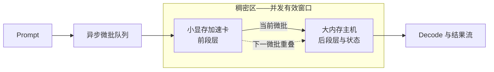

#  小显存加速卡 + 大显存低算力主机稠密加速 — 异构 GPU PD 实验室

[English](README.md)

当前版本 **v2.20**。这一版只改文字，让首页能顺着读下来：两张加速卡的实验分开讲，单机自己跑出来的成绩放到所有双机数据之前，原来那些绕口的说法换成日常表达。这一版没做新测试，也没动过任何一个数字。准确数值都在 `results/` 的实验详档和 `data/` 的 CSV 里。

这个仓库研究一件事：一张算力强但显存小的显卡，怎么和一台算力弱但内存大的主机配合，一起跑大模型推理。

这里公开架构、实测数据、方案怎么一步步演进，以及每个结论能用在什么地方。部署命令、代码补丁、服务地址和切层的具体策略不公开。

## 基础架构：系统如何工作

我们把这种做法叫**稠密加速**：两台设备一起算同一个模型的同一个阶段。

小显存显卡装模型前面的层，也负责算这些层。大内存主机装后面的层和中间状态，负责算后半段。关键在**稠密区**：相邻的两个微批在这里错开跑，所以同一时刻两台设备手上都有活，谁都不用干等。

剩下的事归**稀疏区**：把整个模型装下来，撑住上下文容量。排不进重叠窗口的那部分，由它兜住。

也说清它不是什么：不是把层一个个排队跑完，不是张量并行，不是两台设备重复算同一层，也不是把 395 当远端 KV 仓库的那种独立 PD。

## 两条加速卡路线：RTX 3060 12GB 与 RTX 3080 20GB

本项目到现在只用过两张 NVIDIA 显卡。两张卡装得下的模型不一样，能得出的结论也不一样，所以属于两条不同的实验线。大内存主机一直是同一台 AI Max+ 395。看任何一个数据之前，先弄清它出自哪条线。

| 对比项 | 路线一：RTX 3060 12GB | 路线二：RTX 3080 20GB |
| --- | --- | --- |
| 覆盖版本 | v1.0 → v2.4 | v2.5 → v2.14 |
| 显存与能装什么 | 12GB，只装得下 9B 这一档稠密模型 | 20GB，27B Q4 和 MoE 切层因此才成立 |
| 跑过的模型 | 9B 稠密 Q6_K；27B 只能靠 IQ3 分层装 | 27B 稠密 Q4；Ornith-1.5-35B-A3B 和 Qwen3.8-Flash 两个 MoE |
| 实验编号 | 9B-PD-01、9B-PIPE-01、27B-LONG-01 | 27B-PD-01、27B-KV-01、ORNITH-PD-01、FLASH-SPLIT-01 |
| 这条线最好的成绩 | 9B 异步流水 Prefill **2129.69**、Decode **50.73 tok/s**，比 3060 单卡快 **+34.0% / +15.6%** | 27B 长 prompt 在 64K 比 395 单机快 **+133.4%**；Flash 单服务切层在 C4 档 Prefill **633.685**、总吞吐 **338.270 tok/s** |
| 这条线证明了什么 | 两台设备可以一起做同一个模型的预填充，而且比在场最快的单卡还快。这是仓库里唯一一组有对照的稠密加速证据。 | 换上显存更大的卡以后，能跑的模型、能吃的上下文长度、能扛的并发数一起上了一个台阶。但这条线缺同条件的单机对照，目前只能说明能跑、能服务到什么程度。 |
| 这条线缺什么 | 缺 RTX 3080 在同样的 9B 条件下再跑一遍 | 27B 和 MoE 这几格都缺 3060 或 3080 的单卡对照 |

两条线不能放进一张表里比高低。3060 线上量到的加速百分比，不能拿去套 3080 线跑的模型；3080 线的绝对吞吐更高，也不说明 3060 线有了进步。另外说明一句：仓库里没有任何 RTX 3090 的实测数据，这张卡在选型阶段就被排除了，所以这里所有数字都和 3090 无关。

## 实验发展时间线：v1.0 → v2.20

版本号只代表发布顺序，不代表做了多少个实验。比如 v2.1 到 v2.4，其实是同一项 9B 流水实验的四个阶段性记录。后面的版本里，有些是真的新实验，有些只是把数据归位或把文字改顺。下面这张表逐版说明区别，每个阶段的标题也写清那一阶段用的是哪张卡。

### 阶段一：v1.0 → v2.4 · 加速卡 RTX 3060 12GB · 9B 模型从"能不能接上"做到"比最快的单卡还快"

这个阶段先回答"能不能"，再回答"快不快"。最开始的问题很朴素：两台设备之间，中间状态能不能顺利交接。到阶段结束时，两台设备已经能一起算同一个模型，异步流水的成绩超过了在场最快的那张单卡。Prefill 一路爬升：**1452.29 → 1865.08 → 1893.87 → 1999.51 → 2129.69 tok/s**，每一次提升都能说清是什么带来的。

| 版本 | 这一步想弄清什么 | 做了什么测试 | 测出什么 | 结论往前走了哪一步 |
| --- | --- | --- | --- | --- |
| v1.0 | CUDA 做 Prefill，能不能把状态交给 Vulkan 去 Decode？ | 9B Q6_K，5064 输入 / 128 输出。让 RTX 3060 分别预填充 0 / 512 / 2048 / 全部 token，和 AI Max+ 395 单机对比（**9B-PD-01**）。 | 全量 PD：TTFT **3.496 秒**、Prefill **1452.29**、Decode **30.28 tok/s**；395 单机是 5.879 秒、861.55、30.24。 | 交接能成。首字更快、Prefill 更高，Decode 没掉。但两台设备还是一前一后地跑，这就引出了下一步的流水化。 |
| v2.1 | v1.0 里两台设备轮流闲着，微批能不能错开跑？ | 第一个融合流水记录点，9B Q6_K 条件不变。 | Prefill **1865.08 tok/s**。 | 错开有用。Prefill 第一次超过 RTX 3060 单卡的 1589.00。 |
| v2.2 | 这个提升能不能复现？ | 继续细调重叠方式。 | Prefill **1893.87 tok/s**。 | 多轮之间的波动变小，提升站得住。 |
| v2.3 | 调整两端的负载分配，能不能两头一起变好？ | 细调两段的负载平衡。 | Prefill **1999.51**、Decode **37.16 tok/s**。 | 第一次记下 Decode。两个指标同时改善。 |
| **v2.4** | 两端都在干活以后，能不能超过最快的单卡，同时输出质量不出边界？ | 最后一次校准流水，定案为 **9B-PIPE-01**。同期还单独做了 27B IQ3 分层验证、DGX Spark 外部对照（**EXT-DGX-01**），并补齐了中文镜像。 | Prefill **2129.69**、Decode **50.73 tok/s**；和 RTX 3060 单卡（1589.00 / 43.87）相比是 **+34.0% / +15.6%**。27B IQ3：pp4096 **658.52**、pp65536 **319.10**、pp98304 **225.10**、tg64 **19.57 tok/s**。 | 这一档的稠密加速走通了，稠密区也是这时候定名的。27B 那组数据后来进了 27B-LONG-01。EXT-DGX-01 只当背景，不和本地数据排名。 |

### 阶段二：v2.5 → v2.10 · 换上 RTX 3080 20GB · 模型升到 27B

这个阶段把 9B 上验证过的做法搬到更大的模型和更强的卡上，一共碰了五类新问题：分层装模型、服务状态下的 PD、把 395 当远端 KV 仓库、投机解码的数据核查、外部机器对照。阶段结束时得到一个判断：模型大了以后要按目标挑路线——想让首字更快就用阶段分离，想要更大容量就用远端 KV，prompt 特别长就把模型分层装。这三种都不算稠密加速。

| 版本 | 这一步想弄清什么 | 做了什么测试 | 测出什么 | 结论往前走了哪一步 |
| --- | --- | --- | --- | --- |
| v2.5 | 9B 上的做法成立以后，3080 包下全部 Prefill、395 负责 Decode，能不能把 27B Q4 撑进服务状态？ | 换到 **RTX 3080 20GB**。C1–C6 六个并发档，每档跑 split 和 solo 两条路，共 12 组服务压测（**27B-PD-01**）。 | C1：TTFT **1073 / 4825 毫秒**、Prefill **1000.6 / 207.2**、Decode **38.75 / 36.33 tok/s**；C1–C6 的 KV 搬运耗时 **68–76 毫秒**。去掉 RPC 每个 ubatch 同步一次的做法后，Prefill 从 **683.2** 涨到 **1000.6 tok/s**，相当于 3080 裸算 **1228.53 tok/s** 的 **82%**。 | 服务状态下的 PD 能跑。Prefill 不随并发下滑，Decode 也没损失。同步开销被找出来，是当时最大的一笔浪费。 |
| v2.6 | 3060 跑的 IQ3 和 3080 跑的 Q4 是两份割裂的 27B 记录，怎么并到一起？ | 合并成一个 27B 实验区。发布 3080 路由 v1.1 与线上 v1.2。新增 395 上的自然语言核查（**27B-DRAFT-AUDIT-01**）。 | Prefill 最高 **1210.6**、单流 Decode **63.2 tok/s**。重复文本 **35.0–38.5 tok/s**、接受率 100%；自然语言 C1 只有 **12.1 tok/s**、接受率 17.7%。 | 分出 Prefill 优先和 Decode 优先两种画像。核查也立下一条规矩：重复文本跑出来的高分不能代表真实文本。 |
| v2.7 | 最重要的结果被实现细节盖住了，怎么让人先看到路线？ | 只调整了呈现顺序。 | 无新测量。 | 路线选择排到参数细节前面。 |
| v2.8 | C 和 D 两种配置里，"谁在算"和"能装多少"被混为一谈。 | 纠正归属。 | 无新测量。确认全部计算都在 3080，395 只存 KV，每条流能撑 **1M** 上下文。 | 远端 KV 被明确划成容量路线，不是算得更快。 |
| v2.9 | 27B-D 的 C6 峰值和它的适用范围需要更正。 | 纠数据。 | C6 聚合 Decode 更正为 **116.3 tok/s**。没做新实验。 | 数字和它的适用条件对上了。 |
| v2.10 | C、D 和 DGX Spark 的数据散在各处。 | 合成一张对比表，同时把 **DFlash2 加速头**单独列成一类。 | 本地没有新测量。DGX Spark 的公开成绩约为 **1000 tok/s Prefill、25–30 tok/s 单流 Decode、107 tok/s 聚合 Decode、C1–C6 并发**，并明确标注不能直接比。 | 外部成绩和本地数据分栏放，不再混排。 |

### 阶段三：v2.11 → v2.14 · 还是 RTX 3080 20GB · 扩到 MoE 模型和单服务切层

这个阶段回答两个问题。第一，换成 MoE 模型以后，还能不能分清 Prefill 和 Decode 各自算在哪台设备上。第二，只跑一个服务时，吞吐在第几档并发就上不去了。结果是：MoE 的 PD 跑得稳，两段活也分得清，但没有单机成绩可比，所以不能说它更快；Flash 切层则找到了 C4 这个最好用的并发档。

| 版本 | 这一步想弄清什么 | 做了什么测试 | 测出什么 | 结论往前走了哪一步 |
| --- | --- | --- | --- | --- |
| v2.11 | 换成 MoE 模型以后，两段活的归属和 100K 长上下文的稳定性还成立吗？ | Ornith-1.5-35B-A3B 双机 PD 压测：3080 包下全部 Prefill，395 包下全部 Decode（**ORNITH-PD-01**）。 | **42/42** 全部成功，`route=pd`、`n_reuse=0`。短任务 Prefill 聚合 **4017.46 → 3943.88**；100K Prefill 聚合 **2895.53 → 2793.24**；395 纯 Decode 聚合 **23.33 → 148.20 tok/s**。 | MoE 的 PD 跑得稳，两段活分得清。但同一轮没有单机成绩，所以不能说更快。 |
| v2.12 | 整段墙钟时间换算出来的数，能不能算清是谁的功劳？ | 治理指标。 | 无新测量。删掉了换算得来的 Decode 展示。 | 公开的指标只留能直接归到某台设备的量。 |
| v2.13 | 多轮记录里可能混进了别的实验。 | 把证据锁定到 r337。 | 无新测量。锁定为 3080 纯 Prefill、395 纯 Decode。 | Ornith 的数据只认这一个来源。 |
| v2.14 | 一个服务同时带两台设备，吞吐在第几档并发就上不去了？ | r374 Qwen3.8-Flash Q4：一个 llama-server 同时使用 3080 和 395，跑 C1–C6（**FLASH-SPLIT-01**）。 | **21/21** 个计分请求全部成功。C4 最好：Prefill **633.685**、聚合 Decode **71.185**、总吞吐 **338.270 tok/s**。3080 显存峰值 **19129 MiB**。 | 这套配置最好用的并发档是 C4。没有单机对照，所以不算加速证明。 |

### 阶段四：v2.15 → v2.20 · 没换硬件、没做新测试，只整理数据归属和改写文字

这个阶段**没有做任何新测试，也没有产生任何新数字**，只做两件事：把数据归到该归的地方，把文字改得能读。到这个阶段结束时，每个实验都有固定编号和唯一的详档入口，两张加速卡的实验分开讲，首页只留下做决定时真正要看的那几个数。

| 版本 | 这一步想弄清什么 | 做了什么测试 | 测出什么 | 结论往前走了哪一步 |
| --- | --- | --- | --- | --- |
| v2.15 | 同一份数据在好几处重复出现，实验目的也混在一起。 | 治理实验。新增 `data/experiment-index.csv`，把 v2.4 的 Decode **50.73** 补回 `data/benchmark-results.csv`。 | 无新测量。 | 每个实验有了固定编号、唯一详档和明确的适用范围。 |
| v2.16 | 首页删得太简，外面的人看不到提升幅度。 | 把关键数据放回首页。 | 无新测量。 | 关键数字、提升幅度和路线表回到首页。 |
| v2.17 | 数据能看见了，但架构和六类实验这条主线还不突出。 | 调整结构。 | 无新测量。 | 架构提到最前面，建立六格实验矩阵，进度标成 **0/6 全部做完、4 格有部分数据、2 格还没测**。 |
| v2.18 | 版本之间的推进读不出来，句子也不通顺。 | 重写叙述。 | 无新测量。 | 时间线整章提前，分成四个阶段，每版一行写清这一步想弄清什么、拿到了什么。 |
| v2.19 | 3060 和 3080 两条线混在一起讲，双机数据还排在单机成绩前面。 | 拆成两条线，并把单机数据提前。 | 无新测量。 | 两张卡各自成章，每一格、每一行都写明用的是哪张卡；单机成绩排到了所有双机数据之前。 |
| **v2.20** | 首页有不少句子是硬凑的术语，中英文都不好读。 | 全文改写行文。 | 无新测量。 | 术语换成日常说法，长句拆短。结构、数字和结论都没动。 |

几个容易数重的地方：**27B-C 和 27B-D** 是 27B-KV-01 这一个实验的两种配置，不是两个实验；395 上那组自然语言测试属于 27B-DRAFT-AUDIT-01；[DGX Spark](results/dgx-spark-community-control.zh-CN.md) 是别人机器上的公开成绩，只当背景。这三样都不另算成新实验。

## 六类实验：都拿 3060 和 3080 当基准

这六格不是按模型名字或参数量分的，而是看**模型跑起来一共要占多少显存、和加速卡的显存比起来是什么关系**。这里说的占用包括权重、KV、计算缓冲和留出的余量。**轻松装**是还剩不少余量；**装满**是快到显存上限了；**装不下**是这张卡单独干不完这个活。

每一格都尽量测五种配置：**RTX 3060 单卡、RTX 3080 单卡、AI Max+ 395 单机、3060 + 395、3080 + 395**。同一格里，模型、量化、prompt、上下文长度、并发数和指标都必须完全一样。如果单卡确实装不下，那"装不进去、跑不完"本身就是一个有效结果，不能换个小模型或更狠的量化去凑一个基线。要看的指标固定为 Prefill、Decode、TTFT、总吞吐、剩余显存和成功率。

**目前六格没有一格算做完。** 四格有了部分数据，两格还没测。只要缺 3060 或 3080 的同条件基线，这一格就标成未完成。

| 实验格 | 要回答什么 | 3060 / 3080 在这格里的角色 | 双机路线看哪些指标 | 现在到哪一步了 |
| --- | --- | --- | --- | --- |
| **D1 稠密 · 轻松装** 已测的卡：**RTX 3060** | 模型装得下还有余量时，稠密流水能不能真比更快的那张卡还快，而不只是多装点东西？ | 3060 的同条件单卡成绩已经有了，3080 的同条件复测还没做。 | 单卡、395 单机、异步分层流水三者对比 Prefill / Decode / TTFT。 | **部分完成**：9B-PIPE-01 比 3060 快 Prefill **+34.0%**、Decode **+15.6%**；缺 3080 的对照。[详档](results/v2.4-fused-layer-pipeline.zh-CN.md) |
| **D2 稠密 · 装满** 已测的卡：**RTX 3080** | 显存快用满时，整模塞一张卡、阶段分离、分层稠密这三条路哪条更好？ | 3080 20GB 是 27B Q4 的主要满载基准；3060 负责记下同一个模型装不下或必须降级的边界。 | 比剩余显存、TTFT、Prefill、Decode，以及交接要花多少时间。 | **部分完成**：27B-PD-01 有 3080 做 Prefill、395 做 Decode 的服务数据；缺两张卡同条件的稠密对照。[详档](results/qwen3.8-27b-dual-machine-pd.zh-CN.md) |
| **D3 稠密 · 装不下** 已测的卡：**RTX 3060** | 一张卡干不完这个活时，把模型分层装能不能跑完，而且比 395 快？ | 3060 是目前的容量下限；3080 要在同样的 prompt 长度上补测，才能知道它算"装满"还是"装不下"。 | 看能不能跑完、长 prompt 的 Prefill、Decode 和 TTFT。 | **部分完成**：27B-LONG-01 在 64K 比 395 快 Prefill **+133.4%**，98K 从超时变成跑完；缺 3080 的同条件记录。[详档](results/qwen3.8-27b-dual-machine-pd.zh-CN.md) |
| **M1 MoE · 轻松装** 已测的卡：**两张都还没测** | 激活参数不大、显存也有余量时，MoE 的路由开销会不会把重叠省下来的时间吃回去？ | 3060 和 3080 都要先跑同模型、同量化的单卡成绩。 | 对比路由之后的 Prefill / Decode、接受率、TTFT 和负载是否均衡。 | **还没测**：目前没有满足双基准条件的本地实验，所以不写提升值。 |
| **M2 MoE · 装满** 已测的卡：**RTX 3080** | MoE 快把 3080 装满时，阶段分离稳不稳；再往上做稠密重叠还有没有收益？ | 3080 是满载 Prefill 的基准；3060 负责记下装不下的边界，或者换个同系列的小模型。 | 先确认路由归属和长上下文稳定性，再补同条件的速度对照。 | **部分完成**：ORNITH-PD-01 已有 **42/42** 全部走通和 100K 的稳定记录；缺 3080、3060 的单机速度对照，所以不能说更快。[详档](results/ornith-1.5-35b-a3b-dual-machine-pd.zh-CN.md) |
| **M3 MoE · 装不下** 已测的卡：**RTX 3080（只有先导记录）** | 模型总占用超过两张基准卡时，按层或按专家分开装，能不能同时保住能跑、吞吐和输出正确？ | 3060 和 3080 都要先记下各自单独跑不完的容量边界。 | 看能不能跑完、路由对不对、Prefill / Decode、显存占用和跨设备等待。 | **还没测**：FLASH-SPLIT-01 只提供了相近的切层服务记录，没有两张卡的单卡成绩，替代不了这一格。[先导记录](results/qwen3.8-flash-q4-layer-split.zh-CN.md) |

## 几句话说清结论

- **真正有对照、能叫稠密加速的只有 9B-PIPE-01 这一项。** 和更快的那张 RTX 3060 单卡比，Prefill 从 1589.00 提到 **2129.69 tok/s（+34.0%）**，Decode 从 43.87 提到 **50.73 tok/s（+15.6%）**。
- **只想让首字出得更快，而且加速卡装得下做 Prefill 那份模型：用阶段分离的 PD。** 9B-PD-01 把 TTFT 从 5.879 秒压到 **3.496 秒（-40.5%）**，Decode 基本没变；27B 那条服务路径把 C1 的 TTFT 从 4825 毫秒压到 **1073 毫秒（-77.8%）**。
- **模型塞不进小卡：把模型分层装。** 27B-LONG-01 用 3060 + 395，和 395 单机比，4K 和 64K 的 Prefill 分别快 **+110.2% / +133.4%**；98K 那一档 395 单机跑了 900 秒还没出结果，分层这条路跑完了。
- **只是想要更大的上下文：用远端 KV，但别把它当成算得更快。** 27B-KV-01 做到**每条流 1M 上下文**。模型计算全在 3080 上，395 只负责存 KV。
- **Ornith 和 Flash 只说明能稳定服务到什么程度。** Ornith 在 100K 压测里 42 个请求全部走通；Flash 计分的 21 个请求全部成功，最好的一档是 **C4，总吞吐 338.270 tok/s**。这两项都没有可比的单机成绩。

## 实验数据

### 先看单机自己能跑多少

后面所有双机数据，都要对着下面这几行单机成绩来看。这些数字直接从 CSV 抄来，没有换算，也没有估算。

**9B Q6_K 这一档**（对应 9B-PD-01 和 9B-PIPE-01）

| 单机成绩 | 模型与量化 | 怎么测的 | Prefill | Decode |
| --- | --- | --- | --- | --- |
| **RTX 3060 12GB 单卡** | 9B Q6_K | `llama-bench`，pp5064 / tg128 | **1589.00 tok/s** | **43.87 tok/s** |
| **AI Max+ 395 单机（服务状态）** | 9B Q6_K | 服务端第二轮，5064 输入 / 128 输出 | **861.55 tok/s** | **30.24 tok/s** |
| **AI Max+ 395 单机（`llama-bench`）** | 9B Q6_K | `llama-bench`，pp5064 / tg128 | **970.00 tok/s** | **31.27 tok/s** |

395 有两个数字，不是对不上，是测法不一样：服务状态那组用来和 v1.0 的独立 PD 比，`llama-bench` 那组用来和 v2.4 的融合流水比。同一次比较只能用同一种测法。上面三行都出自 [benchmark-results.csv](data/benchmark-results.csv)。

**27B 这一档**（对应 27B-LONG-01、27B-PD-01 和 27B-KV-01）

RTX 3060 装不下整个 27B，所以这一档没有 3060 的单卡成绩，只有 3080 单卡和 395 单机。

| 单机成绩 | 模型与量化 | 负载 | 实测 |
| --- | --- | --- | --- |
| **RTX 3080 20GB 单卡裸算** | 27B Q4 | pp1024 / pp4096 / tg64 | Prefill **1228.53** / **1203.06 tok/s**；Decode **33.08 tok/s** |
| **AI Max+ 395 单机（IQ3）** | 27B IQ3 | pp4096 / pp65536 / pp98304 / tg64 | Prefill **313.28** / **136.69 tok/s**，pp98304 在 900 秒时超时；Decode **18.26 tok/s** |
| **AI Max+ 395 单机（Q4 服务状态）** | 27B Q4 | C1，solo 路径 | TTFT **4825 毫秒**；Prefill **207.2 tok/s**；Decode **36.33 tok/s** |

27B 这三行都出自 [qwen27b-local-results.csv](data/qwen27b-local-results.csv)。两项 MoE 实验（ORNITH-PD-01、FLASH-SPLIT-01）没有任何能对上的单卡或单机成绩，所以它们只出现在下面那张"没有对照"的表里。

### 有对照的实验：可以算提升幅度

提升幅度都按"本路线的成绩 ÷ 对照成绩 − 1"算出来，TTFT 写的是降了多少。每一行都限定在同一个模型、同一种量化、同一份负载里，并写明用的是哪张加速卡。

| 实验 | 加速卡 | 对照成绩 | 本路线成绩 | 提升幅度 | 一句话结论 |
| --- | --- | --- | --- | --- | --- |
| **9B-PD-01** | RTX 3060 12GB | 395 单机：TTFT **5.879 秒**、Prefill **861.55**、Decode **30.24 tok/s**（9B Q6_K，5064 输入 / 128 输出） | CUDA 做全部 Prefill、Vulkan 做 Decode：TTFT **3.496 秒**、Prefill **1452.29**、Decode **30.28 tok/s** | TTFT **-40.5%**；Prefill **+68.6%**；Decode **+0.1%** | 状态能整体交接过去，首字也更快。但两段还是先后跑，不算稠密加速。 |
| **9B-PIPE-01** | RTX 3060 12GB | RTX 3060 单卡：Prefill **1589.00**、Decode **43.87 tok/s**；同测法下 395 单机是 **970.00 / 31.27 tok/s** | 最终版异步分层流水：Prefill **2129.69**、Decode **50.73 tok/s** | 比 3060：**+34.0% / +15.6%**；比 395：**+119.6% / +62.2%** | 这是仓库里唯一一组"两台设备在稠密区里都真在出力"的有对照证据。 |
| **27B-LONG-01** | RTX 3060 12GB | 395 单机（27B IQ3）：pp4096 **313.28**、pp65536 **136.69**、pp98304 在 900 秒时超时、tg64 **18.26 tok/s** | 3060 + 395 分层装：pp4096 **658.52**、pp65536 **319.10**、pp98304 **225.10**、tg64 **19.57 tok/s** | 4K **+110.2%**；64K **+133.4%**；98K 从超时变成跑完；Decode **+7.2%** | 小卡装不下整模、又卡在长 prompt 的 Prefill 上，就选分层装。 |
| **27B-PD-01** | RTX 3080 20GB | 395 单机（27B Q4，C1 档）：TTFT **4825 毫秒**、Prefill **207.2**、Decode **36.33 tok/s** | 3080 做 Prefill、395 做 Decode 的服务路径：TTFT **1073 毫秒**、Prefill **1000.6**、Decode **38.75 tok/s**；C1–C6 的 KV 搬运 **68–76 毫秒** | TTFT **-77.8%**；Prefill **+382.9%（4.83×）**；Decode **+6.7%** | 两个实例之间的服务交接在 C1–C6 都能过。它证明的是阶段分离，不是同一阶段一起算。 |

### 没有对照的实验：只说能服务到什么程度

这里的百分比只说明同一套配置里并发加上去以后的变化，不代表比单机快。下面四项都是在 RTX 3080 20GB 上跑的。

| 实验 | 加速卡 | 关键实测 | 同一配置里的变化 | 缺什么对照 | 一句话结论 |
| --- | --- | --- | --- | --- | --- |
| **27B-KV-01** | RTX 3080 20GB | **每条流 1M 上下文**；配置 C 的 Prefill 稳定在 **1194.4–1210.6 tok/s**；聚合 Decode 从 C1 到 C6，配置 C 是 **33.55→63.84**，配置 D 的最新记录是 **63.2→116.3 tok/s** | 并发从 C1 加到 C6，C 涨 **+90.3%**、D 涨 **+84.0%** | 缺同一轮里"3080 不接远端 KV"的对照 | 想要 Prefill 高就选 C，想要 Decode 总吞吐就选 D。395 只存 KV，所以这是容量和服务路线，不是稠密加速。 |
| **27B-DRAFT-AUDIT-01** | RTX 3080 20GB（草稿模型跑在 395 上） | 重复文本 **35.0–38.5 tok/s、接受率 100%**；自然语言 C1 **12.1 tok/s、接受率 17.7%** | 自然语言 C1 比 38.5 这个高分低 **68.6%** | 不适用，这是数据核查不是加速实验 | 重复文本上投机解码的高分不能代表真实文本，比较时必须用同类负载的数据。 |
| **ORNITH-PD-01** | RTX 3080 20GB | **42/42 成功**，`route=pd`、`n_reuse=0`；100K 的 Prefill 从 C1 到 C6 是 **2895.53→2793.24**；纯 Decode 聚合 **23.33→148.20 tok/s** | Prefill 从 C1 到 C6 只变了 **-3.5%**；Decode 随并发涨 **6.35×** | 缺 3080 单卡和 395 单机在同一轮的速度成绩 | 适合验证 MoE 里 Prefill 和 Decode 各自算在谁头上，以及 100K 下稳不稳。没有单机成绩，就不能说加速是它带来的。 |
| **FLASH-SPLIT-01** | RTX 3080 20GB | **21/21 成功**；C4 最好：Prefill **633.685**、聚合 Decode **71.185**、总吞吐 **338.270 tok/s** | 从 C1 到 C4：Prefill **+11.2%**、聚合 Decode **+102.2%**、总吞吐 **+58.4%** | 缺 3080 单卡和 395 单机的同条件对照 | 这套单服务切层配置最好用的一档是 C4。C5、C6 已经不涨了，而且没有单机对照。 |

完整数据行、指标定义和缺了哪些字段，都在各自的[实验详档](results/)和 CSV 里。首页每个实验只摘一条最关键的，摘出来的数不算新实验。首页和详档如果有出入，以详档和 CSV 为准。

## 路线选择

| 你的目标 | 该选哪条路 | 加速卡 | 数据依据 | 什么时候能用 / 什么时候别用 |
| --- | --- | --- | --- | --- |
| 想证明两台设备一起把同一个模型算得更快 | **异步分层稠密加速** | RTX 3060 12GB | 9B-PIPE-01：比更快的那一端 **Prefill +34.0%、Decode +15.6%** | 只有在有单机对照、两段又都真在出力时才能这么说。没有新对照之前，别把 9B 的结论套到别的模型上。 |
| 想让首字更快，同时把 Prefill 和 Decode 分给不同设备 | **独立 PD** | 9B 用 3060，27B 用 3080 | 9B-PD-01：TTFT **-40.5%**；27B-PD-01 C1 档：TTFT **-77.8%** | 做 Prefill 那端装得下所需模型副本、状态又能交接时选它。它是把两段活分开做，不是两台设备同时算。 |
| 模型塞不进小显存的加速卡 | **模型分层装** | RTX 3060 12GB | 27B-LONG-01：64K 的 Prefill 是 395 对照的 **2.33×**；98K 从超时变成跑完 | 适合长 prompt 想提 Prefill、或者纯粹需要容量。别拿它去和 Q4、9B 或别的引擎直接比。 |
| 想把上下文做到最大，或者要扛并发 Decode | **3080 负责计算 + 395 当远端 KV 仓库** | RTX 3080 20GB | 27B-KV-01：**每条流 1M 上下文**；Decode 优先的配置在 C6 档聚合 **116.3 tok/s** | 为容量选它。如果目标是两台设备一起算得更快，就别选：395 完全不参与模型计算。 |
| 想验证 MoE 在深上下文下的 PD 服务 | **角色分离的 PD 压测路线** | RTX 3080 20GB | ORNITH-PD-01：**42/42 成功**；100K 下 C6 档 Decode 聚合 **148.20 tok/s** | 用来看角色归属和稳定性。补齐同条件的单机测试之后，才能谈快了多少。 |
| 只跑一个服务，想知道并发开到几档最合适 | **固定的双设备切层** | RTX 3080 20GB | FLASH-SPLIT-01：C4 档总吞吐 **338.270 tok/s**，比同配置的 C1 高 **+58.4%** | 在约 2077 输入 / 256 输出这份负载上，实测最好的一档是 **C4**。换成别的 prompt 结构必须重新测。这是一个工作档位，不是加速倍数。 |

## 什么样的数据能下什么结论

| 结论类型 | 至少要有什么数据 | 可以怎么写 |
| --- | --- | --- |
| 能跑 | 请求完整跑完、阶段与状态成功交接、每个指标都能说清算在谁头上 | "这套配置能跑起来" |
| 更快 | 模型、量化、负载、指标全都一致，而且有可比的单机成绩 | "比对照更快" |
| 装得下、服务得住 | 负载跑完，有显存和稳定性数据，但没有可比的速度对照 | "装得下"、"能服务"、"实测到这个程度"；**不能写成加速** |
| 外部参考 | 别人公开的实测，注明原来的方法和来源 | "作为背景参考"；不能当本地对照用 |

- 中英文 README 只放**做决定时要看的那部分**：对照成绩、选出来的结果、算好的提升幅度、路线建议和适用范围。
- 每项实验的完整表格只放在对应的 `results/` 详档里，配套的 `data/*.csv` 是同一份数据的机器可读版本，也是所有计算的来源。
- 首页加粗的数字都是从已有实验里摘出来的，不是另做了一组测试。
- 每个数据都要能说清用的是 RTX 3060 还是 RTX 3080，两张卡的结果不混在一起算。
- `CHANGELOG_ZH.md` 只记录哪一版改了什么、纠了什么错。版本号不是实验编号，也不能当数据来源。
- 模型、量化、引擎、prompt 或连接方式不同的数据，不能拼成一张横向排名表。

## 本地实验目录

| 编号 | 加速卡 | 要回答的问题 | 对照组和变量 | 看哪些指标 | 能支持什么结论 | 详档 |
| --- | --- | --- | --- | --- | --- | --- |
| **9B-PD-01** | RTX 3060 12GB | CUDA 做 Prefill，能不能把状态交给 Vulkan 去 Decode？ | 对照是 AI Max+ 395 单机；只改 RTX 3060 预填充多少 token | 交接是否完成、TTFT / Prefill、Decode 是否连续、搬过去的状态有多大 | 独立 PD 能跑；不能说明两端同时在算 | [详档](results/v1.0-independent-pd.zh-CN.md) · [CSV](data/benchmark-results.csv) |
| **9B-PIPE-01** | RTX 3060 12GB | 两台设备能不能通过异步分层流水一起算同一个模型？ | 对照是 RTX 3060 单卡和 AI Max+ 395 单机；模型和负载固定，只调流水调度 | 同条件下的 Prefill / Decode 对比、能否复现、输出有没有越界 | 这一档 9B 上有对照的稠密加速 | [详档](results/v2.4-fused-layer-pipeline.zh-CN.md) · [CSV](data/benchmark-results.csv) |
| **27B-LONG-01** | RTX 3060 12GB | 小卡单独装不下 27B 时，分层装能不能让 395 跑长 prompt 更快？ | 对照是同样 IQ3 负载的 395 单机；变量是加进来的 RTX 3060 层段 | 不同 prompt 长度能不能跑完、Prefill、Decode | 长 prompt 能跑，而且比 395 快；不能套到 Q4 或 9B 上 | [详档](results/qwen3.8-27b-dual-machine-pd.zh-CN.md) · [CSV](data/qwen27b-local-results.csv) |
| **27B-PD-01** | RTX 3080 20GB | 3080 当 Prefill 节点，能不能在 C1–C6 的服务压力下交给 395 做 Decode？ | 对照是同模型的 395 单机；只改请求走不走双节点 PD | TTFT、Prefill、Decode、KV 搬运、并发是否全部成功 | 双实例 PD 调度能跑通 | [详档](results/qwen3.8-27b-dual-machine-pd.zh-CN.md) · [CSV](data/qwen27b-local-results.csv) |
| **27B-KV-01** | RTX 3080 20GB | 3080 包下全部计算、395 只存 KV 时，服务能力是怎么取舍的？ | 最新那批没有"不接远端 KV"的对照；C 和 D 是同一实验的两种配置，只扫并发 | 上下文容量、Prefill、单流和聚合 Decode、缺失字段是否照实标注 | 远端 KV 的容量和服务能力；**不是稠密加速** | [详档](results/qwen3.8-27b-dual-machine-pd.zh-CN.md) · [CSV](data/qwen27b-local-results.csv) |
| **27B-DRAFT-AUDIT-01** | RTX 3080 20GB | 重复文本上投机解码的高分，能代表真实服务吗？ | 直接在 395 的草稿路径上发自然语言请求；历史那组无头结果只当背景，不作对照 | 真实文本能否跑完、实际 Decode、草稿接受率 | 一条核查底线：不许用重复文本的成绩顶替真实文本 | [详档](results/qwen3.8-27b-dual-machine-pd.zh-CN.md) · [CSV](data/qwen27b-local-results.csv) |
| **ORNITH-PD-01** | RTX 3080 20GB | MoE 模型能不能一边分清 Prefill / Decode 的归属，一边扛住短任务和 100K 的 C1–C6 压测？ | 同一轮没有单机速度对照；变量是负载长度和并发数 | 路由是否成功、有没有复用 KV、3080 的 Prefill 和 395 的 Decode 是否各自单独计时 | 角色归属和稳定性；不能说明端到端更快 | [详档](results/ornith-1.5-35b-a3b-dual-machine-pd.zh-CN.md) · [CSV](data/ornith35a3b-local-results.csv) |
| **FLASH-SPLIT-01** | RTX 3080 20GB | 一个服务同时用 CUDA 和 Vulkan 切层，能不能稳跑 C1–C6，吞吐在哪一档到顶？ | 没有单设备对照；这套记录里只改并发数 | HTTP 是否成功、Prefill / Decode 聚合、总吞吐、剩余显存 | 并发能力和最佳档位；不算加速证明 | [详档](results/qwen3.8-flash-q4-layer-split.zh-CN.md) · [CSV](data/qwen38flash-q4-local-results.csv) |

实验编号和旧标签的对应关系，机器可读版本在 [data/experiment-index.csv](data/experiment-index.csv)。

## 保留的后续规划

| 版本 | 当前结果引出的问题 | 计划做什么、做到什么算完成 |
| --- | --- | --- |
| **v3.0** | v2.4 只在 9B + 3060 这一种条件下做齐了，六类实验还差很多格。 | 用同一套负载标准把 3060 和 3080 的基准补齐，再把一对一的稠密加速搬到更多大内存主机和更多小显存显卡上。做完的标准有三条：稠密区能对得上、Prefill 和 Decode 的收益不打折、调度稳定。 |
| **v4.0** | 一对一跑稳之后，一张加速卡能不能同时带多台大内存主机？ | 研究一对多的调度、资源隔离、公平分配、故障恢复和扩展上限。做完的标准：主机数量增加后收益还能复现，单台主机的性能下降在可接受范围内。 |

## 阅读顺序

1. 先看"两条加速卡路线"，弄清你关心的数据是哪张卡跑出来的。
2. 再看"先看单机自己能跑多少"，记住这一档单卡和单机各能跑多少。
3. 然后在六类实验或数据表里，找到和你要解决的问题对得上的那一项。
4. 打开 `results/` 里的详档，先看清测试条件和适用范围，再看数据。自己算的时候用对应的 CSV；除非详档写明有可比的对照，不要把不同编号的实验数据合起来算。
5. [更新记录](CHANGELOG_ZH.md)用来查某段文字、某个归属或某个文件是什么时候改的。
