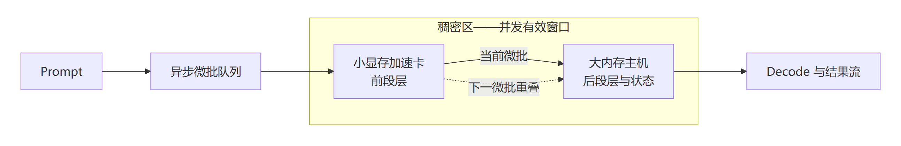

#  小显存加速卡 + 大显存低算力主机稠密加速 — 异构 GPU PD 实验室

[English](README.md)

当前版本 **v2.23**。这一版只核对并补写 Prefill 的口径：把 27B 档 AI Max+ 395 单机的三个 Prefill 数（207.2、307.1、313.28）各自的测法写清，把 RTX 3080 那一侧 Prefill 从 683.2 到 1000.6 再到 1210.6 的每一步补进时间线。核对结果是首页原有数字没有一个需要改。准确数值都在 `results/` 的实验详档和 `data/` 的 CSV 里。

这个仓库研究一件事：一张算力强但显存小的显卡，怎么和一台算力弱但内存大的主机配合，一起跑大模型推理。这里公开架构、实测数据、方案怎么一步步演进，以及每个结论能用在什么地方。部署命令、代码补丁、服务地址和切层的具体策略不公开。

## 结论与核心数据

**先说结论。** 把一张小显存的稠密加速卡（RTX 3060 12GB 或 RTX 3080 20GB）接到 AI Max+ 395 上，同一个模型的 Prefill、Decode 和首字时间都明显好于这张卡单独跑，也明显好于 395 单机跑。9B 这一档，3060 + 395 的异步流水比在场最快的单卡还快；27B 这一档，3060 分层装能把 395 单机跑不完的长 prompt 跑完，3080 做阶段分离能把 395 单机的首字时间压掉四分之三以上。加速卡的显存决定装得下多大的模型，395 决定能撑多大的上下文。

下面两张表是首页唯一放完整数据的地方。每一行都限定在同一个模型、同一种量化、同一份负载里；数值直接抄自 CSV，提升幅度按「组合成绩 ÷ 对照成绩 − 1」算，TTFT 写的是降了多少。首页和详档如果有出入，以详档和 CSV 为准。

### 有对照的实验：组合成绩对着单卡和单机看

| 实验 | 加速卡 | 模型与负载 | 加速卡单独跑 | AI Max+ 395 单机跑 | 加速卡 + 395 组合跑 | 提升幅度 | 能证明什么 |
| --- | --- | --- | --- | --- | --- | --- | --- |
| **9B-PIPE-01**<br/>异步分层稠密加速 | RTX 3060 12GB | 9B Q6_K，`llama-bench` pp5064 / tg128 | Prefill **1589.00**、Decode **43.87 tok/s** | 同测法：Prefill **970.00**、Decode **31.27 tok/s** | Prefill **2129.69**、Decode **50.73 tok/s** | 比 3060 单卡 **+34.0% / +15.6%**；比 395 单机 **+119.6% / +62.2%** | 两台设备在稠密区里都真在出力，而且比在场最快的单卡还快。这是仓库里唯一一组有对照的稠密加速证据。 |
| **9B-PD-01**<br/>独立 PD | RTX 3060 12GB | 9B Q6_K，服务状态，5064 输入 / 128 输出 | 这组没测单卡，只和 395 比 | 服务状态：TTFT **5.879 秒**、Prefill **861.55**、Decode **30.24 tok/s** | 3060 做全部 Prefill、395 做 Decode：TTFT **3.496 秒**、Prefill **1452.29**、Decode **30.28 tok/s** | TTFT **-40.5%**；Prefill **+68.6%**；Decode **+0.1%** | 中间状态能整体交接过去，首字更快，Decode 不掉。两段还是先后跑，所以不算稠密加速。 |
| **27B-LONG-01**<br/>模型分层装 | RTX 3060 12GB | 27B IQ3，pp4096 / pp65536 / pp98304 / tg64 | 3060 装不下整个 27B，没有单卡成绩 | Prefill **313.28** / **136.69 tok/s**，pp98304 跑到 900 秒超时；Decode **18.26 tok/s** | Prefill **658.52** / **319.10** / **225.10 tok/s**；Decode **19.57 tok/s** | 4K **+110.2%**；64K **+133.4%**；98K 从超时变成跑完；Decode **+7.2%** | 小卡装不下整模、又卡在长 prompt 上时，分层装不仅能跑完，还比 395 单机快一倍以上。 |
| **27B-PD-01**<br/>独立 PD，服务状态 | RTX 3080 20GB | 27B Q4，C1 档（C1–C6 六档全部跑通） | 3080 裸算：Prefill pp1024 **1228.53** / pp4096 **1203.06 tok/s**；Decode tg64 **33.08 tok/s** | C1，solo 路径，v1.0 口径：TTFT **4825 毫秒**、Prefill **207.2**、Decode **36.33 tok/s** | 3080 做 Prefill、395 做 Decode，v1.0 口径：TTFT **1073 毫秒**、Prefill **1000.6**、Decode **38.75 tok/s**；KV 搬运 **68–76 毫秒** | 比 395 单机：TTFT **-77.8%**、Prefill **+382.9%（4.83×）**、Decode **+6.7%**；Prefill 达到 3080 裸算的 **82%** | 服务状态下的阶段分离能跑，Prefill 不随并发下滑，Decode 也不掉。它证明的是阶段分离，不是同一阶段一起算。 |

395 在 9B 档有两个成绩，不是对不上，是测法不一样：`llama-bench` 那组对着 9B-PIPE-01 看，服务状态那组对着 9B-PD-01 看。9B 两行出自 [benchmark-results.csv](data/benchmark-results.csv)，27B 两行出自 [qwen27b-local-results.csv](data/qwen27b-local-results.csv)。

27B 档 395 单机的 Prefill 也有三个数，同样是测法不同，不是有的对有的错。**207.2** 是 v1.0 服务态的 C1 solo 成绩，那一版每处理一个 prompt 都要整拷一份 524 MiB 的递归态检查点，Vulkan 侧回读约 0.8 秒，这个数对着 27B-PD-01 的组合成绩 1000.6 看。**307.1** 是同一批机器关掉检查点后（v1.1 口径）的 C1 solo 成绩，记在 27B-KV-01 配置 C 的详档表里作历史对照。**313.28** 是 IQ3 量化下 `llama-bench` pp4096 的成绩，对着 27B-LONG-01 看。关掉检查点后，3080 那一侧的服务态 Prefill 也从 1000.6 涨到 1210.6（见 27B-KV-01 配置 C），两侧一起涨，组合对 395 单机的优势仍在 4 倍上下。27B 档 1200 以上的 Prefill 只出现在 RTX 3080 这一侧（裸算 1228.53、服务态 1194.4–1210.6）；395 单机跑 27B 稠密模型的 Prefill 在 200–320 之间，它跑 9B 也只有 861.55–970.00。

### 没有对照的实验：只说能服务到什么程度

这几项缺同条件的单卡或单机成绩，所以只写实测到哪一步，不算提升。百分比只说明同一套配置里并发加上去以后的变化。都是在 RTX 3080 20GB 上跑的。

| 实验 | 关键实测 | 同一配置里的变化 | 能证明什么 |
| --- | --- | --- | --- |
| **27B-KV-01**<br/>3080 全算、395 只存 KV | **每条流 1M 上下文**；配置 C 的 Prefill 稳定在 **1194.4–1210.6 tok/s**；聚合 Decode 从 C1 到 C6，配置 C **33.55→63.84**，配置 D **63.2→116.3 tok/s** | 并发从 C1 加到 C6，C 涨 **+90.3%**、D 涨 **+84.0%** | 想要 Prefill 高选 C，想要 Decode 总吞吐选 D。395 完全不参与模型计算，所以这是容量和服务路线，不是稠密加速。缺同一轮「3080 不接远端 KV」的对照。 |
| **27B-DRAFT-AUDIT-01**<br/>投机解码核查 | 重复文本 **35.0–38.5 tok/s、接受率 100%**；自然语言 C1 **12.1 tok/s、接受率 17.7%** | 自然语言比重复文本的高分低 **68.6%** | 这是数据核查，不是加速实验：重复文本上投机解码的高分不能代表真实文本。 |
| **ORNITH-PD-01**<br/>MoE 的 PD 压测 | **42/42 成功**，`route=pd`、`n_reuse=0`；100K 的 Prefill 从 C1 到 C6 是 **2895.53→2793.24**；395 纯 Decode 聚合 **23.33→148.20 tok/s** | Prefill 从 C1 到 C6 只变了 **-3.5%**；Decode 随并发涨 **6.35×** | MoE 的 PD 跑得稳，Prefill 和 Decode 各算在谁头上分得清。没有单机成绩，不能说更快。 |
| **FLASH-SPLIT-01**<br/>单服务双设备切层 | **21/21 成功**；C4 最好：Prefill **633.685**、聚合 Decode **71.185**、总吞吐 **338.270 tok/s** | 从 C1 到 C4：Prefill **+11.2%**、聚合 Decode **+102.2%**、总吞吐 **+58.4%** | 这套配置最好用的并发档是 C4，C5、C6 已经不涨了。它是一个工作档位，不是加速倍数。 |
| **EXT-DGX-01**<br/>DGX Spark 外部参考 | 公开成绩约为 **1000 tok/s Prefill、25–30 tok/s 单流 Decode、107 tok/s 聚合 Decode**，C1–C6 | 不适用 | 别人机器上的公开数据，只当背景，不和本地数据排名。[详档](results/dgx-spark-community-control.zh-CN.md) |

## 基础架构：系统如何工作



<details>
<summary>这张图的 mermaid 源码（可以复制到 mermaid.live 打开）</summary>

```text
flowchart LR
    P["Prompt"] --> Q["异步微批队列"]
    subgraph D["稠密区——并发有效窗口"]
        direction LR
        N["小显存加速卡<br/>前段层"] -->|"当前微批"| A["大内存主机<br/>后段层与状态"]
    end
    Q --> N
    A --> O["Decode 与结果流"]
    N -.->|"下一微批重叠"| A
```

</details>

我们把这种做法叫**稠密加速**：两台设备一起算同一个模型的同一个阶段。小显存显卡装模型前面的层，也负责算这些层；大内存主机装后面的层和中间状态，负责算后半段。关键在**稠密区**：相邻的两个微批在这里错开跑，所以同一时刻两台设备手上都有活，谁都不用干等。排不进重叠窗口的部分归**稀疏区**：把整个模型装下来，撑住上下文容量。

它不是什么：不是把层一个个排队跑完，不是张量并行，不是两台设备重复算同一层，也不是把 395 当远端 KV 仓库的那种独立 PD。


## 两条加速卡路线与六类实验

本项目到现在只用过两张 NVIDIA 显卡，大内存主机一直是同一台 AI Max+ 395。两张卡装得下的模型不一样，能得出的结论也不一样，所以是两条不同的实验线；看任何一个数据之前，先弄清它出自哪条线。两条线不能放进一张表里比高低。另外，仓库里没有任何 RTX 3090 的实测数据，这张卡在选型阶段就被排除了。

| 对比项 | 路线一：RTX 3060 12GB | 路线二：RTX 3080 20GB |
| --- | --- | --- |
| 覆盖版本 | v1.0 → v2.4 | v2.5 → v2.14 |
| 显存与能装什么 | 12GB，只装得下 9B 这一档稠密模型；27B 只能靠 IQ3 分层装 | 20GB，27B Q4 装得下，MoE 切层也因此成立 |
| 跑过的模型 | 9B 稠密 Q6_K；27B IQ3 | 27B 稠密 Q4；Ornith-1.5-35B-A3B 和 Qwen3.8-Flash 两个 MoE |
| 实验编号 | 9B-PD-01、9B-PIPE-01、27B-LONG-01 | 27B-PD-01、27B-KV-01、27B-DRAFT-AUDIT-01、ORNITH-PD-01、FLASH-SPLIT-01 |
| 这条线想验证什么 | 两台设备能不能一起做同一个模型的预填充，并且比在场最快的单卡还快；小卡装不下的模型，分层装能不能跑完 | 显存大一档以后，能跑的模型、能吃的上下文、能扛的并发能不能一起上台阶；服务状态下阶段分离和远端 KV 能不能走通 |
| 这条线缺什么 | 缺 RTX 3080 在同样 9B 条件下的复测 | 27B 和 MoE 几格都缺 3060 或 3080 同条件的单卡对照 |

**六类实验矩阵。** 六格不按模型名字或参数量分，而看模型跑起来一共要占多少显存、和加速卡的显存比起来是什么关系（占用包括权重、KV、计算缓冲和留出的余量）。**轻松装**是还剩不少余量，**装满**是快到显存上限，**装不下**是这张卡单独干不完这个活。每一格都尽量测五种配置：RTX 3060 单卡、RTX 3080 单卡、AI Max+ 395 单机、3060 + 395、3080 + 395；同一格里模型、量化、prompt、上下文长度、并发数和指标必须完全一样。单卡确实装不下时，「装不进去、跑不完」本身就是有效结果，不能换小模型或更狠的量化去凑基线。

目前六格没有一格算做完：**0/6 全部做完、4 格有部分数据、2 格还没测**。只要缺 3060 或 3080 的同条件基线，这一格就标成未完成。

| 实验格 | 要回答什么 | 现在到哪一步 |
| --- | --- | --- |
| **D1 稠密 · 轻松装**（已测的卡：RTX 3060） | 模型装得下还有余量时，稠密流水能不能真比更快的那张卡还快，而不只是多装点东西？ | **部分完成**：9B-PIPE-01 已有 3060 单卡和 395 单机两组对照；缺 3080 的同条件复测。[详档](results/v2.4-fused-layer-pipeline.zh-CN.md) |
| **D2 稠密 · 装满**（已测的卡：RTX 3080） | 显存快用满时，整模塞一张卡、阶段分离、分层稠密这三条路哪条更好？ | **部分完成**：27B-PD-01 有 3080 做 Prefill、395 做 Decode 的服务数据；缺两张卡同条件的稠密对照。[详档](results/qwen3.8-27b-dual-machine-pd.zh-CN.md) |
| **D3 稠密 · 装不下**（已测的卡：RTX 3060） | 一张卡干不完这个活时，分层装能不能跑完，而且比 395 快？ | **部分完成**：27B-LONG-01 已比 395 单机快，98K 从超时变成跑完；缺 3080 的同条件记录。[详档](results/qwen3.8-27b-dual-machine-pd.zh-CN.md) |
| **M1 MoE · 轻松装**（两张卡都还没测） | 激活参数不大、显存也有余量时，MoE 的路由开销会不会把重叠省下来的时间吃回去？ | **还没测**：没有满足双基准条件的本地实验。 |
| **M2 MoE · 装满**（已测的卡：RTX 3080） | MoE 快把 3080 装满时，阶段分离稳不稳；再往上做稠密重叠还有没有收益？ | **部分完成**：ORNITH-PD-01 已有全部走通和 100K 的稳定记录；缺 3080、3060 的单机速度对照。[详档](results/ornith-1.5-35b-a3b-dual-machine-pd.zh-CN.md) |
| **M3 MoE · 装不下**（RTX 3080 只有先导记录） | 模型总占用超过两张基准卡时，按层或按专家分开装，能不能同时保住能跑、吞吐和输出正确？ | **还没测**：FLASH-SPLIT-01 只是相近的切层服务记录，替代不了这一格。[先导记录](results/qwen3.8-flash-q4-layer-split.zh-CN.md) |

**按目标选路线。**

- 想证明两台设备一起把同一个模型算得更快：选异步分层稠密加速，依据是 9B-PIPE-01。只有在有单机对照、两段又都真在出力时才能这么说，别把 9B 的结论套到别的模型上。
- 想让首字更快，同时把 Prefill 和 Decode 分给不同设备：选独立 PD，9B 用 3060（9B-PD-01），27B 用 3080（27B-PD-01）。做 Prefill 那端要装得下所需的模型副本。
- 模型塞不进小显存的加速卡：把模型分层装，依据是 27B-LONG-01。适合长 prompt 想提 Prefill，或者纯粹需要容量。
- 想把上下文做到最大，或者要扛并发 Decode：3080 负责计算、395 当远端 KV 仓库，依据是 27B-KV-01。这是为容量选的路，395 不参与计算，不是算得更快。
- 想验证 MoE 在深上下文下的 PD 服务：看 ORNITH-PD-01。补齐单机对照之后才能谈快了多少。
- 只跑一个服务、想知道并发开到几档最合适：看 FLASH-SPLIT-01，它在约 2077 输入 / 256 输出这份负载上选出了 C4，换负载必须重测。

## 实验发展时间线：v1.0 → v2.23

版本号只代表发布顺序，不代表做了多少个实验：v2.1 到 v2.4 是同一项 9B 流水实验的四个阶段性记录；后面的版本有些是真的新实验，有些只是把数据归位或把文字改顺。每个阶段的标题写清那一阶段用的是哪张卡。数据不在这里重复，看上面的两张表。

### 阶段一：v1.0 → v2.4 · RTX 3060 12GB · 9B 从「能不能接上」做到「比最快的单卡还快」

先回答「能不能」，再回答「快不快」。这一阶段 Prefill 一路爬升：**1452.29 → 1865.08 → 1893.87 → 1999.51 → 2129.69 tok/s**，每一次提升都能说清是什么带来的。

| 版本 | 这一步想弄清什么 | 做了什么 | 结论往前走了哪一步 |
| --- | --- | --- | --- |
| v1.0 | CUDA 做 Prefill，能不能把状态交给 Vulkan 去 Decode？ | 9B Q6_K，让 RTX 3060 分别预填充不同数量的 token，和 395 单机对比（9B-PD-01）。 | 交接能成：首字更快、Prefill 更高、Decode 没掉。但两台设备还是一前一后地跑，这就引出了流水化。 |
| v2.1 | 两台设备轮流闲着，微批能不能错开跑？ | 第一个融合流水记录点，条件不变。 | 错开有用，Prefill 第一次超过 RTX 3060 单卡。 |
| v2.2 | 这个提升能不能复现？ | 继续细调重叠方式。 | 多轮之间的波动变小，提升站得住。 |
| v2.3 | 调整两端的负载分配，能不能两头一起变好？ | 细调两段的负载平衡，第一次记下 Decode。 | 两个指标同时改善。 |
| **v2.4** | 两端都在干活以后，能不能超过最快的单卡，同时输出质量不出边界？ | 最后一次校准流水，定案为 9B-PIPE-01。同期做了 27B IQ3 分层验证（后来归入 27B-LONG-01）、DGX Spark 外部对照（EXT-DGX-01），并补齐中文镜像。 | 这一档的稠密加速走通，稠密区也在这时定名。EXT-DGX-01 只当背景。 |

### 阶段二：v2.5 → v2.10 · 换上 RTX 3080 20GB · 模型升到 27B

把 9B 上验证过的做法搬到更大的模型和更强的卡上，碰了五类新问题：分层装模型、服务状态下的 PD、把 395 当远端 KV 仓库、投机解码的数据核查、外部机器对照。阶段结束时的判断：模型大了以后要按目标挑路线——想让首字更快就用阶段分离，想要更大容量就用远端 KV，prompt 特别长就分层装。这三种都不算稠密加速。

| 版本 | 这一步想弄清什么 | 做了什么 | 结论往前走了哪一步 |
| --- | --- | --- | --- |
| v2.5 | 3080 包下全部 Prefill、395 负责 Decode，能不能把 27B Q4 撑进服务状态？ | 换到 RTX 3080 20GB，C1–C6 六个并发档各跑 split 和 solo 两条路（27B-PD-01）。去掉 RPC 每个 ubatch 同步一次的做法后，Prefill 从 **683.2** 涨到 **1000.6 tok/s**。 | 服务状态下的 PD 能跑，Prefill 不随并发下滑，Decode 不掉。同步开销被找出来，是当时最大的一笔浪费。 |
| v2.6 | 3060 跑的 IQ3 和 3080 跑的 Q4 是两份割裂的 27B 记录，怎么并到一起？ | 合并成一个 27B 实验区；发布 3080 路由 v1.1 与线上 v1.2：两端不再在每处理一个 prompt 时整拷一份 524 MiB 的递归态检查点，3080 侧服务态 Prefill 从 **1000.6** 涨到 **1210.6 tok/s**（3080 裸算的 98.5%），395 solo 对照同时从 207.2 涨到 307.1；新增 395 上的自然语言核查（27B-DRAFT-AUDIT-01）。 | 分出 Prefill 优先和 Decode 优先两种画像；立下规矩：重复文本跑出来的高分不能代表真实文本。 |
| v2.7 | 最重要的结果被实现细节盖住了，怎么让人先看到路线？ | 只调整呈现顺序，无新测量。 | 路线选择排到参数细节前面。 |
| v2.8 | C 和 D 两种配置里，「谁在算」和「能装多少」被混为一谈。 | 纠正归属，无新测量。 | 确认全部计算都在 3080、395 只存 KV；远端 KV 划成容量路线，不是算得更快。 |
| v2.9 | 27B-D 的 C6 峰值和适用范围需要更正。 | 纠数据，无新实验。 | 数字和它的适用条件对上了。 |
| v2.10 | C、D 和 DGX Spark 的数据散在各处。 | 合成一张对比表，把 DFlash2 加速头单独列成一类。本地无新测量。 | 外部成绩和本地数据分栏放，不再混排。 |

### 阶段三：v2.11 → v2.14 · 还是 RTX 3080 20GB · 扩到 MoE 模型和单服务切层

两个问题：换成 MoE 模型以后，还能不能分清 Prefill 和 Decode 各自算在哪台设备上；只跑一个服务时，吞吐在第几档并发就上不去了。结果是 MoE 的 PD 跑得稳、两段活分得清，但没有单机成绩可比；Flash 切层找到了 C4 这个最好用的并发档。

| 版本 | 这一步想弄清什么 | 做了什么 | 结论往前走了哪一步 |
| --- | --- | --- | --- |
| v2.11 | 换成 MoE 以后，两段活的归属和 100K 长上下文的稳定性还成立吗？ | Ornith-1.5-35B-A3B 双机 PD 压测：3080 包下全部 Prefill，395 包下全部 Decode（ORNITH-PD-01）。 | 全部请求走通，两段活分得清。同一轮没有单机成绩，不能说更快。 |
| v2.12 | 整段墙钟时间换算出来的数，能不能算清是谁的功劳？ | 治理指标，删掉换算得来的 Decode 展示。无新测量。 | 公开的指标只留能直接归到某台设备的量。 |
| v2.13 | 多轮记录里可能混进了别的实验。 | 把证据锁定到 r337。无新测量。 | Ornith 的数据只认这一个来源：3080 纯 Prefill、395 纯 Decode。 |
| v2.14 | 一个服务同时带两台设备，吞吐在第几档并发就上不去了？ | r374 Qwen3.8-Flash Q4：一个 llama-server 同时使用 3080 和 395，跑 C1–C6（FLASH-SPLIT-01）。 | 计分请求全部成功，最好用的并发档是 C4。没有单机对照，不算加速证明。 |

### 阶段四：v2.15 → v2.23 · 没换硬件、没做新测试，只整理数据归属和改写文字

这个阶段没有做任何新测试、没有产生任何新数字，只做两件事：把数据归到该归的地方，把文字改得能读。

| 版本 | 这一步想弄清什么 | 做了什么 | 结论往前走了哪一步 |
| --- | --- | --- | --- |
| v2.15 | 同一份数据在好几处重复出现，实验目的也混在一起。 | 治理实验，新增 `data/experiment-index.csv`，把 v2.4 的 Decode 补回 `data/benchmark-results.csv`。 | 每个实验有了固定编号、唯一详档和明确的适用范围。 |
| v2.16 | 首页删得太简，外面的人看不到提升幅度。 | 把关键数据放回首页。 | 关键数字、提升幅度和路线表回到首页。 |
| v2.17 | 数据能看见了，但架构和六类实验这条主线还不突出。 | 调整结构。 | 架构提到最前面，建立六格实验矩阵并标出进度。 |
| v2.18 | 版本之间的推进读不出来，句子也不通顺。 | 重写叙述。 | 时间线整章提前，分成四个阶段，每版一行。 |
| v2.19 | 3060 和 3080 两条线混在一起讲，双机数据还排在单机成绩前面。 | 拆成两条线，并把单机数据提前。 | 两张卡各自成章；单机成绩排到了所有双机数据之前。 |
| v2.20 | 首页有不少句子是硬凑的术语，中英文都不好读。 | 全文改写行文。 | 术语换成日常说法，长句拆短。结构、数字和结论都没动。 |
| v2.21 | 开头那张架构图在部分浏览器里显示不出来。 | 查清原因：浏览器整页翻译会改写代码块里的关键字，GitHub 拿到的就不是合法源码。把图换成静态图片，源码折在图下面。 | 图不再受浏览器翻译影响。 |
| v2.22 | 同一份数据从上到下出现好多遍，实验的重点反而不突出。 | 缩减重构：完整数据只在「结论与核心数据」出现一次，其余章节只留实验意图、路线和结论。 | 无新测量，数字未改。首页能一眼看出组合成绩比单卡、单机高多少。 |
| **v2.23** | 27B 档 395 单机的 Prefill 207.2 看起来太低，是不是写错了？ | 回到原始实验记录逐条核对：207.2 是 v1.0 服务态开着检查点时的 C1 solo 实测，关掉检查点后是 307.1，IQ3 `llama-bench` 是 313.28；1200 以上的数都在 3080 那一侧。把三个口径和 3080 侧 683.2 → 1000.6 → 1210.6 的递进补进首页。 | 无新测量，原有数字一个没改。读者能分清 395 的 207 和 3080 的 1210 各是谁的成绩。 |

几个容易数重的地方：27B-C 和 27B-D 是 27B-KV-01 这一个实验的两种配置，不是两个实验；395 上那组自然语言测试属于 27B-DRAFT-AUDIT-01；DGX Spark 是别人机器上的公开成绩，只当背景。

## 数据能证明什么、不能证明什么

- **能跑**：请求完整跑完、状态交接成功、每个指标都能说清算在谁头上，才能写「这套配置能跑起来」。
- **更快**：模型、量化、负载、指标全都一致，而且有可比的单卡或单机成绩，才能写「比对照更快」。首页里只有上面「有对照的实验」那四行满足这条。
- **装得下、服务得住**：负载跑完、有显存和稳定性数据，但没有可比的速度对照，只能写「装得下」「能服务到这个程度」，不能写成加速。「没有对照的实验」那几行都属于这一类。
- **远端 KV 不叫稠密加速**：395 只存 KV、不参与计算的配置，是容量路线。
- **投机解码的点测不能和随机种子压测互换**：27B-DRAFT-AUDIT-01 只立规矩，不给提升。
- **外部参考只当背景**：DGX Spark 是别人公开的实测，注明方法和来源，不能当本地对照用。
- 每个数据都要能说清用的是 RTX 3060 还是 RTX 3080；模型、量化、引擎、prompt 或连接方式不同的数据，不能拼成一张横向排名表。版本号不是实验编号，也不能当数据来源。

## 后续规划：v3.0 与 v4.0

| 版本 | 当前结果引出的问题 | 计划做什么、做到什么算完成 |
| --- | --- | --- |
| **v3.0** | v2.4 只在 9B + 3060 这一种条件下做齐了，六类实验还差很多格。 | 用同一套负载标准把 3060 和 3080 的基准补齐，再把一对一的稠密加速搬到更多大内存主机和更多小显存显卡上。做完的标准：稠密区能对得上、Prefill 和 Decode 的收益不打折、调度稳定。 |
| **v4.0** | 一对一跑稳之后，一张加速卡能不能同时带多台大内存主机？ | 研究一对多的调度、资源隔离、公平分配、故障恢复和扩展上限。做完的标准：主机数量增加后收益还能复现，单台主机的性能下降在可接受范围内。 |

## 详档与数据

首页每个实验只摘最关键的几个数，完整数据行、指标定义和缺了哪些字段都在下面的详档和 CSV 里。自己算的时候用对应的 CSV；除非详档写明有可比的对照，不要把不同编号的实验数据合起来算。

| 编号 | 加速卡 | 要回答的问题 | 详档 | CSV |
| --- | --- | --- | --- | --- |
| 9B-PD-01 | RTX 3060 12GB | CUDA 做 Prefill，能不能把状态交给 Vulkan 去 Decode？ | [v1.0 独立 PD](results/v1.0-independent-pd.zh-CN.md) | [CSV](data/benchmark-results.csv) |
| 9B-PIPE-01 | RTX 3060 12GB | 两台设备能不能通过异步分层流水一起算同一个模型？ | [v2.4 融合分层流水](results/v2.4-fused-layer-pipeline.zh-CN.md) | [CSV](data/benchmark-results.csv) |
| 27B-LONG-01 · 27B-PD-01 · 27B-KV-01 · 27B-DRAFT-AUDIT-01 | RTX 3060 / RTX 3080 | 27B 分层装、服务状态 PD、远端 KV 和投机解码核查 | [Qwen3.8-27B 双机 PD](results/qwen3.8-27b-dual-machine-pd.zh-CN.md) | [CSV](data/qwen27b-local-results.csv) |
| ORNITH-PD-01 | RTX 3080 20GB | MoE 能不能分清 Prefill / Decode 归属，并扛住 100K 的 C1–C6 压测？ | [Ornith 双机 PD](results/ornith-1.5-35b-a3b-dual-machine-pd.zh-CN.md) | [CSV](data/ornith35a3b-local-results.csv) |
| FLASH-SPLIT-01 | RTX 3080 20GB | 一个服务同时用 CUDA 和 Vulkan 切层，吞吐在哪一档到顶？ | [Qwen3.8-Flash Q4 切层](results/qwen3.8-flash-q4-layer-split.zh-CN.md) | [CSV](data/qwen38flash-q4-local-results.csv) |
| EXT-DGX-01 | 外部 | DGX Spark 的公开成绩，只当背景 | [DGX Spark 社区对照](results/dgx-spark-community-control.zh-CN.md) | [CSV](data/dgx-spark-community-controls.csv) |

实验编号和旧标签的对应关系在 [data/experiment-index.csv](data/experiment-index.csv)；全部详档在 [results/](results/) 目录。[更新记录](CHANGELOG_ZH.md)记录每一版改了什么、纠了什么错。
