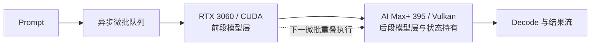

#  AI Max+ 395 加速 — 异构 GPU PD 实验室

[English](README.md)

本仓库记录单机异构 GPU Prefill/Decode（PD）与融合切层实验：RTX 3060 12GB 与 AMD Ryzen AI Max+ 395 / Radeon 8060S 协同工作。

当前版本：**v2.5 — 最终校准融合切层流水**。公开范围仅包含架构、实测数据、思维演进、结论与限制；不提供部署步骤、复现命令、补丁、端点或内部切层策略。

## 本次变化

- **v1.0** 将 prefill 与 decode 分离，并把状态交给 AI Max+ 395。
- **v2.1–v2.5** 演进为异步微批流水，让两台设备共同处理一次 prefill。
- **v2.5 达到 2129.69 tok/s**：在本地 `9B Q6_K / pp5064` 测试中，比 RTX 3060 基线高 34.0%，比 AI Max+ 395 基线高 119.6%。
- 新增 DGX Spark 社区数据作为**外部对照**。由于模型、量化、prompt、分支与内核不同，不能直接排名。

## 架构

融合设计依赖 llama.cpp 上游 [PR #18626](https://github.com/ggml-org/llama.cpp/pull/18626) 的 RPC events/async 能力。模型层常驻各自端点，微批依次穿过两个阶段，使两端能够并发工作；本实验不宣称拥有自研推理引擎补丁。

## 思维进化过程

下面的 v2 名称是公开修订标签，不披露内部切层比例。

| 版本 | 要回答的问题 | 实测认知 | Prefill |
| --- | --- | --- | ---: |
| v1.0 | CUDA prefill 能否把状态交给 Vulkan decode？ | 可以；完整独立 PD 降低了 TTFT，decode 仍约 30 tok/s。 | 1452.29 tok/s |
| v2.1 | 同一请求能否同时占满两个切层阶段？ | 首个融合流水超过任一单端本地基线。 | 1865.08 tok/s |
| v2.2 | 重叠能否更稳定？ | 重叠细化带来小幅增益。 | 1893.87 tok/s |
| v2.3 | 不公开策略时能否继续改善阶段平衡？ | 平衡修订超过 1999 tok/s，并记录到 37.16 tok/s decode。 | 1999.51 tok/s |
| **v2.5** | 最佳校准公开检查点是什么？ | 最终节点达到两端单卡 prefill 之和的 83.2%。 | **2129.69 tok/s** |

## 本地测试口径

| 项目 | 配置 |
| --- | --- |
| 模型 | 9B，Q6_K |
| 设备 | RTX 3060 12GB / CUDA + Ryzen AI Max+ 395 / Radeon 8060S / Vulkan |
| v1.0 输入 / 输出 | 5064 / 128 token |
| v1.0 测量 | 关闭缓存，保留第二次 server 请求结果 |
| v2 测量 | `pp5064`；仅在有记录的节点给出 `tg128` |

## v1.0 — 独立 PD

| 配置 | TTFT | Prefill | Decode |
| --- | ---: | ---: | ---: |
| 纯 AI Max+ 395 | 5.879 s | 861.55 tok/s | 30.24 tok/s |
| 前段 512 token 独立 PD | 5.720 s | 886.62 tok/s | 30.22 tok/s |
| 前段 2048 token 独立 PD | 5.077 s | 999.16 tok/s | 30.18 tok/s |
| 完整独立 PD | **3.496 s** | **1452.29 tok/s** | **30.28 tok/s** |

完整独立 PD 交接 5063 token、208.57 MiB 状态数据。它保留了多请求下 prefill/decode 双工的架构潜力，但本版本没有进行并发量化。

## v2.1–v2.5 — 融合切层流水

空白表示该检查点未记录该指标。

| 检查点 | 公开说明 | Prefill | Decode | TTFT |
| --- | --- | ---: | ---: | ---: |
| RTX 3060 基线 | 仅 CUDA 端 | 1589.00 tok/s | 43.87 tok/s | — |
| AI Max+ 395 基线 | 仅 Vulkan 端 | 970.00 tok/s | 31.27 tok/s | — |
| v2.1 | 首个融合流水 | 1865.08 tok/s | — | — |
| v2.2 | 重叠细化 | 1893.87 tok/s | — | — |
| v2.3 | 平衡细化 | 1999.51 tok/s | 37.16 tok/s | — |
| **v2.5** | 最终校准流水 | **2129.69 tok/s** | — | — |

v2.5 比 RTX 3060 prefill 基线高 34.0%，比 AI Max+ 395 基线高 119.6%，达到两端单卡实测之和 2559 tok/s 的 83.2%。这些结果仅由本地表格计算，不外推到其他硬件。

## DGX Spark 社区外部对照

以下数据保留社区原始公开口径，仅提供背景，不与本地实验排名。

| 设备 | 社区工作负载 | Prompt 口径 | Prefill | 可直接比较？ | 来源 |
| --- | --- | ---: | ---: | --- | --- |
| NVIDIA DGX Spark / GB10 | Qwen3.5 9B，TQ3_4S，分支专属 FP4 cache-on 路径 | pp2048 | 2766.28 tok/s | **否** — 量化、prompt、分支与内核不同 | [llama.cpp-tq3 PR #53](https://github.com/turbo-tan/llama.cpp-tq3/pull/53) |
| NVIDIA DGX Spark / GB10 | Nemotron-3-Nano-30B-A3B，UD-Q4_K_XL，depth 0，f16 KV | pp2048 | 809.55 tok/s | **否** — 模型架构/大小、量化、prompt 与分支不同 | [TurboQuant issue #44](https://github.com/TheTom/llama-cpp-turboquant/issues/44) |

详见 [来源说明](results/dgx-spark-community-control.zh-CN.md) 与 [机器可读外部对照](data/dgx-spark-community-controls.csv)。

## 结论与限制

- v1.0 证明了 CUDA prefill 与 Vulkan decode 间的异构状态交接。
- v2.5 证明了异构切层流水能产生真实异步计算重叠，但同时占用两端会失去 v1.0 的独立 PD 双工能力。
- v1.0 来自 server 请求测量，v2 来自 llama-bench pp/tg；跨版本百分比仅为工程参考，不是严格同口径研究结论。
- 当前证据只覆盖单机、9B、单并发短基准；27B、100K 上下文、多并发与多机均未验证。
- 社区外部对照不做归一化或推算，完整保留原始公开口径。

详细记录：[v1.0 独立 PD](results/v1.0-independent-pd.zh-CN.md)、[v2.5 融合切层演进](results/v2.5-fused-layer-pipeline.zh-CN.md)、[本地 CSV](data/benchmark-results.csv) 与 [更新记录](CHANGELOG_ZH.md)。
