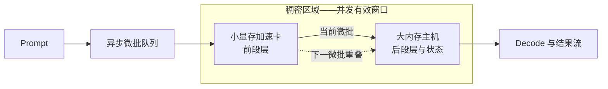

#  小显存加速卡 + 大显存低算力主机稠密加速 — 异构 GPU PD 实验室

[English](README.md)

当前版本：**v2.16 — 首页直接展示决策级实测数据、提升幅度与路线选择**。完整矩阵仍只保留在权威详档和机器可读 CSV；首页拿出足以做判断的关键数字。

本仓库研究高算力小显存加速卡如何与低算力大内存主机协同完成大模型推理。公开内容包括架构、实测证据、设计演进、结论与限制；部署命令、补丁、端点和内部切层策略仍不公开。

## 一眼结论

- **受控稠密加速结论只来自 9B-PIPE-01。** 最终流水相对更快的 RTX 3060 单卡对照，Prefill 从 1589.00 提升到 **2129.69 tok/s（+34.0%）**，Decode 从 43.87 提升到 **50.73 tok/s（+15.6%）**。
- **加速卡能容纳所需 Prefill 副本、目标是降低 TTFT 时，选阶段分离 PD。** 9B-PD-01 的全量 PD 将 TTFT 从 5.879 降到 **3.496 秒（-40.5%）**，Decode 基本不变；27B 历史服务路径将 C1 TTFT 从 4825 降到 **1073 毫秒（-77.8%）**。
- **模型无法装进小卡时，选分层驻留。** 27B-LONG-01 的 3060 + 395 路线相对 395，在 4K / 64K Prefill 分别提升 **+110.2% / +133.4%**；98K 对照 900 秒超时，而分层路线完成。
- **需要容量时选远端 KV，但不要写成计算加速。** 27B-KV-01 达到**每流 1M 上下文**，但全部模型计算都在 3080，395 只存 KV。
- **Ornith 与 Flash 只证明工作包络。** Ornith 在 100K 压测中 42/42 路由成功；Flash 21/21 计分请求成功，最佳实测点是 **C4：总吞吐 338.270 tok/s**。两者都没有匹配单机速度对照。

## 实验结果速览

### 有匹配基线——允许计算提升幅度

变化率统一按“`测试路线 / 匹配对照 - 1`”计算；TTFT 写下降幅度。每一行都限定在同一模型、量化、负载和实验契约内。

| 实验 | 匹配对比 | 关键实测 | 提升幅度 | 直接结论 |
| --- | --- | --- | --- | --- |
| **9B-PD-01** | 395 单机 → 全量 CUDA Prefill / Vulkan Decode PD；9B Q6_K，5064 输入 / 128 输出 | TTFT **5.879 → 3.496 秒**；Prefill **861.55 → 1452.29**；Decode **30.24 → 30.28 tok/s** | TTFT **-40.5%**；Prefill **+68.6%**；Decode **+0.1%** | 全量状态交接可行并降低 prompt 延迟；两阶段仍串行，不属于稠密加速。 |
| **9B-PIPE-01** | 更快的单端对照（RTX 3060）→ 最终异步流水；同一 9B Q6_K 口径 | Prefill **1589.00 → 2129.69**；Decode **43.87 → 50.73 tok/s** | 相对 3060：**+34.0% / +15.6%**；相对 395：**+119.6% / +62.2%** | 这是仓库中“两端都在稠密区域贡献有效计算”的受控证据。 |
| **27B-LONG-01** | 395 单机 → 3060 + 395 分层；Qwen3.8-27B IQ3 | pp4096 **313.28 → 658.52**；pp65536 **136.69 → 319.10**；pp98304 对照超时 / 路线 **225.10 tok/s**；tg64 **18.26 → 19.57** | 4K **+110.2%**；64K **+133.4%**；98K 从超时变为完成；Decode **+7.2%** | 小卡装不下整模且长 prompt 的 Prefill 是瓶颈时，选择分层驻留。 |
| **27B-PD-01** | 395 单机 → 3080 Prefill / 395 Decode 服务路径；Q4、C1 | TTFT **4825 → 1073 ms**；Prefill **207.2 → 1000.6**；Decode **36.33 → 38.75 tok/s**；C1–C6 KV 迁移 **68–76 ms** | TTFT **-77.8%**；Prefill **+382.9%（4.83×）**；Decode **+6.7%** | 双实例服务交接通过 C1–C6；证明阶段分离，不证明同一阶段并行计算。 |

### 无匹配基线——只写服务包络，不写加速倍数

这里的百分比只描述固定配置内的并发伸缩或工作负载敏感性，不代表相对单机的加速。

| 实验 | 关键实测 | 同配置内变化 | 直接结论 |
| --- | --- | --- | --- |
| **27B-KV-01** | **每流 1M 上下文**；配置 C 的 Prefill 保持 **1194.4–1210.6 tok/s**；聚合 Decode C1→C6：C 为 **33.55→63.84**，D 的最新摘要为 **63.2→116.3 tok/s** | C **+90.3%**；D **+84.0%** 的并发伸缩 | Prefill 优先选 C，Decode 吞吐优先选 D。395 只存 KV，因此它是容量/服务路线，不是稠密加速。 |
| **27B-DRAFT-AUDIT-01** | 重复文本 **35.0–38.5 tok/s、接受率 100%**；自然语言 C1 **12.1 tok/s、接受率 17.7%** | 自然语言 C1 相对 38.5 高值低 **68.6%** | 重复文本的投机解码高值不能代表生产文本，必须使用负载匹配数据。 |
| **ORNITH-PD-01** | **42/42 成功**，`route=pd`、`n_reuse=0`；100K Prefill C1→C6 **2895.53→2793.24**；纯 Decode 聚合 **23.33→148.20 tok/s** | Prefill 端点变化 **-3.5%**；Decode 并发伸缩 **6.35×** | 适合验证 MoE 的 Prefill/Decode 归属和 100K 稳定性；没有单机基线，不能宣称因果加速。 |
| **FLASH-SPLIT-01** | **21/21 成功**；C4 最佳：Prefill **633.685**、聚合 Decode **71.185**、总吞吐 **338.270 tok/s** | C1→C4：Prefill **+11.2%**、聚合 Decode **+102.2%**、总吞吐 **+58.4%** | 该单服务切层配置的实测工作点是 C4；C5–C6 已进入平台区，且没有单机对照。 |

所有完整行、指标定义和缺失字段仍由各项[实验详档](results/)及 CSV 承载。首页对每个稳定实验只摘一个决策切片，不把摘要算成新实验；若摘要与权威记录出现冲突，以详档和 CSV 为准。

## 路线选择

| 真实目标 | 应选路线 | 数据锚点 | 什么时候选 / 什么时候不能选 |
| --- | --- | --- | --- |
| 证明两台设备共同加速同一模型计算 | **异步分层稠密加速** | 9B-PIPE-01：相对更快单端 **Prefill +34.0%、Decode +15.6%** | 只有存在匹配单端对照、两段都贡献有效计算时才能选；未经新对照，不能把 9B 结论外推到其他模型。 |
| 降低 prompt 延迟，并明确分开 Prefill / Decode 归属 | **独立 PD** | 9B-PD-01：TTFT **-40.5%**；27B-PD-01 C1：TTFT **-77.8%** | Prefill 端能容纳所需模型副本且能交接状态时选择；它是串行阶段专职，不是并发稠密加速。 |
| 模型无法装进小显存加速卡 | **分层模型驻留** | 27B-LONG-01：64K Prefill 是 395 对照的 **2.33×**；98K 从超时变为完成 | 适合长 prompt Prefill 提升与容量协作；不能拿它与 Q4、9B 或不同引擎直接横比。 |
| 最大化上下文容量或并发 Decode 服务 | **3080 计算 + 395 远端 KV 池** | 27B-KV-01：**每流 1M 上下文**；Decode 优先配置 C6 为 **116.3 tok/s 聚合** | 为容量选择；若目标是两端共同计算加速则应否决，因为 395 不参与模型计算。 |
| 验证 MoE 的深上下文 PD 服务 | **角色分离 PD 压测路线** | ORNITH-PD-01：**42/42 成功**；100K C6 Decode 聚合 **148.20 tok/s** | 用于角色归属与稳定性；补齐匹配单机测试后才能谈加速。 |
| 希望只运行一个服务，并需要明确并发档位 | **固定双设备切层** | FLASH-SPLIT-01：C4 总吞吐 **338.270 tok/s**，相对同配置 C1 **+58.4%** | 当前约 2077/256 负载选择 **C4**；换 prompt 结构必须重测，它是工作点而非加速倍数。 |

## 研究架构

**稠密加速**专指两个设备分别持有同一模型的部分阶段，并在异步分层流水中都贡献有效计算。**稠密区域**是相邻微批让两段同时工作的调度重叠窗口；它不是张量并行、同一层重复计算，也不是远端 KV 存储的泛称。

## 证据规则

| 结论类型 | 最低证据要求 | 本仓库允许的表述 |
| --- | --- | --- |
| 可行性 | 完整请求、有效的阶段/状态交接、指标可归属 | “该配置可以运行” |
| 加速 | 模型、量化、负载、指标一致，并有匹配的单端对照 | “快于匹配对照” |
| 容量 / 服务画像 | 负载完成且有资源、稳定性证据，但没有匹配速度对照 | “能装下”“能服务”或“实测包络”；**不能写成加速** |
| 外部背景 | 保留原方法与来源的第三方公开实测 | “背景参考”；不能当成本地对照 |

- 中英文 README 公开**决策级快照**：匹配基线、选定结果、计算后的变化率、路线选择和结论边界。
- 每项实验的完整可读表格仍只由对应 `results/` 详档承载；其链接的 `data/*.csv` 是机器可读镜像和计算来源。
- 首页高亮值只是同一稳定实验的摘要，不是另一组结果，也不产生新实验。
- `CHANGELOG_ZH.md` 只记录发布与纠错历史；版本号不是实验编号，也不是证据来源。
- 模型、量化、引擎、prompt 或拓扑不同的数据，不得拼成受控横向排名。

## 本地实验目录

| 稳定编号 | 主要问题 | 对照与变化因素 | 主要判定门槛 | 可以支持的结论 | 权威入口 |
| --- | --- | --- | --- | --- | --- |
| **9B-PD-01** | CUDA Prefill 能否把状态交给 Vulkan Decode？ | AI Max+ 395 单机对照；只改变 RTX 3060 预填充的 prompt 份额 | 交接完成、TTFT/Prefill、Decode 连续性、迁移状态大小 | 独立 PD 可行；不证明两端同时计算 | [详档](results/v1.0-independent-pd.zh-CN.md) · [CSV](data/benchmark-results.csv) |
| **9B-PIPE-01** | 两端能否通过异步分层流水共同计算同一模型？ | RTX 3060 单卡与 AI Max+ 395 单机对照；模型和负载固定，只细化流水调度 | 同口径 Prefill/Decode 对照、重复性、输出边界 | 该 9B 口径下的受控稠密加速 | [详档](results/v2.4-fused-layer-pipeline.zh-CN.md) · [CSV](data/benchmark-results.csv) |
| **27B-LONG-01** | 27B 无法由小卡独立装下时，分层驻留能否改善 395 主机的长 prompt 执行？ | 同 IQ3 负载的 395 单机对照；增加 RTX 3060 层段 | 不同 prompt 深度能否完成、Prefill、Decode | 长 prompt 可行性与相对 395 对照的改善；不能外推到 Q4 或 9B | [详档](results/qwen3.8-27b-dual-machine-pd.zh-CN.md) · [CSV](data/qwen27b-local-results.csv) |
| **27B-PD-01** | RTX 3080 Prefill 节点能否在 C1–C6 服务态交给 395 Decode 节点？ | 同模型 395 solo 对照；只改变请求是否走双节点 PD | TTFT、Prefill、Decode、KV 迁移、并发成功 | 历史双实例 PD 调度可行性 | [详档](results/qwen3.8-27b-dual-machine-pd.zh-CN.md) · [CSV](data/qwen27b-local-results.csv) |
| **27B-KV-01** | 3080 承担全部计算、395 只存 KV 时，服务能力如何取舍？ | 最新序列没有匹配的无远端 KV 对照；C/D 是同一实验的两个配置画像，只扫并发 | 上下文容量、Prefill、单流与聚合 Decode、缺失字段纪律 | 远端 KV 容量与服务包络；**不是稠密加速** | [详档](results/qwen3.8-27b-dual-machine-pd.zh-CN.md) · [CSV](data/qwen27b-local-results.csv) |
| **27B-DRAFT-AUDIT-01** | 重复文本的投机 Decode 高值能否代表自然语言服务？ | 在 395 草稿路径直接发自然语言；历史无头结果只作背景，不当因果对照 | 真实文本完成、实际 Decode、草稿接受率 | 审计护栏；禁止用重复文本结果代替生产文本 | [详档](results/qwen3.8-27b-dual-machine-pd.zh-CN.md) · [CSV](data/qwen27b-local-results.csv) |
| **ORNITH-PD-01** | MoE 模型能否保持 Prefill/Decode 归属清楚，并通过短任务与 100K 的 C1–C6 PD 压测？ | 没有同轮单机速度对照；改变负载深度和并发 | 路由成功、无 KV 复用、3080 Prefill 与 395 Decode 各自在独立窗口计量 | 角色归属与稳定性包络；不证明端到端加速 | [详档](results/ornith-1.5-35b-a3b-dual-machine-pd.zh-CN.md) · [CSV](data/ornith35a3b-local-results.csv) |
| **FLASH-SPLIT-01** | 单服务 CUDA+Vulkan 切层能否稳定跑 C1–C6，吞吐在哪个并发档饱和？ | 没有单设备对照；记录配置内只改变并发 | HTTP 成功、Prefill/Decode 聚合、总吞吐、显存余量 | 并发包络与工作点；不构成加速证明 | [详档](results/qwen3.8-flash-q4-layer-split.zh-CN.md) · [CSV](data/qwen38flash-q4-local-results.csv) |

机器可读的实验语义与旧标签别名见 [data/experiment-index.csv](data/experiment-index.csv)。

## 哪些是检查点、配置画像或版本，而不是新实验

- **v2.1–v2.4** 是 **9B-PIPE-01** 内部的调度细化检查点，不是四项独立实验。
- **27B-C 与 27B-D** 是 **27B-KV-01** 内部的 Prefill 优先 / Decode 优先配置画像，不是两个实验；重新发布或纠正计算归属不会产生新测量。
- **v2.5–v2.14** 多数是围绕既有记录的发布、展示或归属修订。它们只属于[更新记录](CHANGELOG_ZH.md)，不能按版本行累计成实验数量。
- 395 自然语言测试是**验证审计**，不是另一套竞争架构。
- DGX Spark 数字是[社区外部参考](results/dgx-spark-community-control.zh-CN.md)，不是本地实验，也不是匹配基线。

## 阅读顺序

1. 先在上表找到与你的决策问题一致的实验。
2. 先读 `results/` 中的实验契约和边界，再看数据表。
3. 计算时使用对应 CSV；除非详档明确给出匹配对照，否则不要跨稳定编号合并数据。
4. [更新记录](CHANGELOG_ZH.md)只用于追溯文案、归属和文件在何时变化。

## 后续研究方向

- **v3.0 方向**：使用统一工作负载矩阵，在更多大内存主机与小显存加速卡上复做受控稠密加速实验。
- **v4.0 方向**：研究一张加速卡服务多台大内存主机，并把公平性、隔离、故障恢复与扩展边界纳入门禁。
