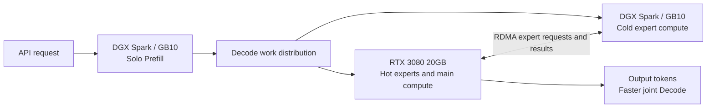

# Qwen3.8 Flash-Next V2: RTX 3080 + DGX Spark

Spark performs solo Prefill. Spark and the RTX 3080 collaborate on Decode using RDMA hot/cold expert compute.

| Metric | V2 | Spark solo baseline |
| --- | ---: | ---: |
| Prefill, three runs | 1030.80 / 1163.40 / 1161.10 tok/s | 1117.93 tok/s (2047 tokens) |
| Prefill mean | 1118.43 tok/s | 1117.93 tok/s (2047 tokens) |
| V2 aggregate Decode | **242.37 tok/s** | **107.60 tok/s** |
| V2 single-stream Decode | **62.00 tok/s** | **22.30 tok/s** |

The experimenter supplied the V2 Decode results and solo controls on 2026-10-06; raw benchmark logs, concurrency and workload details were not included in this revision. These reported values give approximately **2.25x aggregate** and **2.78x single-stream** Decode. The three public Prefill runs use 3600 prompt tokens; the solo Prefill control uses 2047, so they do not establish a strict Prefill speedup.

## Deployment design



**The diagram shows the experimental division of work.** The frozen HTTP router selects a backend per request; it has no cross-host KV export/import interface and cannot seamlessly hand one request from Spark Prefill to 3080 Decode. Joint Decode uses RDMA compute cooperation between hot experts on the 3080 and cold experts on Spark, rather than polling two independent HTTP services. The container diagnostics disclose this reproduction limit.

## Docker deployment

**Pulling is followed by asset preparation and one native build.** The image includes CUDA 13, CMake, compilers, RDMA libraries, TVM-FFI and sources; the first native build is cached. Model weights, hot/cold packs and PLE are mounted separately. You need Linux, a 20GB RTX 3080 host, a DGX Spark/GB10, compatible GPU drivers, [NVIDIA Container Toolkit](https://docs.nvidia.com/datacenter/cloud-native/container-toolkit/latest/install-guide.html) and working RDMA.

```bash
git clone https://github.com/Soulmate-Halo/heterogeneous-gpu-pd-lab.git
cd heterogeneous-gpu-pd-lab/qwen38-flash-spark-3080
cp env.example .env
# Set MODELS_DIR, STRATA_REMOTE_HOST and both HTTP backend addresses.
docker pull ghcr.io/soulmate-halo/heterogeneous-gpu-pd-lab/qwen38-flash-spark-3080:latest
docker run --rm ghcr.io/soulmate-halo/heterogeneous-gpu-pd-lab/qwen38-flash-spark-3080:latest help
docker run --rm ghcr.io/soulmate-halo/heterogeneous-gpu-pd-lab/qwen38-flash-spark-3080:latest doctor
# On Spark, then on the 3080 host (separate machines):
bash scripts/deploy.sh spark
bash scripts/deploy.sh 3080
# Optional request router on either host:
bash scripts/deploy.sh router
```

Prepare the matched `strata-pack-hot/`, `strata-cold-pack/`, `dense.gguf`, `ple-fp8.bin`, and the 3080 `profile.bin` under `MODELS_DIR` (default `/srv/qwen38-models`) following [ASSETS.md](ASSETS.md). A checkpoint cannot replace a prepared pack. Keep the PLE scale consistent with the asset conversion. `STRATA_REMOTE_HOST` must name the Spark RDMA endpoint; configure HCA/GID for your link.

The Compose profiles use host networking, GPUs, `/dev/infiniband`, read-only model mounts and per-host persistent build/state volumes. HTTP ports are Spark **8200**, 3080 **8100**, router **8400**; RDMA control uses **39580**. The first native CUDA build and model loading can take time. Check `docker compose --env-file .env logs -f spark` or `logs -f gpu3080` and `curl -f http://localhost:8200/health` / `http://localhost:8100/health`.

```bash
docker compose --env-file .env --profile spark --profile 3080 --profile router down
python verify_bundle.py
bash apply-bundle.sh --overlay-dir /opt/strata-overlay
```

The foreground container process is managed by Docker; missing assets or devices fail with readable errors. Generic `help`, `doctor`, `verify` and `smoke` work without a GPU. Role-specific `doctor spark` / `doctor 3080` requires its real assets and devices. CI validates image build, entrypoints and missing-asset failures; it does not remeasure GPU throughput. Reproducing seamless cross-host KV handoff requires interfaces not present in this frozen snapshot or an updated experimental runtime.

Evidence and its provenance are in [evidence](evidence/README.md); upstream versions and licenses are in `SOURCE-REVISION.txt`, `NOTICE` and `src/`.
