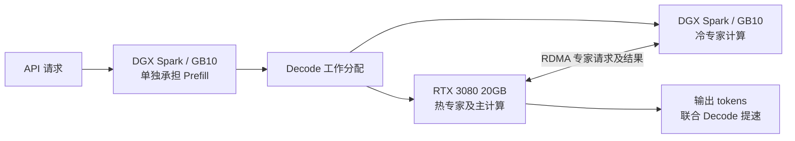

# Qwen3.8 Flash-Next V2：RTX 3080 + DGX Spark

DGX Spark 单独进行 Prefill；Spark 与 RTX 3080 协同 Decode，通过 RDMA 分担冷、热专家计算，主要加速解码。

| 指标 | V2 | Spark 单机基线 |
| --- | ---: | ---: |
| Prefill 三次 | 1030.80 / 1163.40 / 1161.10 tok/s | 1117.93 tok/s（2047 token） |
| Prefill 均值 | 1118.43 tok/s | 1117.93 tok/s（2047 token） |
| V2 聚合解码 | **242.37 tok/s** | **107.60 tok/s** |
| V2 单流解码 | **62.00 tok/s** | **22.30 tok/s** |

本轮 V2 解码及单机对照由实验者于 2026-10-06 提供，原始压测日志未随本次修订附入；并发档位和负载条件未补录。按上述数字，聚合约为单机的 **2.25 倍**，单流约为 **2.78 倍**。Prefill 沿用公开三次记录，输入为 3600 token；单机 Prefill 对照输入为 2047 token，不能用两者计算严格提速倍率。

## 搭建方案



**示意图表示实验分工。** 本次冻结源码中的 HTTP router 按请求类型分流，尚无跨主机 KV 导出/导入接口；它不能把同一请求无缝从 Spark Prefill 接到 3080 Decode。联合 Decode 本身通过 3080 热专家与 Spark 冷专家的 RDMA 计算协作实现，和两台 HTTP 服务轮询不同。容器入口会明确报告这一复现限制。

## Docker 快速部署

**拉取后还需准备资产并完成一次本机编译。** 镜像已带 CUDA 13、CMake、编译器、RDMA 库、TVM-FFI 和源码，首次编译会缓存；不包含模型权重、NVFP4 hot/cold pack 和 PLE 表。需要 Linux、3080 20GB 主机、DGX Spark/GB10、匹配的 GPU 驱动、[NVIDIA Container Toolkit](https://docs.nvidia.com/datacenter/cloud-native/container-toolkit/latest/install-guide.html) 和可用 RDMA 链路。

```bash
git clone https://github.com/Soulmate-Halo/heterogeneous-gpu-pd-lab.git
cd heterogeneous-gpu-pd-lab/qwen38-flash-spark-3080
cp env.example .env
# 编辑 .env：MODELS_DIR、STRATA_REMOTE_HOST 和两台主机的 HTTP 地址。
# 两台主机分别运行；不要在一台机器上同时启动两个 GPU 角色。
docker pull ghcr.io/soulmate-halo/heterogeneous-gpu-pd-lab/qwen38-flash-spark-3080:latest
docker run --rm ghcr.io/soulmate-halo/heterogeneous-gpu-pd-lab/qwen38-flash-spark-3080:latest help
docker run --rm ghcr.io/soulmate-halo/heterogeneous-gpu-pd-lab/qwen38-flash-spark-3080:latest doctor
```

按 [资产契约](ASSETS.md) 将对应文件放到两台主机的模型目录（`MODELS_DIR`，默认 `/srv/qwen38-models`）：`strata-pack-hot/`、`strata-cold-pack/`、`dense.gguf`、`ple-fp8.bin`；3080 主机还需匹配的 `profile.bin`。提供的 `assets/expert-profile-v4.bin` 只能在与对应 pack 匹配时使用。PLE scale 必须与转换资产一致。

```bash
# Spark：启动完整 Spark HTTP 引擎及内置 RDMA 冷专家服务，首次自动编译 sm_121。
bash scripts/deploy.sh spark
# 3080：连接 Spark 冷专家服务，首次自动编译 sm_86。
bash scripts/deploy.sh 3080
# 可选，在任一主机启动 HTTP 请求分流入口。
bash scripts/deploy.sh router
```

Spark、3080 和 router 默认 HTTP 端口分别是 **8200、8100、8400**，RDMA 控制端口 **39580**。`STRATA_REMOTE_HOST` 必须填 Spark RDMA 地址；HCA 名称可留空自动选择，GID 索引按链路设置。Compose 使用主机网络、GPU 和 `/dev/infiniband`；模型目录只读挂载，`/cache` 保存各架构编译产物、`/state` 保存配置和日志。首次编译或加载 PLE 时间较长，查看容器日志确认阶段。

```bash
docker compose --env-file .env logs -f spark
docker compose --env-file .env logs -f gpu3080
curl -f http://localhost:8200/health
curl -f http://localhost:8100/health
# 停止当前主机上的角色（缓存和模型仍保留）：
docker compose --env-file .env --profile spark --profile 3080 --profile router down
```

缺模型、架构不符、CUDA/RDMA 未挂入时会给出可读报错；容器服务用前台 `exec`，由 Docker 管理生命周期。没有 GPU 时只能执行 `help`、`verify`、通用 `doctor` 和 `smoke`，不代表推理性能已经验收。指定角色的 `doctor spark` / `doctor 3080` 会严格检查该角色资产和设备。

## 包验证与资产转换

```bash
python verify_bundle.py
bash apply-bundle.sh --overlay-dir /opt/strata-overlay
```

转换工具、匹配 pack 和 PLE 的要求见 [ASSETS.md](ASSETS.md)。使用匹配资产后，`spark` / `3080` 角色会直接启动公开源码编译出的模型服务；完全复现图中同一请求跨主机 KV 接力还需要补充未随冻结包公开的接口或更新实验运行版本。

原始证据在 [evidence](evidence/README.md)，上游版本与许可见 `SOURCE-REVISION.txt`、`NOTICE` 和 `src/`。本轮 GPU 吞吐采用实验者报告，容器 CI 验证构建、入口和缺资产错误，不伪称 GPU 性能复测。
