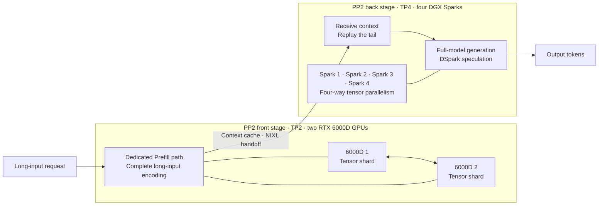
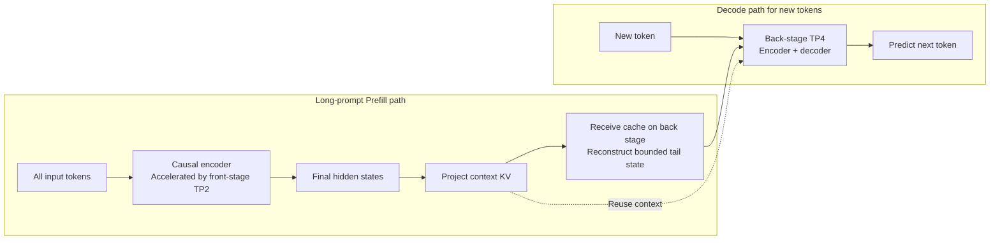
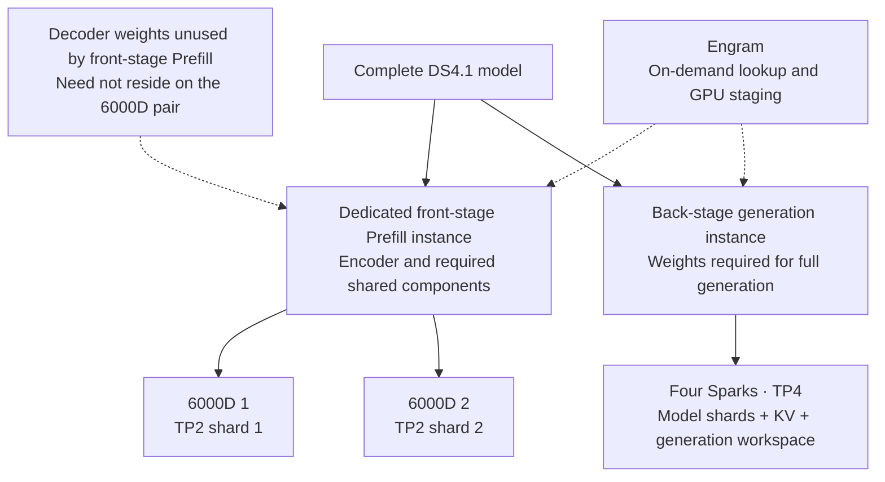

# DeepSeek-V4.1-Flash: peak Prefill 16698.30 tok/s, V1–V7 and TP4 / H20 comparisons

[中文](deepseek-v4.1-flash-six-gpu-v1-v7.zh-CN.md) · [Home](../README.md) · [Local CSV](../data/deepseek-v4.1-flash-six-gpu-v1-v7.csv) · [Sanitized evidence](../data/deepseek-v4.1-flash-six-gpu-v1-v7-evidence.json)

**The six-GPU P stage reaches a measured peak of 16698.30 tok/s; this report also compares formal individual-batch peaks for standalone TP4 and eight H20 GPUs.** P-stage and complete-request timings are separated. The matched C8 controls at 4.54× / 7.82×, V1–V7 evolution and original batch links remain below.

## Peak Prefill: 16698.30 tok/s

**Four DGX Sparks plus two RTX 6000Dpro GPUs reach a Prefill peak of 16698.30 tok/s. Per the experimenter’s September 18 correction, the displayed workload is 32768 input / 128 output / C12, with 12/12 requests completed.** The existing machine archive records the same numerical rate at C1; the C12 raw batch is pending.

## Why two 6000D GPUs can handle Prefill: PP2 with a TP2 front stage and TP4 back stage

**The six GPUs form a two-stage PP2 pipeline: two RTX 6000D GPUs use TP2 for long-input Prefill, and four DGX Sparks use TP4 to receive context and generate the response. DS4.1's dedicated Prefill path does not require the accelerator side to load the full model. Both 6000D GPUs can therefore cooperate on the entire long-input encoding path, concentrating compute where acceleration matters most.**

**Why does the model allow this?** DeepSeek-V4.1-Flash uses a causal encoder-decoder (CED). Long prompts pass through the encoder, and the decoder's global KV is projected from the encoder's final hidden states. The decoder therefore need not process the entire long prompt again. The official active-parameter counts are **8B** per Prefill token and **16B** per Decode token; generation still requires the complete encoder-and-decoder path. [Official model description](https://huggingface.co/deepseek-ai/DeepSeek-V4.1-Flash#introduction) · [Inference framework explanation](https://github.com/vllm-project/recipes/blob/main/models/deepseek-ai/DeepSeek-V4.1-Flash.yaml)

**Figure 1 · Two-stage topology across six GPUs**

TP2 means that two GPUs cooperate on the front stage; TP4 means that four Sparks cooperate on the back stage. **PP2 counts stages, while TP counts devices within each stage: 2 + 4 = 6 GPUs.** PP2 here describes the experimenter's two-stage organization. The archived implementation connects P/D services through NIXL; generation runs the full model on the back stage without sending each new token back to the front stage.

**Figure 2 · Why Prefill can use the encoder path**

The 6000D pair carries the main computation over the full input. The Sparks reuse the prepared context and perform the implementation's required tail replay before generation. Large-memory hosts hold the complete generation path while compute GPUs handle the long-input matrix work.

**Figure 3 · Weight placement and memory roles**

**Fully using the pair for Prefill means assigning long-input encoding to both 6000D GPUs, without splitting that main path back onto the Sparks merely to fit the complete model.** Actual speed still depends on intra-stage communication, Engram lookup, chunking and cache handoff; this is not a measured claim of 100% GPU utilization. The 8B / 16B figures describe active parameters per token, not resident weight memory. TP sharding, external Engram storage and KV budgeting remain necessary in this experiment.

**The acceleration chain is: CED enables a specialized Prefill path → TP2 fits and computes the required weights jointly → the 6000D pair handles long-input batches → the large-memory TP4 back stage receives context and generates.** This explains why Prefill is the main improvement; measured peaks and matched controls follow below.

## Primary results: Prefill throughput and time to first text

Both paths reuse the same four-Spark D service with budget 1536, DSpark K=5 and identical Engram/CUDA Graph settings. Each path and input length has two C8 batches with 512 output tokens per request. Tables use batch means; code templates match but random prefixes differ.

| Input / output / concurrency | Four Spark TP4: input tok/s | Dual 6000D + four Sparks: input tok/s | Speedup |
| --- | ---: | ---: | ---: |
| 8192 / 512 / C8 | 1720.90 | **7812.43** | **4.54×** |
| 32768 / 512 / C8 | 1699.75 | **13300.06** | **7.82×** |

**Timing:** Prefill aggregate input = all input tokens / (latest first text − earliest request start), including Prefill, transfer, replay and waiting. This measures input-serving performance, not isolated kernels.

| Input / output / concurrency | TP4 mean TTFT | Six-GPU mean TTFT | Wait reduction |
| --- | ---: | ---: | ---: |
| 8192 / 512 / C8 | 21.711 s | **5.103 s** | **76.5%** |
| 32768 / 512 / C8 | 86.541 s | **11.596 s** | **86.6%** |

## Observed peaks: six GPUs, standalone TP4 and eight H20 GPUs

**The six-GPU row shows a Prefill peak of 16698.30 tok/s at C12 with 12/12 completions; the table adds standalone TP4, community H20 results and current complete-system purchase prices.** Prices checked on 2026-09-18, in their listed currencies.

| Hardware / runtime | Peak workload: input / output / concurrency | Measured peak tok/s | Current system price (USD; host and RAM in total) | Peak batch success |
| --- | --- | ---: | --- | ---: |
| Four Spark TP4 / SGLang | About 8K / 1 / C4; chunk 8192 | 5037.39 | **US$18,796** (four complete systems) | 4/4 |
| **Dual 6000D + four Sparks / PP2 (TP2→TP4)** | **32768 / 128 / C12** | **16698.30** | **US$38,146 + host and RAM (quote pending)** | **12/12** |
| Eight H20-3e / SGLang | 8192 / 128 / C32 | 4918.82 | **Overseas from ~US$256,816**; China equivalent **US$193,499** | 64/64 |
| Eight H20-3e / vLLM | 24576 / 128 / C32 | 6974.62 | **Overseas from ~US$256,816**; China equivalent **US$193,499** | 64/64 |

**Pricing basis (2026-09-18):** All prices in the table are USD. The [Bank of Russia daily rates](https://www.cbr.ru/currency_base/daily/?UniDbQuery.Posted=True&UniDbQuery.To=18.09.2026) are 1 USD = 84.5093 RUB and 1 CNY = 12.5788 RUB, implying 1 USD ≈ 6.718391 CNY. Calculations use the unrounded cross rate; displayed amounts are rounded to whole dollars. Converted China quotes and overseas seller listings are identified separately. Taxes, shipping and cluster networking are not normalized.

**Six-GPU cost breakdown:** Four Sparks at the [official US$4,699 unit price](https://forums.developer.nvidia.com/t/2-23-2026-price-change-announcement/361713) total **US$18,796**, each including 128GB unified memory and a 4TB SSD. The experimenter quotes CNY 65,000 per 6000D, approximately **US$9,675 each** or **US$19,350 for two**. The system cost is therefore **US$38,146 plus the dual-GPU host and RAM**. The latter covers CPU, motherboard, RAM, storage, chassis, PSU and cooling; its actual quote is still missing. **US$38,146 is the known subtotal, not a complete system price including the host and RAM.**

**Overseas H20 system and architecture:** [ServerICT lists a Dell PowerEdge XE9680](https://serverict.com/servers-gpu/dell/dell-h20-nvidia/) from RUB 21,703,313, approximately **US$256,816 and up**. Its configuration page lists **8×96GB H20 (768GB total), dual Xeon CPUs and 16×64GB DDR5 RDIMMs (1TB total)**. The entry SKU D-XE9680-H20-1-64GB lists 2×7.68TB SAS SSDs. The [Dell specification](https://www.delltechnologies.com/asset/en-ai/products/servers/technical-support/poweredge-xe9680-spec-sheet.pdf) confirms a 6U chassis, 500W H20 SXM5 GPUs and full NVLink connectivity; the [official NVSwitch support table](https://docs.nvidia.com/ai-enterprise/release-7/latest/infra-software/vgpu/features/nvswitch.html) places H20 96GB in the Hopper family and confirms NVSwitch support. This is a family listing; exact CPUs and delivered configuration require the seller quotation. The experimenter’s China quote of CNY 1,300,000 for a complete 8×96GB H20 server including RAM converts to approximately **US$193,499** and is not assumed to have the same configuration as the overseas system.

**Benchmark versus purchase model:** The [community benchmark](https://aik8s.run/ai-k8s/practices/deepseek-v41-flash-h20-day0/) used H20-3e reporting 143,771 MiB per GPU. As requested, the prices refer to an 8×96GB H20 purchase reference, not to that benchmark hardware.

**The six-GPU peak measures only the P stage; TP4 and H20 input rates include generation time, so these rows cannot be used to calculate hardware speedup ratios.** Input/output lengths, concurrency and speculation settings also differ. These are measured results, not hardware performance limits.

Scope: C12 and 12/12 in the six-GPU row follow the experimenter’s 2026-09-18 correction. The same numerical rate in the old archive is a **C1 P-stage record from 2026-09-17**, with **zero** additional P-side prefix-cache hits; TP4 has 12 formal Prefill batches across chunk sizes 2048 / 4096 / 8192, excluding warmup; H20 has 36 [core rounds per engine](https://aik8s.run/ai-k8s/practices/deepseek-v41-flash-h20-day0/), excluding warmup, historical-length and arrival-rate experiments. The TP4 peak batch contains 8194 + 8018 + 8019 + 7895 = **32126 input tokens**.

[Peak CSV](../data/deepseek-v4.1-flash-six-gpu-v1-v7-peaks.csv) · [Per-batch metrics, formulas and source evidence](../data/deepseek-v4.1-flash-six-gpu-v1-v7-peaks.json). Historical C1 archive calculation: 32768 / 1.962356 ≈ **16698.30 tok/s**; this single-request formula does not recompute the corrected C12 result. H20 input rates are recomputed from [original round timings](https://aik8s.run/assets/practices/deepseek-v41-flash-h20-day0/benchmark-summary.json): SGLang = 524288 / 106.588177; vLLM = 1572864 / 225.512473. Failed requests remain in the full-wall denominator.

## Secondary results: Decode and full-wall output

The original Decode results below describe overall delivery gains; Prefill acceleration and shorter first-text waiting are the primary findings. Rates are tok/s.

| Input / output / concurrency | Four Spark TP4 alone | 2×6000D + 4×Spark | Ratio |
| --- | ---: | ---: | ---: |
| 8192 / 512 / C8 | 80.32 | **160.27** | **2.00×** |
| 32768 / 512 / C8 | 27.71 | **123.25** | **4.45×** |

The aggregate generation window includes late requests still prefilling, replaying or waiting. These are serving-efficiency gains, not a 4.45× speedup of each Decode kernel.

| Input / output / C | TP4 full-wall output | Six-GPU full-wall output | TP4 mean TTFT s | Six-GPU mean TTFT s |
| --- | ---: | ---: | ---: | ---: |
| 8192 / 512 / C8 | 73.12 | **151.87** | 21.711 | **5.103** |
| 32768 / 512 / C8 | 24.56 | **111.87** | 86.541 | **11.596** |

**Historical standalone TP4 remains a separate baseline.** The September 13 four-Spark SGLang + DSpark recipe used 2048-token chunks and eight running slots. At C8/C12 it reported aggregate Decode **140.31/138.19** and full-wall output **131.85/133.16**, using **512 input / 256 output**. Its separate **8192 input / 1 output** Prefill tests gave **3232.70/3261.25**. These are not matched controls for the current long-input workload.

## Deployment evolution V1 → V7

These are deployment stages, separate from public research release **v1.6**. V1 is a retrospective label for the initial six-GPU pipeline; no separate V1 frozen-image manifest was found. V2–V5 are recorded experiment stages; V6/V7 have recovery materials. Early remote Engram stages used an additional helper host, so their hardware costs are not identical. Exact layer allocations remain private.

| Deployment | Date | Change | Measured outcome |
| --- | --- | --- | --- |
| **V1** | 2026-09-14–15 | Initial six-GPU TP2×PP3 pipeline; per-row Engram disk reads | Prefill plateaued around 375–380 tok/s; lookup and pipeline waits dominated. |
| **V2** | 2026-09-15 | Resident remote Engram gather, followed by NCCL tuning | 8K Prefill 225.5→2082.0; tuned 32K Prefill 3621.6 tok/s, Decode about 25.6. |
| **V3** | 2026-09-15 | Move the 6000D pair to the final stage; enable DSpark with a special layer allocation | 30K Prefill 4883; ordinary-text single-stream Decode 41.4–42.8 tok/s; limited memory headroom. |
| **V4** | 2026-09-15 | Disable DSpark, reduce chunk size and reserve KV memory for long context | 12×149437-token inputs completed; C1 Prefill 5062 and Decode 35.0 tok/s; observed running peak only 5. |
| **V5** | 2026-09-16 | Cross-stage KV mirroring and revised placement restore DSpark and 8192-token chunks | 12 long-input requests with 512 output tokens each completed in 215.19 s; C1 150K Prefill about 3860 tok/s. |
| **V6** | 2026-09-16–17 | Switch to PD: dual 6000D Prefill plus four-Spark TP4 Decode; repair P2P, GPU gather and NIXL | P single-request stage rate about 13K–16.5K tok/s; end-to-end input still pays handoff and tail replay; golden checkpoint frozen. |
| **V7** | 2026-09-17–18 | Select code-serving settings, D prefetch/GPU staging and tail=1280; package images and add a watchdog | 100/100 requests in the 8K/32K × C1/C4/C8/C12 matrix; matched C8 Prefill input throughput is 4.54×/7.82× direct TP4; mean 32K TTFT falls 86.6%. |

Adding compute first required removing lookup, interconnect and pipeline stalls. With the experimenter's current clarification, the six-GPU organization is described as **PP2: a dual-6000D TP2 front stage and four-Spark TP4 back stage**. The diagrams above explain how this organization uses CED; the V6/V7 archive retains P/D and NIXL as the actual service roles and handoff mechanism. **The 6000D pair handles long-input encoding; four Sparks replay the tail and perform full-model generation**, including subsequent Decode steps.

## V7 code matrix: 8K / 32K × C1 / C4 / C8 / C12

512 output tokens/request; two batches per cell, 16 batches and 100 requests total. Arithmetic means of the two batches, temperature=0, fixed output length, random prefixes and zero additional local prefix-cache hits on P/D. Rates are tok/s.

| Input | C | Aggregate input | Aggregate Decode | Full-wall output | Mean TTFT (s) |
| ---: | ---: | ---: | ---: | ---: | ---: |
| 8192 | 1 | 5678.91 | 72.96 | 60.62 | 1.443 |
| 8192 | 4 | 7184.36 | 124.31 | 114.21 | 3.075 |
| 8192 | 8 | 7543.46 | 158.78 | 150.45 | 5.218 |
| 8192 | 12 | 7371.07 | 177.25 | 170.02 | 7.520 |
| 32768 | 1 | 9757.62 | 73.77 | 49.75 | 3.367 |
| 32768 | 4 | 12804.59 | 103.46 | 88.96 | 6.854 |
| 32768 | 8 | 13173.51 | 121.70 | 110.97 | 11.713 |
| 32768 | 12 | 13814.56 | 135.73 | 126.59 | 16.278 |

**12K+ aggregate input is verified:** 32K/C4, C8 and C12 yield **12804.59, 13173.51 and 13814.56 tok/s**. Their paired aggregate Decode rates are **103.46, 121.70 and 135.73**. Input throughput is not output throughput.

One additional 32K/2048-output/C12 batch measured input **13485.39**, batch Decode **199.39** and full-wall output **194.24**. The **72.692 s** interval with all twelve requests generating measured **235.93 tok/s**. This diagnostic window is not the full-batch metric; only one longer-output batch was tested.

## Eight H20 GPUs: community reference

[Source: same-model community measurements](https://aik8s.run/ai-k8s/practices/deepseek-v41-flash-h20-day0/), retrieved September 18, 2026. **8×H20-3e, TP8/EP8, no DSpark. Output uses full-round time; median of three rounds.**

| Input / output | C | Engine | Full-wall output tok/s | Success |
| --- | ---: | --- | ---: | ---: |
| 8192 / 128 | 8 | SGLang | 63.64 | 48/48 |
| 8192 / 128 | 8 | vLLM | 97.63 | 48/48 |
| 24576 / 128 | 32 | SGLang | 22.79 | 192/192 |
| 24576 / 128 | 32 | vLLM | 36.30 | 192/192 |
| 1024 / 512 | 32 | SGLang | 824.70 | 192/192 |
| 1024 / 512 | 32 | vLLM | 1219.46 | 191/192 |

[External CSV](../data/deepseek-v4.1-flash-six-gpu-v1-v7-h20.csv). Different lengths and concurrency prevent a matched hardware ranking. Use the local full-wall output metric and align workload, speculation and validity requirements first.

**The project owner additionally reports “12K+ Prefill and 1200 aggregate Decode”.** No corresponding 1200 tok/s batch, workload or timing evidence was found in the referenced session and archived results. It remains unverified. **The published evidence does not establish higher total throughput than eight H20 GPUs.** A verified 1200 result would still need comparable conditions and cannot be ranked only against a selected lower H20 operating point.

## Current parameters and limits

| Item | V7 |
| --- | --- |
| Model / weights | Original DeepSeek-V4.1-Flash checkpoint; MXFP4 experts / FP8 main dense weights |
| Compute hardware | 4×DGX Spark GB10 + 2×RTX 6000Dpro, with proxy and Engram shard services |
| Runtime | PP2 organization: TP2 front stage, TP4 back stage; vLLM P/D services with NIXL handoff |
| Shared per-step token budget | P=4096; D=1536 |
| Request / context limits | 12 / 153600; configured limits are not a full workload validation |
| KV | auto, native fp8_ds_mla; block=128; P 1.5 GiB and D 6 GiB per rank |
| Speculation | D: DSpark K=5, probabilistic/block, adaptive verification disabled |
| Other | CUDA Graph and Engram GPU stage/prefetch enabled; tail=1280 with block alignment |
| Readiness | At least 90 seconds of continuous backend health, followed by two consecutive content smoke checks |
| Recovery | 16 ARM64/AMD64 service images, five export bundles; weights/dictionaries external; watchdog supplement |

D budget 4096 produced **2/12 garbled requests** in 32K/C12 and was rejected; V7 remains at 1536. A later watchdog acceptance run also exposed a CUDA illegal-memory-access error. Recovery passed content checks, but the root cause remains open. The readiness gate does not fix that error. A complete six-GPU cold restore is not yet validated. These are initial deployment results, not claims of lossless model accuracy or long-term reliability.

## Definitions and evidence

- Aggregate input: all input tokens / (latest first text − earliest request start), including P, handoff, D replay and waiting.
- Aggregate Decode: output tokens after each request's first nonempty packet / (latest last text − earliest first text). Deduct the actual first-packet token count.
- Full-wall output: all output tokens / (latest request end − earliest request start).
- Total input-plus-output throughput requires one shared full wall time: `(all input + all output tokens) / full seconds`. Do not add input and Decode rates with different denominators.
- Dividing input by summed per-request P-prefill durations is not aggregate P throughput when those durations overlap.

The evidence JSON contains sixteen timed batches, usage/timestamps for 100 requests, controls, the longer-output diagnostic, version provenance and source SHA256 values. S1 is the formal matrix; S2 the controls; S3–S6 deployment/recovery records; S7 historical TP4; S8 the overall report. Original SSE streams and generated text remain in the source project. Private endpoints, credentials, precise layer allocation and launch patches are excluded.
