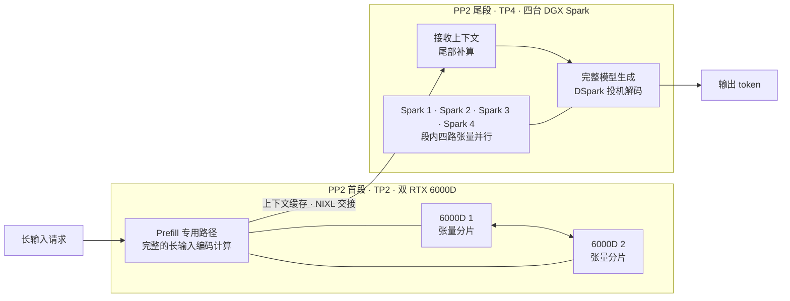
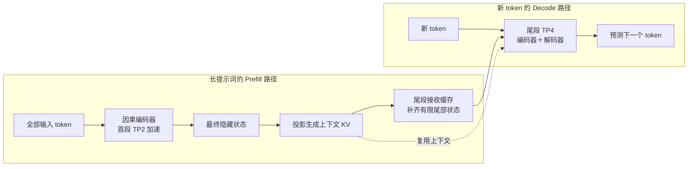
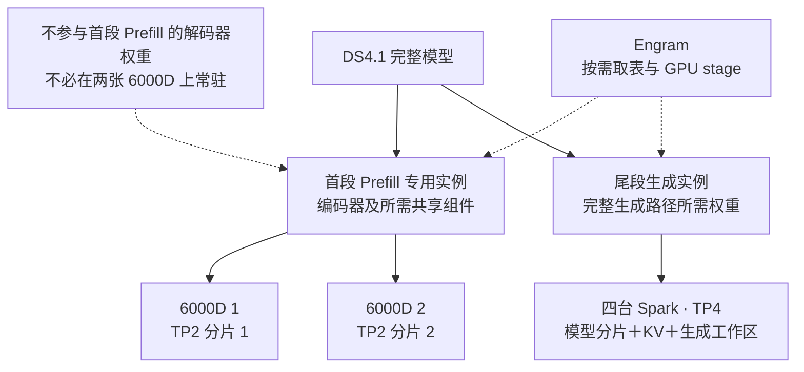

# DeepSeek-V4.1-Flash：Prefill 峰值 16698.30 tok/s、V1–V7 与 TP4 / H20 对比

[English](deepseek-v4.1-flash-six-gpu-v1-v7.md) · [首页](../README_ZH.md) · [本地数据 CSV](../data/deepseek-v4.1-flash-six-gpu-v1-v7.csv) · [脱敏证据](../data/deepseek-v4.1-flash-six-gpu-v1-v7-evidence.json)

**六卡方案的 P 阶段已测峰值为 16698.30 tok/s；本报告同时给出纯 TP4 与八卡 H20 的正式单批峰值对比。** P 阶段计时与完整请求计时分别列出，下方保留同配置 C8 的 4.54× / 7.82× 对照，以及 V1–V7 演进和全部原始批次入口。

## Prefill 峰值：16698.30 tok/s

**四台 DGX Spark 加两张 RTX 6000Dpro，Prefill 峰值 16698.30 tok/s；按实验者 2026-09-18 校正，展示条件为 32768 输入 / 128 输出 / C12，12/12 请求完成。** 现有机器归档中的同数值记录为 C1，C12 原始批次待补充同步。

## 为什么两张 6000D 能接住 Prefill：PP2，首段 TP2、尾段 TP4

**六卡按 PP2 两段流水组织：首段由两张 RTX 6000D 组成 TP2，集中承担长输入 Prefill；尾段由四台 DGX Spark 组成 TP4，承接上下文并完成后续生成。关键在于 DS4.1 的 Prefill 专用路径不需要在加速侧加载完整模型权重，两张 6000D 因而可以共同承接整条长输入编码路径，把算力用在最需要提速的环节。**

**模型结构为什么允许这样做？** DeepSeek-V4.1-Flash 采用因果编码器—解码器（CED）：长提示词先经过编码器，解码器所需的全局 KV 由编码器最终隐藏状态投影得到。因此，长输入不必在解码器中再完整计算一遍。官方给出的每 token 激活参数为 Prefill **8B**、Decode **16B**；生成时仍需完整的编码器与解码器路径。[模型官方说明](https://huggingface.co/deepseek-ai/DeepSeek-V4.1-Flash#introduction) · [推理框架原理说明](https://github.com/vllm-project/recipes/blob/main/models/deepseek-ai/DeepSeek-V4.1-Flash.yaml)

**图 1 · 六卡的两段拓扑**

TP2 表示两张卡共同计算同一首段，TP4 表示四台 Spark 共同计算同一尾段。**PP2 数的是两段，TP 数的是各段参与张量并行的设备数，总计 2＋4＝6 个 GPU。** 这里用 PP2 表示实验者补充的两段组织；归档实现以 P/D 服务和 NIXL 连接，输出阶段由尾段执行完整模型，不将每个新 token 送回首段。

**图 2 · Prefill 为什么可以只运行编码器主路径**

完整输入的主要计算集中在双 6000D，Spark 复用已建立的上下文，仅按实现要求完成尾部补算后开始生成。由此，大显存主机可以承接完整生成路径，而长输入的矩阵计算交给算力卡处理。

**图 3 · 权重与显存怎样分工**

**“吃满 Prefill 加速”的含义是：两张 6000D 一起承担长输入编码计算，不必为了装下完整模型而把这条主路径拆回 Spark。** 实际速度仍取决于段内通信、Engram 取表、分块和缓存交接；本报告没有把它写成 GPU 利用率达到 100% 的实测结论。8B / 16B 是每 token 的激活参数量，不能据此直接计算权重驻留显存；本实验仍需结合 TP 分片、Engram 外置与 KV 预算才能装下。

**加速链条：CED 让 Prefill 路径可以独立裁剪 → TP2 双卡容纳并协同计算所需权重 → 大批输入集中到 6000D → TP4 大显存尾段承接缓存与生成。** 这解释了为什么本次最显著的收益出现在 Prefill；峰值和同条件收益见下方实测表。

## 首要结果：Prefill 吞吐和首字等待

两条路径复用同一四 Spark D 服务，分块 1536、DSpark K=5、Engram 和 CUDA Graph 设置一致。每种输入长度、每条路径各两批，均为 C8、输出 512 token；表为两批均值，代码模板一致、随机前缀不同。

| 输入 / 输出 / 并发 | 纯四 Spark TP4：输入 tok/s | 双 6000D＋四 Spark：输入 tok/s | 提升至 |
| --- | ---: | ---: | ---: |
| 8192 / 512 / C8 | 1720.90 | **7812.43** | **4.54×** |
| 32768 / 512 / C8 | 1699.75 | **13300.06** | **7.82×** |

**计时口径：** Prefill 聚合输入 = 全批输入 token ÷（最晚首字 − 最早请求开始），包含预填充、传输、补算和排队。它体现输入服务速度，不是孤立内核速度。

| 输入 / 输出 / 并发 | 纯 TP4 平均首字等待 | 六卡平均首字等待 | 等待缩短 |
| --- | ---: | ---: | ---: |
| 8192 / 512 / C8 | 21.711 s | **5.103 s** | **76.5%** |
| 32768 / 512 / C8 | 86.541 s | **11.596 s** | **86.6%** |

## 峰值对比：六卡、纯 TP4、八卡 H20

**六卡展示 Prefill 峰值 16698.30 tok/s、C12、12/12 完成；下表同时列出纯 TP4、八卡 H20 社区成绩和当前整机采购价格。** 价格查询日期：2026-09-18；海外价格保留原币种。

| 机组 / 引擎 | 峰值负载：输入 / 输出 / 并发 | 已测峰值 tok/s | 当前系统价格（USD；主机、内存计入总价） | 峰值批成功 |
| --- | --- | ---: | --- | ---: |
| 纯四 Spark TP4 / SGLang | 约 8K / 1 / C4；分块 8192 | 5037.39 | **US$18,796**（4 台整机） | 4/4 |
| **双 6000D＋四 Spark / PP2（TP2→TP4）** | **32768 / 128 / C12** | **16698.30** | **US$38,146＋主机及内存（待补）** | **12/12** |
| 八卡 H20-3e / SGLang | 8192 / 128 / C32 | 4918.82 | **海外约 US$256,816 起**；国内折合 **US$193,499** | 64/64 |
| 八卡 H20-3e / vLLM | 24576 / 128 / C32 | 6974.62 | **海外约 US$256,816 起**；国内折合 **US$193,499** | 64/64 |

**计价基准（2026-09-18）：** 价格列统一为美元。[俄罗斯央行当日汇率](https://www.cbr.ru/currency_base/daily/?UniDbQuery.Posted=True&UniDbQuery.To=18.09.2026)为 1 USD = 84.5093 RUB、1 CNY = 12.5788 RUB，交叉折算 1 USD ≈ 6.718391 CNY；使用未舍入汇率计算，展示金额四舍五入至美元。国内报价折算与海外商家报价分别标注；税费、运输及集群互联设备未统一到同一口径。

**六卡成本拆分：** 四台 Spark 按[官方 US$4,699/台](https://forums.developer.nvidia.com/t/2-23-2026-price-change-announcement/361713)计，共 **US$18,796**，每台整机含 128GB 统一内存、4TB SSD。6000D 按实验者提供的当前单卡人民币 65,000 元计，折合约 **US$9,675/张**，两张约 **US$19,350**。因此六卡系统应为 **US$38,146＋双卡主机及内存成本**；后者包括 CPU、主板、RAM、存储、机箱、电源及散热，当前实际报价尚缺，**US$38,146 只是已知部分小计，不是含主机、内存的完整总价**。

**H20 海外整机与架构：** [ServerICT 的 Dell PowerEdge XE9680](https://serverict.com/servers-gpu/dell/dell-h20-nvidia/)公开起价 RUB 21,703,313，折合约 **US$256,816 起**。页面列出 **8×H20 96GB（合计 768GB）、双路 Xeon、16×64GB DDR5 RDIMM（合计 1TB）**；起价 SKU 为 D-XE9680-H20-1-64GB，列有 2×7.68TB SAS SSD。[Dell 官方规格](https://www.delltechnologies.com/asset/en-ai/products/servers/technical-support/poweredge-xe9680-spec-sheet.pdf)确认 6U、H20 SXM5 500W、NVLink 全互连；[官方 NVSwitch 支持表](https://docs.nvidia.com/ai-enterprise/release-7/latest/infra-software/vgpu/features/nvswitch.html)确认 H20 96GB 属于 Hopper 架构并支持 NVSwitch。商家页面为系列配置，最终 CPU 型号及交付配置以书面报价为准。实验者提供的国内 H20 96GB×8 含服务器、内存报价人民币 1,300,000 元，折合约 **US$193,499**，不视为与海外机器完全同配。

**测速与采购型号：** [社区测速](https://aik8s.run/ai-k8s/practices/deepseek-v41-flash-h20-day0/)使用 H20-3e（每卡报告 143,771 MiB）；表中价格按要求对应 H20 96GB×8 采购参考，不代表该测速机型的售价。

**六卡峰值只计 P 阶段，TP4 与 H20 的全程输入吞吐包含生成时间，不能据此直接计算机组间提速倍数。** 输入长度、输出长度、并发和投机设置也不同；这些是已测成绩，不代表硬件性能上限。

取值范围：六卡表内 C12、12/12 来自实验者 2026-09-18 校正；旧归档同数值为 **2026-09-17 的 C1 P 阶段记录**，该归档 P 侧前缀缓存命中增量为 **0**；TP4 为 2048 / 4096 / 8192 分块扫描的 12 个正式 Prefill 批次（剔除预热）；H20 为[社区核心矩阵](https://aik8s.run/ai-k8s/practices/deepseek-v41-flash-h20-day0/)每引擎 36 轮，剔除预热、历史长度与限速实验。TP4 峰值批实际输入为 8194＋8018＋8019＋7895，共 **32126 token**。

[峰值 CSV](../data/deepseek-v4.1-flash-six-gpu-v1-v7-peaks.csv) · [逐批数字、公式与来源证据](../data/deepseek-v4.1-flash-six-gpu-v1-v7-peaks.json)。历史 C1 归档复算：32768 / 1.962356 ≈ **16698.30 tok/s**；此单请求公式不用于复算校正后的 C12。H20 输入吞吐用其[逐轮原始计时](https://aik8s.run/assets/practices/deepseek-v41-flash-h20-day0/benchmark-summary.json)复算：SGLang = 524288 / 106.588177；vLLM = 1572864 / 225.512473；失败请求仍占用完整墙钟的分母时间。

## 补充结果：解码与全程输出

以下解码成绩保留用于说明整体交付收益；Prefill 加速和首字等待缩短是本次主结论。单位 tok/s。

| 输入 / 输出 / 并发 | 纯四 Spark TP4 | 双 6000D＋四 Spark | 加速倍数 |
| --- | ---: | ---: | ---: |
| 8192 / 512 / C8 | 80.32 | **160.27** | **2.00×** |
| 32768 / 512 / C8 | 27.71 | **123.25** | **4.45×** |

这里统计的是**整批生成窗口**，包含后到请求的预填充、补算和排队。它证明 PD 提高了这组长输入负载的交付效率，不能解释成 D 的每个解码内核快了 4.45 倍。

| 输入 / 输出 / 并发 | TP4 全程输出 tok/s | 六卡全程输出 tok/s | TP4 平均 TTFT 秒 | 六卡平均 TTFT 秒 |
| --- | ---: | ---: | ---: | ---: |
| 8192 / 512 / C8 | 73.12 | **151.87** | 21.711 | **5.103** |
| 32768 / 512 / C8 | 24.56 | **111.87** | 86.541 | **11.596** |

**旧纯 TP4 配方也保留，但不混成同配置对照。** 2026-09-13 的四 Spark SGLang＋DSpark（2048 分块、8 个运行槽）在 C8 / C12 的 Decode 聚合为 **140.31 / 138.19**，全程输出为 **131.85 / 133.16**；这测的是 **512 输入 / 256 输出**。它另测 8192 输入 / 1 输出的 Prefill，为 **3232.70 / 3261.25**。与本轮 8K/32K 代码负载不同，不据此计算加速百分比。

## V1 → V7：从能跑到有可验证的收益

以下是**部署方案的演进**，与研究仓库公开版本 **v1.6** 无关。V1 是对初始六卡节点的回溯归类，未找到独立 V1 镜像冻结清单；V2–V5 是保存的实验阶段，V6/V7 有恢复材料。早期远程 Engram 方案曾使用额外的辅助主机，不把各阶段都当作相同硬件成本。具体分层比例不公开。

| 部署版本 | 日期 | 解决了什么 | 实测结果与取舍 |
| --- | --- | --- | --- |
| **V1** | 2026-09-14–15 | 六卡 TP2×PP3 初始跑通；Engram 按行读盘 | Prefill 约 375–380 tok/s 封顶；先证明能跑，瓶颈在取表与流水等待。 |
| **V2** | 2026-09-15 | Engram 远程常驻内存取表，随后调优 NCCL | 8K Prefill 225.5→2082.0；NCCL 调优后 32K 为 3621.6 tok/s，Decode 约 25.6。 |
| **V3** | 2026-09-15 | 6000D 移至末段，启用 DSpark；特殊配比分层 | 30K Prefill 4883；普通文本单流 Decode 41.4–42.8 tok/s；显存限制上下文。 |
| **V4** | 2026-09-15 | 关闭 DSpark，缩小分块、固定 KV 预算，优先长上下文容量 | 12×149437 输入均完成；单流 Prefill 5062、Decode 35.0 tok/s；峰值实际生成并发只有 5。 |
| **V5** | 2026-09-16 | 跨段 KV 镜像＋重新配比分层，恢复 DSpark 与 8192 分块 | 12 路长输入＋每路 512 输出全部完成，215.19 秒；单流 150K Prefill 约 3860 tok/s。 |
| **V6** | 2026-09-16–17 | 转向 PD：双 6000D 负责输入计算，四 Spark TP4 解码；修 P2P、GPU 取表及 NIXL | P 单流阶段速率达到约 13K–16.5K；PD 输入阶段仍有尾部补算和交接开销；冻结黄金恢复点。 |
| **V7** | 2026-09-17–18 | 按代码负载选定参数；D 侧预取与 GPU stage、tail=1280；封装镜像并补看门狗 | 8K/32K × C1/C4/C8/C12 正式压测 100/100；同配置 C8 Prefill 输入吞吐为纯 TP4 的 4.54×/7.82×，32K 平均首字等待缩短 86.6%。 |

这条演进说明：增加算力卡后，先要消除取表、互联和流水等待，收益才能显现。按实验者本次补充，最新六卡结构统一表述为 **PP2：首段 TP2 双 6000D，尾段 TP4 四 Spark**。上面的原理图解释两段组织与 CED 的配合；V6/V7 归档中的 P/D、NIXL 描述保留为实际服务分工与交接方式。**双 6000D 负责长输入编码预填充，四 Spark 负责尾部补算和完整模型的输出生成**；后续 Decode 由尾段执行。

## V7 正式代码压测：8K / 32K × C1 / C4 / C8 / C12

每请求输出 512 token；每档两批，合计 16 批、100 请求；表为两批算术平均。temperature=0，固定生成长度，随机前缀，P/D 本地前缀缓存命中增量均为零。单位 tok/s。

| 输入 token | 并发 | 聚合输入 tok/s | 聚合 Decode tok/s | 含首字全程输出 tok/s | 平均 TTFT 秒 |
| ---: | ---: | ---: | ---: | ---: | ---: |
| 8192 | 1 | 5678.91 | 72.96 | 60.62 | 1.443 |
| 8192 | 4 | 7184.36 | 124.31 | 114.21 | 3.075 |
| 8192 | 8 | 7543.46 | 158.78 | 150.45 | 5.218 |
| 8192 | 12 | 7371.07 | 177.25 | 170.02 | 7.520 |
| 32768 | 1 | 9757.62 | 73.77 | 49.75 | 3.367 |
| 32768 | 4 | 12804.59 | 103.46 | 88.96 | 6.854 |
| 32768 | 8 | 13173.51 | 121.70 | 110.97 | 11.713 |
| 32768 | 12 | 13814.56 | 135.73 | 126.59 | 16.278 |

**12K＋的输入吞吐有实证：32K/C4、C8、C12 分别为 12804.59、13173.51、13814.56 tok/s。与这些行成对的聚合 Decode 分别是 103.46、121.70、135.73 tok/s。** 不能把其中输入吞吐当作解码速度。

另一次 32K / 2048 输出 / C12 诊断：聚合输入 **13485.39**、整批 Decode **199.39**、全程输出 **194.24**。十二路都在生成的 **72.692 秒**窗口为 **235.93 tok/s**；窗口值与整批值分开报告，仅测一批。

## 八卡 H20：社区原始记录与比较边界

来源：[AI/LLM on Kubernetes 的同模型实测](https://aik8s.run/ai-k8s/practices/deepseek-v41-flash-h20-day0/)，检索日期 2026-09-18。**8×H20-3e，TP8/EP8，未启用 DSpark；表列为全程输出、三轮中位数。**

| 输入 / 输出 token | 并发 | 引擎 | 全程输出 tok/s | 成功请求 |
| --- | ---: | --- | ---: | ---: |
| 8192 / 128 | 8 | SGLang | 63.64 | 48/48 |
| 8192 / 128 | 8 | vLLM | 97.63 | 48/48 |
| 24576 / 128 | 32 | SGLang | 22.79 | 192/192 |
| 24576 / 128 | 32 | vLLM | 36.30 | 192/192 |
| 1024 / 512 | 32 | SGLang | 824.70 | 192/192 |
| 1024 / 512 | 32 | vLLM | 1219.46 | 191/192 |

[外部数据 CSV](../data/deepseek-v4.1-flash-six-gpu-v1-v7-h20.csv)。这组 H20 的输入、输出长度及并发与本地不同，不能做硬件优劣排名；对照应使用本地“含首字全程输出”列，并先统一负载、投机和成功率要求。

**关于“12K＋1200”：** 项目方本次补充报告了这一成绩，但指定会话和已归档结果中未找到 **1200 tok/s 聚合 Decode** 对应的批次、负载和计时记录，故暂不列入已核验成绩。**现有证据不能确认“六卡总吞吐超过八卡 H20”。** 即使补齐 1200 的原始记录，也仍需与 H20 的同口径结果比较，不能只选择较低的外部档位。

## 最新参数与初步成功的边界

| 项目 | V7 固定值 |
| --- | --- |
| 模型 / 权重 | DeepSeek-V4.1-Flash 原版权重；MXFP4 专家＋FP8 主要稠密权重 |
| 计算设备 | 4×DGX Spark GB10＋2×RTX 6000Dpro；另有代理与 Engram 分片服务 |
| 框架与分工 | PP2 两段组织：首段 TP2，尾段 TP4；vLLM P/D 服务，NIXL 交接 |
| 每轮 token 总预算 | P=4096；D=1536；预算为整批共享 |
| 请求上限 / 上下文上限 | 12 / 153600；配置上限不等于全部负载已验收 |
| KV | auto（原生 fp8_ds_mla），block=128；P 1.5 GiB，D 6 GiB 的每 rank 预算 |
| 投机解码 | D：DSpark K=5，probabilistic/block，自适应验证关闭 |
| 其他优化 | CUDA Graph、Engram GPU stage 与预取开启；tail=1280，按 KV 块对齐补算 |
| 就绪门禁 | 后端连续健康至少 90 秒，再连续两次内容烟测通过才放行 |
| 恢复交付 | ARM64 / AMD64 共 16 个服务镜像、5 个导出包；权重与字典外置；看门狗为补充包 |

D 分块 4096 在 32K/C12 出现 **2/12 请求乱码**，未纳入 V7；保持 1536。最新看门狗验收还触发过 CUDA 非法内存访问，恢复后烟测通过，但根因未定位。90 秒门禁是运行保护，不是底层错误已经修复的证明；完整六卡冷恢复也尚未验收。因此这里使用“初步成功”，不宣称精度无损或长期稳定。

## 指标怎么算、证据在哪里

- 聚合输入 = 全批输入 token ÷（最晚首字 − 最早请求开始）。包含 P、交接、D 补算和排队。
- 聚合 Decode = 各请求首个非空包之后的输出 token 之和 ÷（最晚末文本 − 最早首文本）。首包可能含多个 token，按实际累计计数扣除。
- 全程输出 = 全批输出 token ÷（最晚请求结束 − 最早请求开始）。与前两个指标分母不同。
- 输入加输出的总吞吐必须使用**同一完整墙钟**：`(全批输入 token + 全批输出 token) / 全程秒数`。不能直接把聚合输入与聚合 Decode 相加。
- P 的请求 prefill 时长累计值可能重叠，输入除以该累计值不是 P 聚合吞吐。

脱敏证据 JSON 保存 16 批的计时、100 条逐请求 usage、同配置对照与长输出诊断、版本来源及原文件 SHA256。私有原始文件路径只保留相对标识；不公开服务地址、凭据、具体分层或启动补丁。S1 为正式代码矩阵，S2 为路径对照，S3–S6 为版本及恢复记录，S7 为旧 TP4，S8 为总测试文档。其余原始流事件和生成文本在源项目留存。
